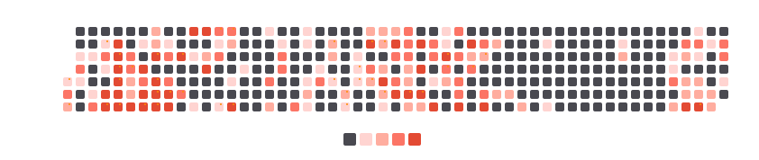

# StravaGraph

_Engineered with Go, inspired by GitHub's contribution graph, powered by your sweat._

[](https://github.com/samuellee/StravaGraph/stargazers)
[](https://github.com/samuellee/StravaGraph/blob/main/LICENSE)
[](https://goreportcard.com/report/github.com/samuellee/StravaGraph)
[](https://github.com/samuellee/StravaGraph/releases)

A professional GitHub profile enhancement that displays your Strava activity as a contribution-style heatmap directly in your GitHub profile README.

## Overview

StravaGraph integrates your athletic data from Strava with your GitHub profile, generating a contribution-style heatmap that visualizes your workout frequency and intensity. The visualization mirrors GitHub's own contribution graph aesthetics while representing your physical activities. Color intensity variations reflect your chosen activity metrics, providing profile visitors with an elegant representation of your athletic consistency and commitment.



## Key Features

| Feature                        | Description                                                                                      |
| ------------------------------ | ------------------------------------------------------------------------------------------------ |
| **Activity Visualization**     | Displays Strava activities in a GitHub-style heatmap with organized days of the week             |
| **Versatile Activity Support** | Compatible with running, cycling, swimming, hiking, and various other Strava activity types      |
| **Metric-Based Intensity**     | Configurable color intensity based on duration, distance, elevation, effort, or heart rate zones |
| **Automated Updates**          | Daily refresh via GitHub Actions workflow                                                        |
| **Secure Authentication**      | Implements OAuth with Strava API without exposing sensitive tokens                               |
| **Customizable Appearance**    | Adaptable design to complement your GitHub profile aesthetic                                     |
| **Dark Mode Support**          | Automatic theme switching based on user preferences                                              |
| **Achievement Highlighting**   | Visual indicators for personal records and significant milestones                                |
| **Reliable Rendering**         | PNG output format ensures consistent display across GitHub README environments                   |

## Implementation

### Quick Setup

1. **Fork this repository**
2. **Create a Strava API application** at https://www.strava.com/settings/api
3. **Configure your credentials** using one of these methods:

   **Option A: Using a .env file (recommended for local development):**

   ```bash
   # Create a .env file with your credentials
   cp .env.example .env
   # Edit the .env file with your actual values
   ```

   To export variables from your .env file to the current shell (useful for some commands):

   ```bash
   # Make the script executable if needed
   chmod +x ./export_env.sh

   # Export variables to current shell
   source ./export_env.sh
   ```

   **Option B: Using environment variables directly:**

   ```bash
   export STRAVA_CLIENT_ID=your_client_id
   export STRAVA_CLIENT_SECRET=your_client_secret
   export STRAVA_REFRESH_TOKEN=your_refresh_token  # If you already have one
   ```

4. **Generate your Strava refresh token** if you don't have one yet:
   ```bash
   go run ./cmd/strava-heatmap/main.go -auth
   ```
5. **Configure repository secrets** (Settings > Secrets and variables > Actions):

   - `STRAVA_CLIENT_ID`: Your Strava API client ID
   - `STRAVA_CLIENT_SECRET`: Your Strava API client secret
   - `STRAVA_REFRESH_TOKEN`: Your Strava refresh token (put it in quotes)
   - `PAT`: GitHub Personal Access Token with repository write permissions

   > **About the PAT**: This token allows the GitHub Action to update your profile repository. To create one:
   >
   > 1. Go to GitHub → Settings → Developer settings → Personal access tokens → Tokens (classic)
   > 2. Click "Generate new token" → "Generate new token (classic)"
   > 3. Name it something like "StravaGraph Access" and set expiration as desired
   > 4. Select the `repo` scope to allow repository modifications
   > 5. Click "Generate token" and copy the token value immediately

6. **Add the marker comments to your GitHub profile README**:

   ```bash
   ## Strava Activity

   <!-- STRAVA-HEATMAP-START -->
   <!-- STRAVA-HEATMAP-END -->
   ```

7. **Execute the GitHub Action** to generate and update your activity heatmap

For comprehensive setup information, refer to the [Installation Guide](./INSTALL.md).

## Usage Guide

### Building from Source

```bash
go build -o strava-heatmap ./cmd/strava-heatmap
```

### Command Reference

| Command     | Description                                      | Example                                    |
| ----------- | ------------------------------------------------ | ------------------------------------------ |
| `-auth`     | Display authentication instructions              | `./strava-heatmap -auth`                   |
| `-update`   | Update StravaGraph README with generated heatmap | `./strava-heatmap -update`                 |
| `-generate` | Create SVG without modifying README              | `./strava-heatmap -generate > heatmap.svg` |
| `-test`     | Validate configuration and authentication        | `./strava-heatmap -test`                   |

### Configuration Options

Customize your visualization by editing the `config.json` file:

```json
{
	"activityTypes": ["Run", "Ride", "Swim", "Hike", "WeightTraining"],
	"metricType": "distance",
	"colorScheme": "strava",
	"showStats": false,
	"dateRange": "1year",
	"cellSize": 10,
	"includePRs": true,
	"darkModeSupport": true,
	"weekStart": "Monday",
	"timeZone": "UTC"
}
```

For a complete configuration reference with all available options, see [examples/config.customized.json](./examples/config.customized.json).

## Documentation

- [Installation Guide](./INSTALL.md) - Detailed setup and configuration instructions
- [API Documentation](./API.md) - Technical API reference
- [Example Profile](./examples/profile/README.md) - Sample GitHub profile README implementation

## Recent Enhancements

### Visual Improvements

- Redesigned heatmap layout with 7-day weekly grid structure
- Implemented clear day-of-week labeling system
- Enhanced month label positioning to prevent visual overlaps
- Optimized text colors for improved readability
- Vertically aligned legend elements for professional presentation
- Refined minimalist design emphasizing data clarity
- Integrated Strava's signature orange color palette for brand consistency

### Technical Advancements

- Transitioned to PNG rendering for consistent GitHub README display
- Implemented SVG to PNG conversion in CI/CD workflow
- Optimized tooltip positioning within viewport boundaries
- Enhanced spacing algorithms for improved visual balance
- Implemented responsive dark mode support with consistent styling
- Streamlined visualization by focusing on core heatmap functionality

## Architecture

### Project Structure

```
/
├── cmd/
│   └── strava-heatmap/
│       └── main.go                 # Main entry point
├── internal/
│   ├── auth/                       # Strava authentication
│   ├── strava/                     # Strava API client
│   ├── processor/                  # Data processing
│   ├── svg/                        # SVG generation
│   ├── github/                     # GitHub integration
│   └── config/                     # Configuration
├── .github/
│   └── workflows/
│       └── update-heatmap.yml      # GitHub Action workflow
├── examples/
│   ├── profile/                    # Example profile README
│   └── config.customized.json      # Example custom config
├── config.json                     # Configuration file
├── README.md                       # This documentation
├── INSTALL.md                      # Installation guide
└── API.md                          # API documentation
```

### Contributing

Contributions are welcome. Please follow our collaboration workflow:

1. Fork the repository
2. Create a feature branch (`git checkout -b feature/enhancement-name`)
3. Commit your changes with descriptive messages (`git commit -m 'Add feature: enhancement description'`)
4. Push to your branch (`git push origin feature/enhancement-name`)
5. Submit a Pull Request

## License

MIT

---

## Your Strava Activity Heatmap

Your generated heatmap from `.strava-heatmap -update` will be displayed here.

<!-- STRAVA-HEATMAP-START -->

<svg width="842" height="178" viewBox="0 0 842 178" xmlns="http://www.w3.org/2000/svg"><style>
.heatmap-cell { rx: 2; }
.heatmap-label { font-family: -apple-system, BlinkMacSystemFont, "Segoe UI", Helvetica, Arial, sans-serif; font-size: 10px; fill: #ffffff; }
.heatmap-month-label { font-family: -apple-system, BlinkMacSystemFont, "Segoe UI", Helvetica, Arial, sans-serif; font-size: 14px; font-weight: bold; fill: #ffffff; }
.heatmap-day-label { font-family: -apple-system, BlinkMacSystemFont, "Segoe UI", Helvetica, Arial, sans-serif; font-size: 12px; fill: #ffffff; font-weight: bold; }
.heatmap-legend-text { font-family: -apple-system, BlinkMacSystemFont, "Segoe UI", Helvetica, Arial, sans-serif; font-size: 12px; fill: #ffffff; font-weight: bold; }
.heatmap-tooltip { font-family: -apple-system, BlinkMacSystemFont, "Segoe UI", Helvetica, Arial, sans-serif; font-size: 12px; pointer-events: none; filter: drop-shadow(0px 0px 2px rgba(0,0,0,0.2)); opacity: 0; transition: opacity 0.2s; }
.heatmap-cell:hover + .heatmap-tooltip { opacity: 1; }
.heatmap-tooltip-rect { fill: white; stroke: #ddd; rx: 3; }
.heatmap-tooltip-text { font-size: 11px; fill: #333; }
.heatmap-tooltip-header { font-weight: bold; }
.pr-marker { fill: #ff8c00; }
@media (prefers-color-scheme: dark) {
.heatmap-label { fill: #8b949e; }
.heatmap-month-label { fill: #c9d1d9; }
.heatmap-day-label { fill: #8b949e; }
.heatmap-legend-text { fill: #8b949e; }
.heatmap-tooltip-rect { fill: #161b22; stroke: #30363d; }
.heatmap-tooltip-text { fill: #c9d1d9; }
}
.intensity-0 { fill: #494950; }
.intensity-1 { fill: #ffd4d1; }
.intensity-2 { fill: #ffad9f; }
.intensity-3 { fill: #fc7566; }
.intensity-4 { fill: #e34a33; }
@media (prefers-color-scheme: dark) {
.intensity-0 { fill: #36363c; }
.intensity-1 { fill: #7c2c2a; }
.intensity-2 { fill: #a63b33; }
.intensity-3 { fill: #d64c3b; }
.intensity-4 { fill: #fc7566; }
}
</style><g class="heatmap-month-labels"><text x="392" y="20" class="heatmap-month-label">Sep</text><text x="462" y="20" class="heatmap-month-label">Oct</text><text x="574" y="20" class="heatmap-month-label">Dec</text><text x="210" y="20" class="heatmap-month-label">Jun</text><text x="266" y="20" class="heatmap-month-label">Jul</text><text x="518" y="20" class="heatmap-month-label">Nov</text><text x="644" y="20" class="heatmap-month-label">Jan</text><text x="700" y="20" class="heatmap-month-label">Feb</text><text x="84" y="20" class="heatmap-month-label">Apr</text><text x="154" y="20" class="heatmap-month-label">May</text><text x="336" y="20" class="heatmap-month-label">Aug</text></g><g class="heatmap-week-labels"></g><g class="heatmap-cells"><text x="60" y="40" class="heatmap-day-label" text-anchor="end">Sun</text><text x="60" y="54" class="heatmap-day-label" text-anchor="end">Mon</text><text x="60" y="68" class="heatmap-day-label" text-anchor="end">Tue</text><text x="60" y="82" class="heatmap-day-label" text-anchor="end">Wed</text><text x="60" y="96" class="heatmap-day-label" text-anchor="end">Thu</text><text x="60" y="110" class="heatmap-day-label" text-anchor="end">Fri</text><text x="60" y="124" class="heatmap-day-label" text-anchor="end">Sat</text><rect x="70" y="86" width="10" height="10" class="heatmap-cell intensity-1" data-date="2024-03-29" data-count="1"><title>Mar 29, 2024: 1 activity
Total distance: 3.5 km
Total time: 20 minutes
Total elevation: 26 m
Personal Record!</title></rect><circle cx="77" cy="88" r="1" class="pr-marker" /><g class="heatmap-tooltip" transform="translate(85, 86)"><rect x="0" y="0" width="200" height="80" class="heatmap-tooltip-rect" /><text x="10" y="15" class="heatmap-tooltip-text heatmap-tooltip-header">March 29, 2024</text><text x="10" y="35" class="heatmap-tooltip-text">1 activities</text><text x="10" y="55" class="heatmap-tooltip-text" fill="#ff8c00">Personal Record!</text></g><rect x="70" y="100" width="10" height="10" class="heatmap-cell intensity-3" data-date="2024-03-30" data-count="1"><title>Mar 30, 2024: 1 activity
Total distance: 8.1 km
Total time: 44 minutes</title></rect><g class="heatmap-tooltip" transform="translate(85, 100)"><rect x="0" y="0" width="200" height="80" class="heatmap-tooltip-rect" /><text x="10" y="15" class="heatmap-tooltip-text heatmap-tooltip-header">March 30, 2024</text><text x="10" y="35" class="heatmap-tooltip-text">1 activities</text></g><rect x="70" y="114" width="10" height="10" class="heatmap-cell intensity-2" data-date="2024-03-31" data-count="1"><title>Mar 31, 2024: 1 activity
Total distance: 6.5 km
Total time: 37 minutes
Total elevation: 38 m
Personal Record!</title></rect><circle cx="77" cy="116" r="1" class="pr-marker" /><g class="heatmap-tooltip" transform="translate(85, 114)"><rect x="0" y="0" width="200" height="80" class="heatmap-tooltip-rect" /><text x="10" y="15" class="heatmap-tooltip-text heatmap-tooltip-header">March 31, 2024</text><text x="10" y="35" class="heatmap-tooltip-text">1 activities</text><text x="10" y="55" class="heatmap-tooltip-text" fill="#ff8c00">Personal Record!</text></g><rect x="84" y="30" width="10" height="10" class="heatmap-cell intensity-0" data-date="2024-04-01" data-count="0"><title>No activities on Apr 1, 2024</title></rect><g class="heatmap-tooltip" transform="translate(99, 30)"><rect x="0" y="0" width="200" height="80" class="heatmap-tooltip-rect" /><text x="10" y="25" class="heatmap-tooltip-text">No activities on April 1, 2024</text></g><rect x="84" y="44" width="10" height="10" class="heatmap-cell intensity-0" data-date="2024-04-02" data-count="0"><title>No activities on Apr 2, 2024</title></rect><g class="heatmap-tooltip" transform="translate(99, 44)"><rect x="0" y="0" width="200" height="80" class="heatmap-tooltip-rect" /><text x="10" y="25" class="heatmap-tooltip-text">No activities on April 2, 2024</text></g><rect x="84" y="58" width="10" height="10" class="heatmap-cell intensity-1" data-date="2024-04-03" data-count="1"><title>Apr 3, 2024: 1 activity
Total distance: 4.9 km
Total time: 30 minutes</title></rect><g class="heatmap-tooltip" transform="translate(99, 58)"><rect x="0" y="0" width="200" height="80" class="heatmap-tooltip-rect" /><text x="10" y="15" class="heatmap-tooltip-text heatmap-tooltip-header">April 3, 2024</text><text x="10" y="35" class="heatmap-tooltip-text">1 activities</text></g><rect x="84" y="72" width="10" height="10" class="heatmap-cell intensity-3" data-date="2024-04-04" data-count="1"><title>Apr 4, 2024: 1 activity
Total distance: 8.1 km
Total time: 59 minutes</title></rect><g class="heatmap-tooltip" transform="translate(99, 72)"><rect x="0" y="0" width="200" height="80" class="heatmap-tooltip-rect" /><text x="10" y="15" class="heatmap-tooltip-text heatmap-tooltip-header">April 4, 2024</text><text x="10" y="35" class="heatmap-tooltip-text">1 activities</text></g><rect x="84" y="86" width="10" height="10" class="heatmap-cell intensity-1" data-date="2024-04-05" data-count="1"><title>Apr 5, 2024: 1 activity
Total distance: 5.0 km
Total time: 33 minutes</title></rect><g class="heatmap-tooltip" transform="translate(99, 86)"><rect x="0" y="0" width="200" height="80" class="heatmap-tooltip-rect" /><text x="10" y="15" class="heatmap-tooltip-text heatmap-tooltip-header">April 5, 2024</text><text x="10" y="35" class="heatmap-tooltip-text">1 activities</text></g><rect x="84" y="100" width="10" height="10" class="heatmap-cell intensity-0" data-date="2024-04-06" data-count="0"><title>No activities on Apr 6, 2024</title></rect><g class="heatmap-tooltip" transform="translate(99, 100)"><rect x="0" y="0" width="200" height="80" class="heatmap-tooltip-rect" /><text x="10" y="25" class="heatmap-tooltip-text">No activities on April 6, 2024</text></g><rect x="84" y="114" width="10" height="10" class="heatmap-cell intensity-0" data-date="2024-04-07" data-count="0"><title>No activities on Apr 7, 2024</title></rect><g class="heatmap-tooltip" transform="translate(99, 114)"><rect x="0" y="0" width="200" height="80" class="heatmap-tooltip-rect" /><text x="10" y="25" class="heatmap-tooltip-text">No activities on April 7, 2024</text></g><rect x="98" y="30" width="10" height="10" class="heatmap-cell intensity-0" data-date="2024-04-08" data-count="0"><title>No activities on Apr 8, 2024</title></rect><g class="heatmap-tooltip" transform="translate(113, 30)"><rect x="0" y="0" width="200" height="80" class="heatmap-tooltip-rect" /><text x="10" y="25" class="heatmap-tooltip-text">No activities on April 8, 2024</text></g><rect x="98" y="44" width="10" height="10" class="heatmap-cell intensity-0" data-date="2024-04-09" data-count="0"><title>No activities on Apr 9, 2024</title></rect><g class="heatmap-tooltip" transform="translate(113, 44)"><rect x="0" y="0" width="200" height="80" class="heatmap-tooltip-rect" /><text x="10" y="25" class="heatmap-tooltip-text">No activities on April 9, 2024</text></g><rect x="98" y="58" width="10" height="10" class="heatmap-cell intensity-1" data-date="2024-04-10" data-count="1"><title>Apr 10, 2024: 1 activity
Total distance: 1.1 km
Total time: 6 minutes</title></rect><g class="heatmap-tooltip" transform="translate(113, 58)"><rect x="0" y="0" width="200" height="80" class="heatmap-tooltip-rect" /><text x="10" y="15" class="heatmap-tooltip-text heatmap-tooltip-header">April 10, 2024</text><text x="10" y="35" class="heatmap-tooltip-text">1 activities</text></g><rect x="98" y="72" width="10" height="10" class="heatmap-cell intensity-0" data-date="2024-04-11" data-count="0"><title>No activities on Apr 11, 2024</title></rect><g class="heatmap-tooltip" transform="translate(113, 72)"><rect x="0" y="0" width="200" height="80" class="heatmap-tooltip-rect" /><text x="10" y="25" class="heatmap-tooltip-text">No activities on April 11, 2024</text></g><rect x="98" y="86" width="10" height="10" class="heatmap-cell intensity-0" data-date="2024-04-12" data-count="0"><title>No activities on Apr 12, 2024</title></rect><g class="heatmap-tooltip" transform="translate(113, 86)"><rect x="0" y="0" width="200" height="80" class="heatmap-tooltip-rect" /><text x="10" y="25" class="heatmap-tooltip-text">No activities on April 12, 2024</text></g><rect x="98" y="100" width="10" height="10" class="heatmap-cell intensity-1" data-date="2024-04-13" data-count="1"><title>Apr 13, 2024: 1 activity
Total distance: 4.8 km
Total time: 32 minutes
Total elevation: 5 m</title></rect><g class="heatmap-tooltip" transform="translate(113, 100)"><rect x="0" y="0" width="200" height="80" class="heatmap-tooltip-rect" /><text x="10" y="15" class="heatmap-tooltip-text heatmap-tooltip-header">April 13, 2024</text><text x="10" y="35" class="heatmap-tooltip-text">1 activities</text></g><rect x="98" y="114" width="10" height="10" class="heatmap-cell intensity-3" data-date="2024-04-14" data-count="1"><title>Apr 14, 2024: 1 activity
Total distance: 8.2 km
Total time: 58 minutes
Total elevation: 41 m</title></rect><g class="heatmap-tooltip" transform="translate(113, 114)"><rect x="0" y="0" width="200" height="80" class="heatmap-tooltip-rect" /><text x="10" y="15" class="heatmap-tooltip-text heatmap-tooltip-header">April 14, 2024</text><text x="10" y="35" class="heatmap-tooltip-text">1 activities</text></g><rect x="112" y="30" width="10" height="10" class="heatmap-cell intensity-0" data-date="2024-04-15" data-count="0"><title>No activities on Apr 15, 2024</title></rect><g class="heatmap-tooltip" transform="translate(127, 30)"><rect x="0" y="0" width="200" height="80" class="heatmap-tooltip-rect" /><text x="10" y="25" class="heatmap-tooltip-text">No activities on April 15, 2024</text></g><rect x="112" y="44" width="10" height="10" class="heatmap-cell intensity-1" data-date="2024-04-16" data-count="1"><title>Apr 16, 2024: 1 activity
Total distance: 4.9 km
Total time: 32 minutes
Total elevation: 17 m
Personal Record!</title></rect><circle cx="119" cy="46" r="1" class="pr-marker" /><g class="heatmap-tooltip" transform="translate(127, 44)"><rect x="0" y="0" width="200" height="80" class="heatmap-tooltip-rect" /><text x="10" y="15" class="heatmap-tooltip-text heatmap-tooltip-header">April 16, 2024</text><text x="10" y="35" class="heatmap-tooltip-text">1 activities</text><text x="10" y="55" class="heatmap-tooltip-text" fill="#ff8c00">Personal Record!</text></g><rect x="112" y="58" width="10" height="10" class="heatmap-cell intensity-3" data-date="2024-04-17" data-count="1"><title>Apr 17, 2024: 1 activity
Total distance: 8.1 km
Total time: 1 hour 8 minutes</title></rect><g class="heatmap-tooltip" transform="translate(127, 58)"><rect x="0" y="0" width="200" height="80" class="heatmap-tooltip-rect" /><text x="10" y="15" class="heatmap-tooltip-text heatmap-tooltip-header">April 17, 2024</text><text x="10" y="35" class="heatmap-tooltip-text">1 activities</text></g><rect x="112" y="72" width="10" height="10" class="heatmap-cell intensity-1" data-date="2024-04-18" data-count="1"><title>Apr 18, 2024: 1 activity
Total distance: 5.0 km
Total time: 36 minutes
Total elevation: 35 m</title></rect><g class="heatmap-tooltip" transform="translate(127, 72)"><rect x="0" y="0" width="200" height="80" class="heatmap-tooltip-rect" /><text x="10" y="15" class="heatmap-tooltip-text heatmap-tooltip-header">April 18, 2024</text><text x="10" y="35" class="heatmap-tooltip-text">1 activities</text></g><rect x="112" y="86" width="10" height="10" class="heatmap-cell intensity-0" data-date="2024-04-19" data-count="0"><title>No activities on Apr 19, 2024</title></rect><g class="heatmap-tooltip" transform="translate(127, 86)"><rect x="0" y="0" width="200" height="80" class="heatmap-tooltip-rect" /><text x="10" y="25" class="heatmap-tooltip-text">No activities on April 19, 2024</text></g><rect x="112" y="100" width="10" height="10" class="heatmap-cell intensity-4" data-date="2024-04-20" data-count="3"><title>Apr 20, 2024: 3 activitys
Total distance: 12.9 km
Total time: 1 hour 44 minutes
Total elevation: 15 m</title></rect><g class="heatmap-tooltip" transform="translate(127, 100)"><rect x="0" y="0" width="200" height="80" class="heatmap-tooltip-rect" /><text x="10" y="15" class="heatmap-tooltip-text heatmap-tooltip-header">April 20, 2024</text><text x="10" y="35" class="heatmap-tooltip-text">3 activities</text></g><rect x="112" y="114" width="10" height="10" class="heatmap-cell intensity-4" data-date="2024-04-21" data-count="2"><title>Apr 21, 2024: 2 activitys
Total distance: 15.3 km
Total time: 1 hour 45 minutes
Total elevation: 138 m
Personal Record!</title></rect><circle cx="119" cy="116" r="1" class="pr-marker" /><g class="heatmap-tooltip" transform="translate(127, 114)"><rect x="0" y="0" width="200" height="80" class="heatmap-tooltip-rect" /><text x="10" y="15" class="heatmap-tooltip-text heatmap-tooltip-header">April 21, 2024</text><text x="10" y="35" class="heatmap-tooltip-text">2 activities</text><text x="10" y="55" class="heatmap-tooltip-text" fill="#ff8c00">Personal Record!</text></g><rect x="126" y="30" width="10" height="10" class="heatmap-cell intensity-0" data-date="2024-04-22" data-count="0"><title>No activities on Apr 22, 2024</title></rect><g class="heatmap-tooltip" transform="translate(141, 30)"><rect x="0" y="0" width="200" height="80" class="heatmap-tooltip-rect" /><text x="10" y="25" class="heatmap-tooltip-text">No activities on April 22, 2024</text></g><rect x="126" y="44" width="10" height="10" class="heatmap-cell intensity-4" data-date="2024-04-23" data-count="1"><title>Apr 23, 2024: 1 activity
Total distance: 9.7 km
Total time: 1 hour 2 minutes</title></rect><g class="heatmap-tooltip" transform="translate(141, 44)"><rect x="0" y="0" width="200" height="80" class="heatmap-tooltip-rect" /><text x="10" y="15" class="heatmap-tooltip-text heatmap-tooltip-header">April 23, 2024</text><text x="10" y="35" class="heatmap-tooltip-text">1 activities</text></g><rect x="126" y="58" width="10" height="10" class="heatmap-cell intensity-4" data-date="2024-04-24" data-count="1"><title>Apr 24, 2024: 1 activity
Total distance: 9.7 km
Total time: 54 minutes
Total elevation: 87 m
Personal Record!</title></rect><circle cx="133" cy="60" r="1" class="pr-marker" /><g class="heatmap-tooltip" transform="translate(141, 58)"><rect x="0" y="0" width="200" height="80" class="heatmap-tooltip-rect" /><text x="10" y="15" class="heatmap-tooltip-text heatmap-tooltip-header">April 24, 2024</text><text x="10" y="35" class="heatmap-tooltip-text">1 activities</text><text x="10" y="55" class="heatmap-tooltip-text" fill="#ff8c00">Personal Record!</text></g><rect x="126" y="72" width="10" height="10" class="heatmap-cell intensity-4" data-date="2024-04-25" data-count="2"><title>Apr 25, 2024: 2 activitys
Total distance: 12.3 km
Total time: 1 hour 10 minutes
Total elevation: 114 m
Personal Record!</title></rect><circle cx="133" cy="74" r="1" class="pr-marker" /><g class="heatmap-tooltip" transform="translate(141, 72)"><rect x="0" y="0" width="200" height="80" class="heatmap-tooltip-rect" /><text x="10" y="15" class="heatmap-tooltip-text heatmap-tooltip-header">April 25, 2024</text><text x="10" y="35" class="heatmap-tooltip-text">2 activities</text><text x="10" y="55" class="heatmap-tooltip-text" fill="#ff8c00">Personal Record!</text></g><rect x="126" y="86" width="10" height="10" class="heatmap-cell intensity-4" data-date="2024-04-26" data-count="2"><title>Apr 26, 2024: 2 activitys
Total distance: 14.8 km
Total time: 1 hour 44 minutes
Total elevation: 211 m
Personal Record!</title></rect><circle cx="133" cy="88" r="1" class="pr-marker" /><g class="heatmap-tooltip" transform="translate(141, 86)"><rect x="0" y="0" width="200" height="80" class="heatmap-tooltip-rect" /><text x="10" y="15" class="heatmap-tooltip-text heatmap-tooltip-header">April 26, 2024</text><text x="10" y="35" class="heatmap-tooltip-text">2 activities</text><text x="10" y="55" class="heatmap-tooltip-text" fill="#ff8c00">Personal Record!</text></g><rect x="126" y="100" width="10" height="10" class="heatmap-cell intensity-4" data-date="2024-04-27" data-count="1"><title>Apr 27, 2024: 1 activity
Total distance: 10.4 km
Total time: 1 hour 8 minutes
Total elevation: 93 m</title></rect><g class="heatmap-tooltip" transform="translate(141, 100)"><rect x="0" y="0" width="200" height="80" class="heatmap-tooltip-rect" /><text x="10" y="15" class="heatmap-tooltip-text heatmap-tooltip-header">April 27, 2024</text><text x="10" y="35" class="heatmap-tooltip-text">1 activities</text></g><rect x="126" y="114" width="10" height="10" class="heatmap-cell intensity-4" data-date="2024-04-28" data-count="1"><title>Apr 28, 2024: 1 activity
Total distance: 16.2 km
Total time: 1 hour 43 minutes
Total elevation: 133 m
Personal Record!</title></rect><circle cx="133" cy="116" r="1" class="pr-marker" /><g class="heatmap-tooltip" transform="translate(141, 114)"><rect x="0" y="0" width="200" height="80" class="heatmap-tooltip-rect" /><text x="10" y="15" class="heatmap-tooltip-text heatmap-tooltip-header">April 28, 2024</text><text x="10" y="35" class="heatmap-tooltip-text">1 activities</text><text x="10" y="55" class="heatmap-tooltip-text" fill="#ff8c00">Personal Record!</text></g><rect x="140" y="30" width="10" height="10" class="heatmap-cell intensity-0" data-date="2024-04-29" data-count="0"><title>No activities on Apr 29, 2024</title></rect><g class="heatmap-tooltip" transform="translate(155, 30)"><rect x="0" y="0" width="200" height="80" class="heatmap-tooltip-rect" /><text x="10" y="25" class="heatmap-tooltip-text">No activities on April 29, 2024</text></g><rect x="140" y="44" width="10" height="10" class="heatmap-cell intensity-0" data-date="2024-04-30" data-count="0"><title>No activities on Apr 30, 2024</title></rect><g class="heatmap-tooltip" transform="translate(155, 44)"><rect x="0" y="0" width="200" height="80" class="heatmap-tooltip-rect" /><text x="10" y="25" class="heatmap-tooltip-text">No activities on April 30, 2024</text></g><rect x="140" y="58" width="10" height="10" class="heatmap-cell intensity-3" data-date="2024-05-01" data-count="1"><title>May 1, 2024: 1 activity
Total distance: 6.6 km
Total time: 38 minutes</title></rect><g class="heatmap-tooltip" transform="translate(155, 58)"><rect x="0" y="0" width="200" height="80" class="heatmap-tooltip-rect" /><text x="10" y="15" class="heatmap-tooltip-text heatmap-tooltip-header">May 1, 2024</text><text x="10" y="35" class="heatmap-tooltip-text">1 activities</text></g><rect x="140" y="72" width="10" height="10" class="heatmap-cell intensity-3" data-date="2024-05-02" data-count="1"><title>May 2, 2024: 1 activity
Total distance: 6.9 km
Total time: 42 minutes
Total elevation: 79 m
Personal Record!</title></rect><circle cx="147" cy="74" r="1" class="pr-marker" /><g class="heatmap-tooltip" transform="translate(155, 72)"><rect x="0" y="0" width="200" height="80" class="heatmap-tooltip-rect" /><text x="10" y="15" class="heatmap-tooltip-text heatmap-tooltip-header">May 2, 2024</text><text x="10" y="35" class="heatmap-tooltip-text">1 activities</text><text x="10" y="55" class="heatmap-tooltip-text" fill="#ff8c00">Personal Record!</text></g><rect x="140" y="86" width="10" height="10" class="heatmap-cell intensity-2" data-date="2024-05-03" data-count="1"><title>May 3, 2024: 1 activity
Total distance: 5.4 km
Total time: 36 minutes
Total elevation: 18 m</title></rect><g class="heatmap-tooltip" transform="translate(155, 86)"><rect x="0" y="0" width="200" height="80" class="heatmap-tooltip-rect" /><text x="10" y="15" class="heatmap-tooltip-text heatmap-tooltip-header">May 3, 2024</text><text x="10" y="35" class="heatmap-tooltip-text">1 activities</text></g><rect x="140" y="100" width="10" height="10" class="heatmap-cell intensity-2" data-date="2024-05-04" data-count="1"><title>May 4, 2024: 1 activity
Total distance: 6.5 km
Total time: 42 minutes</title></rect><g class="heatmap-tooltip" transform="translate(155, 100)"><rect x="0" y="0" width="200" height="80" class="heatmap-tooltip-rect" /><text x="10" y="15" class="heatmap-tooltip-text heatmap-tooltip-header">May 4, 2024</text><text x="10" y="35" class="heatmap-tooltip-text">1 activities</text></g><rect x="140" y="114" width="10" height="10" class="heatmap-cell intensity-4" data-date="2024-05-05" data-count="1"><title>May 5, 2024: 1 activity
Total distance: 21.5 km
Total time: 1 hour 55 minutes
Total elevation: 98 m</title></rect><g class="heatmap-tooltip" transform="translate(155, 114)"><rect x="0" y="0" width="200" height="80" class="heatmap-tooltip-rect" /><text x="10" y="15" class="heatmap-tooltip-text heatmap-tooltip-header">May 5, 2024</text><text x="10" y="35" class="heatmap-tooltip-text">1 activities</text></g><rect x="154" y="30" width="10" height="10" class="heatmap-cell intensity-0" data-date="2024-05-06" data-count="0"><title>No activities on May 6, 2024</title></rect><g class="heatmap-tooltip" transform="translate(169, 30)"><rect x="0" y="0" width="200" height="80" class="heatmap-tooltip-rect" /><text x="10" y="25" class="heatmap-tooltip-text">No activities on May 6, 2024</text></g><rect x="154" y="44" width="10" height="10" class="heatmap-cell intensity-1" data-date="2024-05-07" data-count="1"><title>May 7, 2024: 1 activity
Total distance: 4.9 km
Total time: 25 minutes</title></rect><g class="heatmap-tooltip" transform="translate(169, 44)"><rect x="0" y="0" width="200" height="80" class="heatmap-tooltip-rect" /><text x="10" y="15" class="heatmap-tooltip-text heatmap-tooltip-header">May 7, 2024</text><text x="10" y="35" class="heatmap-tooltip-text">1 activities</text></g><rect x="154" y="58" width="10" height="10" class="heatmap-cell intensity-0" data-date="2024-05-08" data-count="0"><title>No activities on May 8, 2024</title></rect><g class="heatmap-tooltip" transform="translate(169, 58)"><rect x="0" y="0" width="200" height="80" class="heatmap-tooltip-rect" /><text x="10" y="25" class="heatmap-tooltip-text">No activities on May 8, 2024</text></g><rect x="154" y="72" width="10" height="10" class="heatmap-cell intensity-4" data-date="2024-05-09" data-count="2"><title>May 9, 2024: 2 activitys
Total distance: 13.5 km
Total time: 1 hour 27 minutes
Total elevation: 123 m</title></rect><g class="heatmap-tooltip" transform="translate(169, 72)"><rect x="0" y="0" width="200" height="80" class="heatmap-tooltip-rect" /><text x="10" y="15" class="heatmap-tooltip-text heatmap-tooltip-header">May 9, 2024</text><text x="10" y="35" class="heatmap-tooltip-text">2 activities</text></g><rect x="154" y="86" width="10" height="10" class="heatmap-cell intensity-3" data-date="2024-05-10" data-count="1"><title>May 10, 2024: 1 activity
Total distance: 6.9 km
Total time: 44 minutes
Total elevation: 78 m</title></rect><g class="heatmap-tooltip" transform="translate(169, 86)"><rect x="0" y="0" width="200" height="80" class="heatmap-tooltip-rect" /><text x="10" y="15" class="heatmap-tooltip-text heatmap-tooltip-header">May 10, 2024</text><text x="10" y="35" class="heatmap-tooltip-text">1 activities</text></g><rect x="154" y="100" width="10" height="10" class="heatmap-cell intensity-4" data-date="2024-05-11" data-count="1"><title>May 11, 2024: 1 activity
Total distance: 11.0 km
Total time: 1 hour 12 minutes
Total elevation: 75 m</title></rect><g class="heatmap-tooltip" transform="translate(169, 100)"><rect x="0" y="0" width="200" height="80" class="heatmap-tooltip-rect" /><text x="10" y="15" class="heatmap-tooltip-text heatmap-tooltip-header">May 11, 2024</text><text x="10" y="35" class="heatmap-tooltip-text">1 activities</text></g><rect x="154" y="114" width="10" height="10" class="heatmap-cell intensity-4" data-date="2024-05-12" data-count="1"><title>May 12, 2024: 1 activity
Total distance: 14.5 km
Total time: 1 hour 33 minutes
Total elevation: 112 m
Personal Record!</title></rect><circle cx="161" cy="116" r="1" class="pr-marker" /><g class="heatmap-tooltip" transform="translate(169, 114)"><rect x="0" y="0" width="200" height="80" class="heatmap-tooltip-rect" /><text x="10" y="15" class="heatmap-tooltip-text heatmap-tooltip-header">May 12, 2024</text><text x="10" y="35" class="heatmap-tooltip-text">1 activities</text><text x="10" y="55" class="heatmap-tooltip-text" fill="#ff8c00">Personal Record!</text></g><rect x="168" y="30" width="10" height="10" class="heatmap-cell intensity-2" data-date="2024-05-13" data-count="1"><title>May 13, 2024: 1 activity
Total distance: 5.4 km
Total time: 32 minutes
Total elevation: 49 m</title></rect><g class="heatmap-tooltip" transform="translate(183, 30)"><rect x="0" y="0" width="200" height="80" class="heatmap-tooltip-rect" /><text x="10" y="15" class="heatmap-tooltip-text heatmap-tooltip-header">May 13, 2024</text><text x="10" y="35" class="heatmap-tooltip-text">1 activities</text></g><rect x="168" y="44" width="10" height="10" class="heatmap-cell intensity-2" data-date="2024-05-14" data-count="1"><title>May 14, 2024: 1 activity
Total distance: 6.5 km
Total time: 34 minutes</title></rect><g class="heatmap-tooltip" transform="translate(183, 44)"><rect x="0" y="0" width="200" height="80" class="heatmap-tooltip-rect" /><text x="10" y="15" class="heatmap-tooltip-text heatmap-tooltip-header">May 14, 2024</text><text x="10" y="35" class="heatmap-tooltip-text">1 activities</text></g><rect x="168" y="58" width="10" height="10" class="heatmap-cell intensity-4" data-date="2024-05-15" data-count="1"><title>May 15, 2024: 1 activity
Total distance: 14.1 km
Total time: 1 hour 32 minutes
Total elevation: 82 m
Personal Record!</title></rect><circle cx="175" cy="60" r="1" class="pr-marker" /><g class="heatmap-tooltip" transform="translate(183, 58)"><rect x="0" y="0" width="200" height="80" class="heatmap-tooltip-rect" /><text x="10" y="15" class="heatmap-tooltip-text heatmap-tooltip-header">May 15, 2024</text><text x="10" y="35" class="heatmap-tooltip-text">1 activities</text><text x="10" y="55" class="heatmap-tooltip-text" fill="#ff8c00">Personal Record!</text></g><rect x="168" y="72" width="10" height="10" class="heatmap-cell intensity-0" data-date="2024-05-16" data-count="0"><title>No activities on May 16, 2024</title></rect><g class="heatmap-tooltip" transform="translate(183, 72)"><rect x="0" y="0" width="200" height="80" class="heatmap-tooltip-rect" /><text x="10" y="25" class="heatmap-tooltip-text">No activities on May 16, 2024</text></g><rect x="168" y="86" width="10" height="10" class="heatmap-cell intensity-4" data-date="2024-05-17" data-count="2"><title>May 17, 2024: 2 activitys
Total distance: 10.4 km
Total time: 1 hour 3 minutes
Total elevation: 53 m
Personal Record!</title></rect><circle cx="175" cy="88" r="1" class="pr-marker" /><g class="heatmap-tooltip" transform="translate(183, 86)"><rect x="0" y="0" width="200" height="80" class="heatmap-tooltip-rect" /><text x="10" y="15" class="heatmap-tooltip-text heatmap-tooltip-header">May 17, 2024</text><text x="10" y="35" class="heatmap-tooltip-text">2 activities</text><text x="10" y="55" class="heatmap-tooltip-text" fill="#ff8c00">Personal Record!</text></g><rect x="168" y="100" width="10" height="10" class="heatmap-cell intensity-4" data-date="2024-05-18" data-count="1"><title>May 18, 2024: 1 activity
Total distance: 10.7 km
Total time: 1 hour 7 minutes
Total elevation: 65 m
Personal Record!</title></rect><circle cx="175" cy="102" r="1" class="pr-marker" /><g class="heatmap-tooltip" transform="translate(183, 100)"><rect x="0" y="0" width="200" height="80" class="heatmap-tooltip-rect" /><text x="10" y="15" class="heatmap-tooltip-text heatmap-tooltip-header">May 18, 2024</text><text x="10" y="35" class="heatmap-tooltip-text">1 activities</text><text x="10" y="55" class="heatmap-tooltip-text" fill="#ff8c00">Personal Record!</text></g><rect x="168" y="114" width="10" height="10" class="heatmap-cell intensity-4" data-date="2024-05-19" data-count="1"><title>May 19, 2024: 1 activity
Total distance: 22.6 km
Total time: 2 hours 28 minutes
Total elevation: 133 m
Personal Record!</title></rect><circle cx="175" cy="116" r="1" class="pr-marker" /><g class="heatmap-tooltip" transform="translate(183, 114)"><rect x="0" y="0" width="200" height="80" class="heatmap-tooltip-rect" /><text x="10" y="15" class="heatmap-tooltip-text heatmap-tooltip-header">May 19, 2024</text><text x="10" y="35" class="heatmap-tooltip-text">1 activities</text><text x="10" y="55" class="heatmap-tooltip-text" fill="#ff8c00">Personal Record!</text></g><rect x="182" y="30" width="10" height="10" class="heatmap-cell intensity-0" data-date="2024-05-20" data-count="0"><title>No activities on May 20, 2024</title></rect><g class="heatmap-tooltip" transform="translate(197, 30)"><rect x="0" y="0" width="200" height="80" class="heatmap-tooltip-rect" /><text x="10" y="25" class="heatmap-tooltip-text">No activities on May 20, 2024</text></g><rect x="182" y="44" width="10" height="10" class="heatmap-cell intensity-1" data-date="2024-05-21" data-count="1"><title>May 21, 2024: 1 activity
Total distance: 3.8 km
Total time: 24 minutes
Total elevation: 39 m</title></rect><g class="heatmap-tooltip" transform="translate(197, 44)"><rect x="0" y="0" width="200" height="80" class="heatmap-tooltip-rect" /><text x="10" y="15" class="heatmap-tooltip-text heatmap-tooltip-header">May 21, 2024</text><text x="10" y="35" class="heatmap-tooltip-text">1 activities</text></g><rect x="182" y="58" width="10" height="10" class="heatmap-cell intensity-3" data-date="2024-05-22" data-count="1"><title>May 22, 2024: 1 activity
Total distance: 7.0 km
Total time: 47 minutes
Total elevation: 48 m</title></rect><g class="heatmap-tooltip" transform="translate(197, 58)"><rect x="0" y="0" width="200" height="80" class="heatmap-tooltip-rect" /><text x="10" y="15" class="heatmap-tooltip-text heatmap-tooltip-header">May 22, 2024</text><text x="10" y="35" class="heatmap-tooltip-text">1 activities</text></g><rect x="182" y="72" width="10" height="10" class="heatmap-cell intensity-0" data-date="2024-05-23" data-count="0"><title>No activities on May 23, 2024</title></rect><g class="heatmap-tooltip" transform="translate(197, 72)"><rect x="0" y="0" width="200" height="80" class="heatmap-tooltip-rect" /><text x="10" y="25" class="heatmap-tooltip-text">No activities on May 23, 2024</text></g><rect x="182" y="86" width="10" height="10" class="heatmap-cell intensity-3" data-date="2024-05-24" data-count="1"><title>May 24, 2024: 1 activity
Total distance: 6.9 km
Total time: 42 minutes
Total elevation: 37 m</title></rect><g class="heatmap-tooltip" transform="translate(197, 86)"><rect x="0" y="0" width="200" height="80" class="heatmap-tooltip-rect" /><text x="10" y="15" class="heatmap-tooltip-text heatmap-tooltip-header">May 24, 2024</text><text x="10" y="35" class="heatmap-tooltip-text">1 activities</text></g><rect x="182" y="100" width="10" height="10" class="heatmap-cell intensity-4" data-date="2024-05-25" data-count="1"><title>May 25, 2024: 1 activity
Total distance: 11.9 km
Total time: 1 hour 16 minutes
Total elevation: 43 m
Personal Record!</title></rect><circle cx="189" cy="102" r="1" class="pr-marker" /><g class="heatmap-tooltip" transform="translate(197, 100)"><rect x="0" y="0" width="200" height="80" class="heatmap-tooltip-rect" /><text x="10" y="15" class="heatmap-tooltip-text heatmap-tooltip-header">May 25, 2024</text><text x="10" y="35" class="heatmap-tooltip-text">1 activities</text><text x="10" y="55" class="heatmap-tooltip-text" fill="#ff8c00">Personal Record!</text></g><rect x="182" y="114" width="10" height="10" class="heatmap-cell intensity-4" data-date="2024-05-26" data-count="1"><title>May 26, 2024: 1 activity
Total distance: 24.2 km
Total time: 2 hours 51 minutes
Total elevation: 98 m</title></rect><g class="heatmap-tooltip" transform="translate(197, 114)"><rect x="0" y="0" width="200" height="80" class="heatmap-tooltip-rect" /><text x="10" y="15" class="heatmap-tooltip-text heatmap-tooltip-header">May 26, 2024</text><text x="10" y="35" class="heatmap-tooltip-text">1 activities</text></g><rect x="196" y="30" width="10" height="10" class="heatmap-cell intensity-0" data-date="2024-05-27" data-count="0"><title>No activities on May 27, 2024</title></rect><g class="heatmap-tooltip" transform="translate(211, 30)"><rect x="0" y="0" width="200" height="80" class="heatmap-tooltip-rect" /><text x="10" y="25" class="heatmap-tooltip-text">No activities on May 27, 2024</text></g><rect x="196" y="44" width="10" height="10" class="heatmap-cell intensity-0" data-date="2024-05-28" data-count="0"><title>No activities on May 28, 2024</title></rect><g class="heatmap-tooltip" transform="translate(211, 44)"><rect x="0" y="0" width="200" height="80" class="heatmap-tooltip-rect" /><text x="10" y="25" class="heatmap-tooltip-text">No activities on May 28, 2024</text></g><rect x="196" y="58" width="10" height="10" class="heatmap-cell intensity-4" data-date="2024-05-29" data-count="2"><title>May 29, 2024: 2 activitys
Total distance: 21.6 km
Total time: 2 hours 2 minutes
Total elevation: 134 m
Personal Record!</title></rect><circle cx="203" cy="60" r="1" class="pr-marker" /><g class="heatmap-tooltip" transform="translate(211, 58)"><rect x="0" y="0" width="200" height="80" class="heatmap-tooltip-rect" /><text x="10" y="15" class="heatmap-tooltip-text heatmap-tooltip-header">May 29, 2024</text><text x="10" y="35" class="heatmap-tooltip-text">2 activities</text><text x="10" y="55" class="heatmap-tooltip-text" fill="#ff8c00">Personal Record!</text></g><rect x="196" y="72" width="10" height="10" class="heatmap-cell intensity-0" data-date="2024-05-30" data-count="0"><title>No activities on May 30, 2024</title></rect><g class="heatmap-tooltip" transform="translate(211, 72)"><rect x="0" y="0" width="200" height="80" class="heatmap-tooltip-rect" /><text x="10" y="25" class="heatmap-tooltip-text">No activities on May 30, 2024</text></g><rect x="196" y="86" width="10" height="10" class="heatmap-cell intensity-0" data-date="2024-05-31" data-count="0"><title>No activities on May 31, 2024</title></rect><g class="heatmap-tooltip" transform="translate(211, 86)"><rect x="0" y="0" width="200" height="80" class="heatmap-tooltip-rect" /><text x="10" y="25" class="heatmap-tooltip-text">No activities on May 31, 2024</text></g><rect x="196" y="100" width="10" height="10" class="heatmap-cell intensity-3" data-date="2024-06-01" data-count="1"><title>Jun 1, 2024: 1 activity
Total distance: 6.8 km
Total time: 36 minutes
Total elevation: 17 m
Personal Record!</title></rect><circle cx="203" cy="102" r="1" class="pr-marker" /><g class="heatmap-tooltip" transform="translate(211, 100)"><rect x="0" y="0" width="200" height="80" class="heatmap-tooltip-rect" /><text x="10" y="15" class="heatmap-tooltip-text heatmap-tooltip-header">June 1, 2024</text><text x="10" y="35" class="heatmap-tooltip-text">1 activities</text><text x="10" y="55" class="heatmap-tooltip-text" fill="#ff8c00">Personal Record!</text></g><rect x="196" y="114" width="10" height="10" class="heatmap-cell intensity-0" data-date="2024-06-02" data-count="0"><title>No activities on Jun 2, 2024</title></rect><g class="heatmap-tooltip" transform="translate(211, 114)"><rect x="0" y="0" width="200" height="80" class="heatmap-tooltip-rect" /><text x="10" y="25" class="heatmap-tooltip-text">No activities on June 2, 2024</text></g><rect x="210" y="30" width="10" height="10" class="heatmap-cell intensity-4" data-date="2024-06-03" data-count="1"><title>Jun 3, 2024: 1 activity
Total distance: 25.9 km
Total time: 2 hours 26 minutes
Total elevation: 87 m</title></rect><g class="heatmap-tooltip" transform="translate(225, 30)"><rect x="0" y="0" width="200" height="80" class="heatmap-tooltip-rect" /><text x="10" y="15" class="heatmap-tooltip-text heatmap-tooltip-header">June 3, 2024</text><text x="10" y="35" class="heatmap-tooltip-text">1 activities</text></g><rect x="210" y="44" width="10" height="10" class="heatmap-cell intensity-0" data-date="2024-06-04" data-count="0"><title>No activities on Jun 4, 2024</title></rect><g class="heatmap-tooltip" transform="translate(225, 44)"><rect x="0" y="0" width="200" height="80" class="heatmap-tooltip-rect" /><text x="10" y="25" class="heatmap-tooltip-text">No activities on June 4, 2024</text></g><rect x="210" y="58" width="10" height="10" class="heatmap-cell intensity-1" data-date="2024-06-05" data-count="1"><title>Jun 5, 2024: 1 activity
Total distance: 3.6 km
Total time: 21 minutes
Total elevation: 4 m</title></rect><g class="heatmap-tooltip" transform="translate(225, 58)"><rect x="0" y="0" width="200" height="80" class="heatmap-tooltip-rect" /><text x="10" y="15" class="heatmap-tooltip-text heatmap-tooltip-header">June 5, 2024</text><text x="10" y="35" class="heatmap-tooltip-text">1 activities</text></g><rect x="210" y="72" width="10" height="10" class="heatmap-cell intensity-0" data-date="2024-06-06" data-count="0"><title>No activities on Jun 6, 2024</title></rect><g class="heatmap-tooltip" transform="translate(225, 72)"><rect x="0" y="0" width="200" height="80" class="heatmap-tooltip-rect" /><text x="10" y="25" class="heatmap-tooltip-text">No activities on June 6, 2024</text></g><rect x="210" y="86" width="10" height="10" class="heatmap-cell intensity-0" data-date="2024-06-07" data-count="0"><title>No activities on Jun 7, 2024</title></rect><g class="heatmap-tooltip" transform="translate(225, 86)"><rect x="0" y="0" width="200" height="80" class="heatmap-tooltip-rect" /><text x="10" y="25" class="heatmap-tooltip-text">No activities on June 7, 2024</text></g><rect x="210" y="100" width="10" height="10" class="heatmap-cell intensity-0" data-date="2024-06-08" data-count="0"><title>No activities on Jun 8, 2024</title></rect><g class="heatmap-tooltip" transform="translate(225, 100)"><rect x="0" y="0" width="200" height="80" class="heatmap-tooltip-rect" /><text x="10" y="25" class="heatmap-tooltip-text">No activities on June 8, 2024</text></g><rect x="210" y="114" width="10" height="10" class="heatmap-cell intensity-1" data-date="2024-06-09" data-count="1"><title>Jun 9, 2024: 1 activity
Total distance: 3.7 km
Total time: 19 minutes
Total elevation: 10 m</title></rect><g class="heatmap-tooltip" transform="translate(225, 114)"><rect x="0" y="0" width="200" height="80" class="heatmap-tooltip-rect" /><text x="10" y="15" class="heatmap-tooltip-text heatmap-tooltip-header">June 9, 2024</text><text x="10" y="35" class="heatmap-tooltip-text">1 activities</text></g><rect x="224" y="30" width="10" height="10" class="heatmap-cell intensity-4" data-date="2024-06-10" data-count="1"><title>Jun 10, 2024: 1 activity
Total distance: 9.7 km
Total time: 59 minutes
Total elevation: 30 m</title></rect><g class="heatmap-tooltip" transform="translate(239, 30)"><rect x="0" y="0" width="200" height="80" class="heatmap-tooltip-rect" /><text x="10" y="15" class="heatmap-tooltip-text heatmap-tooltip-header">June 10, 2024</text><text x="10" y="35" class="heatmap-tooltip-text">1 activities</text></g><rect x="224" y="44" width="10" height="10" class="heatmap-cell intensity-0" data-date="2024-06-11" data-count="0"><title>No activities on Jun 11, 2024</title></rect><g class="heatmap-tooltip" transform="translate(239, 44)"><rect x="0" y="0" width="200" height="80" class="heatmap-tooltip-rect" /><text x="10" y="25" class="heatmap-tooltip-text">No activities on June 11, 2024</text></g><rect x="224" y="58" width="10" height="10" class="heatmap-cell intensity-2" data-date="2024-06-12" data-count="1"><title>Jun 12, 2024: 1 activity
Total distance: 5.4 km
Total time: 30 minutes
Total elevation: 9 m</title></rect><g class="heatmap-tooltip" transform="translate(239, 58)"><rect x="0" y="0" width="200" height="80" class="heatmap-tooltip-rect" /><text x="10" y="15" class="heatmap-tooltip-text heatmap-tooltip-header">June 12, 2024</text><text x="10" y="35" class="heatmap-tooltip-text">1 activities</text></g><rect x="224" y="72" width="10" height="10" class="heatmap-cell intensity-4" data-date="2024-06-13" data-count="2"><title>Jun 13, 2024: 2 activitys
Total distance: 10.7 km
Total time: 1 hour 1 minute
Total elevation: 19 m</title></rect><g class="heatmap-tooltip" transform="translate(239, 72)"><rect x="0" y="0" width="200" height="80" class="heatmap-tooltip-rect" /><text x="10" y="15" class="heatmap-tooltip-text heatmap-tooltip-header">June 13, 2024</text><text x="10" y="35" class="heatmap-tooltip-text">2 activities</text></g><rect x="224" y="86" width="10" height="10" class="heatmap-cell intensity-0" data-date="2024-06-14" data-count="0"><title>No activities on Jun 14, 2024</title></rect><g class="heatmap-tooltip" transform="translate(239, 86)"><rect x="0" y="0" width="200" height="80" class="heatmap-tooltip-rect" /><text x="10" y="25" class="heatmap-tooltip-text">No activities on June 14, 2024</text></g><rect x="224" y="100" width="10" height="10" class="heatmap-cell intensity-0" data-date="2024-06-15" data-count="0"><title>No activities on Jun 15, 2024</title></rect><g class="heatmap-tooltip" transform="translate(239, 100)"><rect x="0" y="0" width="200" height="80" class="heatmap-tooltip-rect" /><text x="10" y="25" class="heatmap-tooltip-text">No activities on June 15, 2024</text></g><rect x="224" y="114" width="10" height="10" class="heatmap-cell intensity-0" data-date="2024-06-16" data-count="0"><title>No activities on Jun 16, 2024</title></rect><g class="heatmap-tooltip" transform="translate(239, 114)"><rect x="0" y="0" width="200" height="80" class="heatmap-tooltip-rect" /><text x="10" y="25" class="heatmap-tooltip-text">No activities on June 16, 2024</text></g><rect x="238" y="30" width="10" height="10" class="heatmap-cell intensity-3" data-date="2024-06-17" data-count="1"><title>Jun 17, 2024: 1 activity
Total distance: 8.2 km
Total time: 49 minutes
Total elevation: 41 m
Personal Record!</title></rect><circle cx="245" cy="32" r="1" class="pr-marker" /><g class="heatmap-tooltip" transform="translate(253, 30)"><rect x="0" y="0" width="200" height="80" class="heatmap-tooltip-rect" /><text x="10" y="15" class="heatmap-tooltip-text heatmap-tooltip-header">June 17, 2024</text><text x="10" y="35" class="heatmap-tooltip-text">1 activities</text><text x="10" y="55" class="heatmap-tooltip-text" fill="#ff8c00">Personal Record!</text></g><rect x="238" y="44" width="10" height="10" class="heatmap-cell intensity-1" data-date="2024-06-18" data-count="1"><title>Jun 18, 2024: 1 activity
Total distance: 3.3 km
Total time: 18 minutes</title></rect><g class="heatmap-tooltip" transform="translate(253, 44)"><rect x="0" y="0" width="200" height="80" class="heatmap-tooltip-rect" /><text x="10" y="15" class="heatmap-tooltip-text heatmap-tooltip-header">June 18, 2024</text><text x="10" y="35" class="heatmap-tooltip-text">1 activities</text></g><rect x="238" y="58" width="10" height="10" class="heatmap-cell intensity-3" data-date="2024-06-19" data-count="1"><title>Jun 19, 2024: 1 activity
Total distance: 8.1 km
Total time: 53 minutes
Total elevation: 41 m</title></rect><g class="heatmap-tooltip" transform="translate(253, 58)"><rect x="0" y="0" width="200" height="80" class="heatmap-tooltip-rect" /><text x="10" y="15" class="heatmap-tooltip-text heatmap-tooltip-header">June 19, 2024</text><text x="10" y="35" class="heatmap-tooltip-text">1 activities</text></g><rect x="238" y="72" width="10" height="10" class="heatmap-cell intensity-0" data-date="2024-06-20" data-count="0"><title>No activities on Jun 20, 2024</title></rect><g class="heatmap-tooltip" transform="translate(253, 72)"><rect x="0" y="0" width="200" height="80" class="heatmap-tooltip-rect" /><text x="10" y="25" class="heatmap-tooltip-text">No activities on June 20, 2024</text></g><rect x="238" y="86" width="10" height="10" class="heatmap-cell intensity-0" data-date="2024-06-21" data-count="0"><title>No activities on Jun 21, 2024</title></rect><g class="heatmap-tooltip" transform="translate(253, 86)"><rect x="0" y="0" width="200" height="80" class="heatmap-tooltip-rect" /><text x="10" y="25" class="heatmap-tooltip-text">No activities on June 21, 2024</text></g><rect x="238" y="100" width="10" height="10" class="heatmap-cell intensity-0" data-date="2024-06-22" data-count="0"><title>No activities on Jun 22, 2024</title></rect><g class="heatmap-tooltip" transform="translate(253, 100)"><rect x="0" y="0" width="200" height="80" class="heatmap-tooltip-rect" /><text x="10" y="25" class="heatmap-tooltip-text">No activities on June 22, 2024</text></g><rect x="238" y="114" width="10" height="10" class="heatmap-cell intensity-1" data-date="2024-06-23" data-count="1"><title>Jun 23, 2024: 1 activity
Total distance: 3.7 km
Total time: 21 minutes
Total elevation: 7 m
Personal Record!</title></rect><circle cx="245" cy="116" r="1" class="pr-marker" /><g class="heatmap-tooltip" transform="translate(253, 114)"><rect x="0" y="0" width="200" height="80" class="heatmap-tooltip-rect" /><text x="10" y="15" class="heatmap-tooltip-text heatmap-tooltip-header">June 23, 2024</text><text x="10" y="35" class="heatmap-tooltip-text">1 activities</text><text x="10" y="55" class="heatmap-tooltip-text" fill="#ff8c00">Personal Record!</text></g><rect x="252" y="30" width="10" height="10" class="heatmap-cell intensity-3" data-date="2024-06-24" data-count="1"><title>Jun 24, 2024: 1 activity
Total distance: 8.2 km
Total time: 49 minutes
Total elevation: 40 m
Personal Record!</title></rect><circle cx="259" cy="32" r="1" class="pr-marker" /><g class="heatmap-tooltip" transform="translate(267, 30)"><rect x="0" y="0" width="200" height="80" class="heatmap-tooltip-rect" /><text x="10" y="15" class="heatmap-tooltip-text heatmap-tooltip-header">June 24, 2024</text><text x="10" y="35" class="heatmap-tooltip-text">1 activities</text><text x="10" y="55" class="heatmap-tooltip-text" fill="#ff8c00">Personal Record!</text></g><rect x="252" y="44" width="10" height="10" class="heatmap-cell intensity-2" data-date="2024-06-25" data-count="1"><title>Jun 25, 2024: 1 activity
Total distance: 5.2 km
Total time: 28 minutes</title></rect><g class="heatmap-tooltip" transform="translate(267, 44)"><rect x="0" y="0" width="200" height="80" class="heatmap-tooltip-rect" /><text x="10" y="15" class="heatmap-tooltip-text heatmap-tooltip-header">June 25, 2024</text><text x="10" y="35" class="heatmap-tooltip-text">1 activities</text></g><rect x="252" y="58" width="10" height="10" class="heatmap-cell intensity-0" data-date="2024-06-26" data-count="0"><title>No activities on Jun 26, 2024</title></rect><g class="heatmap-tooltip" transform="translate(267, 58)"><rect x="0" y="0" width="200" height="80" class="heatmap-tooltip-rect" /><text x="10" y="25" class="heatmap-tooltip-text">No activities on June 26, 2024</text></g><rect x="252" y="72" width="10" height="10" class="heatmap-cell intensity-0" data-date="2024-06-27" data-count="0"><title>No activities on Jun 27, 2024</title></rect><g class="heatmap-tooltip" transform="translate(267, 72)"><rect x="0" y="0" width="200" height="80" class="heatmap-tooltip-rect" /><text x="10" y="25" class="heatmap-tooltip-text">No activities on June 27, 2024</text></g><rect x="252" y="86" width="10" height="10" class="heatmap-cell intensity-1" data-date="2024-06-28" data-count="1"><title>Jun 28, 2024: 1 activity
Total distance: 3.7 km
Total time: 20 minutes
Total elevation: 9 m</title></rect><g class="heatmap-tooltip" transform="translate(267, 86)"><rect x="0" y="0" width="200" height="80" class="heatmap-tooltip-rect" /><text x="10" y="15" class="heatmap-tooltip-text heatmap-tooltip-header">June 28, 2024</text><text x="10" y="35" class="heatmap-tooltip-text">1 activities</text></g><rect x="252" y="100" width="10" height="10" class="heatmap-cell intensity-0" data-date="2024-06-29" data-count="0"><title>No activities on Jun 29, 2024</title></rect><g class="heatmap-tooltip" transform="translate(267, 100)"><rect x="0" y="0" width="200" height="80" class="heatmap-tooltip-rect" /><text x="10" y="25" class="heatmap-tooltip-text">No activities on June 29, 2024</text></g><rect x="252" y="114" width="10" height="10" class="heatmap-cell intensity-4" data-date="2024-06-30" data-count="1"><title>Jun 30, 2024: 1 activity
Total distance: 11.3 km
Total time: 1 hour 8 minutes
Total elevation: 43 m
Personal Record!</title></rect><circle cx="259" cy="116" r="1" class="pr-marker" /><g class="heatmap-tooltip" transform="translate(267, 114)"><rect x="0" y="0" width="200" height="80" class="heatmap-tooltip-rect" /><text x="10" y="15" class="heatmap-tooltip-text heatmap-tooltip-header">June 30, 2024</text><text x="10" y="35" class="heatmap-tooltip-text">1 activities</text><text x="10" y="55" class="heatmap-tooltip-text" fill="#ff8c00">Personal Record!</text></g><rect x="266" y="30" width="10" height="10" class="heatmap-cell intensity-0" data-date="2024-07-01" data-count="0"><title>No activities on Jul 1, 2024</title></rect><g class="heatmap-tooltip" transform="translate(281, 30)"><rect x="0" y="0" width="200" height="80" class="heatmap-tooltip-rect" /><text x="10" y="25" class="heatmap-tooltip-text">No activities on July 1, 2024</text></g><rect x="266" y="44" width="10" height="10" class="heatmap-cell intensity-0" data-date="2024-07-02" data-count="0"><title>No activities on Jul 2, 2024</title></rect><g class="heatmap-tooltip" transform="translate(281, 44)"><rect x="0" y="0" width="200" height="80" class="heatmap-tooltip-rect" /><text x="10" y="25" class="heatmap-tooltip-text">No activities on July 2, 2024</text></g><rect x="266" y="58" width="10" height="10" class="heatmap-cell intensity-0" data-date="2024-07-03" data-count="0"><title>No activities on Jul 3, 2024</title></rect><g class="heatmap-tooltip" transform="translate(281, 58)"><rect x="0" y="0" width="200" height="80" class="heatmap-tooltip-rect" /><text x="10" y="25" class="heatmap-tooltip-text">No activities on July 3, 2024</text></g><rect x="266" y="72" width="10" height="10" class="heatmap-cell intensity-1" data-date="2024-07-04" data-count="1"><title>Jul 4, 2024: 1 activity
Total distance: 3.4 km
Total time: 20 minutes
Total elevation: 4 m</title></rect><g class="heatmap-tooltip" transform="translate(281, 72)"><rect x="0" y="0" width="200" height="80" class="heatmap-tooltip-rect" /><text x="10" y="15" class="heatmap-tooltip-text heatmap-tooltip-header">July 4, 2024</text><text x="10" y="35" class="heatmap-tooltip-text">1 activities</text></g><rect x="266" y="86" width="10" height="10" class="heatmap-cell intensity-0" data-date="2024-07-05" data-count="0"><title>No activities on Jul 5, 2024</title></rect><g class="heatmap-tooltip" transform="translate(281, 86)"><rect x="0" y="0" width="200" height="80" class="heatmap-tooltip-rect" /><text x="10" y="25" class="heatmap-tooltip-text">No activities on July 5, 2024</text></g><rect x="266" y="100" width="10" height="10" class="heatmap-cell intensity-0" data-date="2024-07-06" data-count="0"><title>No activities on Jul 6, 2024</title></rect><g class="heatmap-tooltip" transform="translate(281, 100)"><rect x="0" y="0" width="200" height="80" class="heatmap-tooltip-rect" /><text x="10" y="25" class="heatmap-tooltip-text">No activities on July 6, 2024</text></g><rect x="266" y="114" width="10" height="10" class="heatmap-cell intensity-0" data-date="2024-07-07" data-count="0"><title>No activities on Jul 7, 2024</title></rect><g class="heatmap-tooltip" transform="translate(281, 114)"><rect x="0" y="0" width="200" height="80" class="heatmap-tooltip-rect" /><text x="10" y="25" class="heatmap-tooltip-text">No activities on July 7, 2024</text></g><rect x="280" y="30" width="10" height="10" class="heatmap-cell intensity-0" data-date="2024-07-08" data-count="0"><title>No activities on Jul 8, 2024</title></rect><g class="heatmap-tooltip" transform="translate(295, 30)"><rect x="0" y="0" width="200" height="80" class="heatmap-tooltip-rect" /><text x="10" y="25" class="heatmap-tooltip-text">No activities on July 8, 2024</text></g><rect x="280" y="44" width="10" height="10" class="heatmap-cell intensity-0" data-date="2024-07-09" data-count="0"><title>No activities on Jul 9, 2024</title></rect><g class="heatmap-tooltip" transform="translate(295, 44)"><rect x="0" y="0" width="200" height="80" class="heatmap-tooltip-rect" /><text x="10" y="25" class="heatmap-tooltip-text">No activities on July 9, 2024</text></g><rect x="280" y="58" width="10" height="10" class="heatmap-cell intensity-0" data-date="2024-07-10" data-count="0"><title>No activities on Jul 10, 2024</title></rect><g class="heatmap-tooltip" transform="translate(295, 58)"><rect x="0" y="0" width="200" height="80" class="heatmap-tooltip-rect" /><text x="10" y="25" class="heatmap-tooltip-text">No activities on July 10, 2024</text></g><rect x="280" y="72" width="10" height="10" class="heatmap-cell intensity-0" data-date="2024-07-11" data-count="0"><title>No activities on Jul 11, 2024</title></rect><g class="heatmap-tooltip" transform="translate(295, 72)"><rect x="0" y="0" width="200" height="80" class="heatmap-tooltip-rect" /><text x="10" y="25" class="heatmap-tooltip-text">No activities on July 11, 2024</text></g><rect x="280" y="86" width="10" height="10" class="heatmap-cell intensity-0" data-date="2024-07-12" data-count="0"><title>No activities on Jul 12, 2024</title></rect><g class="heatmap-tooltip" transform="translate(295, 86)"><rect x="0" y="0" width="200" height="80" class="heatmap-tooltip-rect" /><text x="10" y="25" class="heatmap-tooltip-text">No activities on July 12, 2024</text></g><rect x="280" y="100" width="10" height="10" class="heatmap-cell intensity-0" data-date="2024-07-13" data-count="0"><title>No activities on Jul 13, 2024</title></rect><g class="heatmap-tooltip" transform="translate(295, 100)"><rect x="0" y="0" width="200" height="80" class="heatmap-tooltip-rect" /><text x="10" y="25" class="heatmap-tooltip-text">No activities on July 13, 2024</text></g><rect x="280" y="114" width="10" height="10" class="heatmap-cell intensity-0" data-date="2024-07-14" data-count="0"><title>No activities on Jul 14, 2024</title></rect><g class="heatmap-tooltip" transform="translate(295, 114)"><rect x="0" y="0" width="200" height="80" class="heatmap-tooltip-rect" /><text x="10" y="25" class="heatmap-tooltip-text">No activities on July 14, 2024</text></g><rect x="294" y="30" width="10" height="10" class="heatmap-cell intensity-1" data-date="2024-07-15" data-count="1"><title>Jul 15, 2024: 1 activity
Total distance: 4.2 km
Total time: 26 minutes
Total elevation: 8 m</title></rect><g class="heatmap-tooltip" transform="translate(309, 30)"><rect x="0" y="0" width="200" height="80" class="heatmap-tooltip-rect" /><text x="10" y="15" class="heatmap-tooltip-text heatmap-tooltip-header">July 15, 2024</text><text x="10" y="35" class="heatmap-tooltip-text">1 activities</text></g><rect x="294" y="44" width="10" height="10" class="heatmap-cell intensity-0" data-date="2024-07-16" data-count="0"><title>No activities on Jul 16, 2024</title></rect><g class="heatmap-tooltip" transform="translate(309, 44)"><rect x="0" y="0" width="200" height="80" class="heatmap-tooltip-rect" /><text x="10" y="25" class="heatmap-tooltip-text">No activities on July 16, 2024</text></g><rect x="294" y="58" width="10" height="10" class="heatmap-cell intensity-0" data-date="2024-07-17" data-count="0"><title>No activities on Jul 17, 2024</title></rect><g class="heatmap-tooltip" transform="translate(309, 58)"><rect x="0" y="0" width="200" height="80" class="heatmap-tooltip-rect" /><text x="10" y="25" class="heatmap-tooltip-text">No activities on July 17, 2024</text></g><rect x="294" y="72" width="10" height="10" class="heatmap-cell intensity-0" data-date="2024-07-18" data-count="0"><title>No activities on Jul 18, 2024</title></rect><g class="heatmap-tooltip" transform="translate(309, 72)"><rect x="0" y="0" width="200" height="80" class="heatmap-tooltip-rect" /><text x="10" y="25" class="heatmap-tooltip-text">No activities on July 18, 2024</text></g><rect x="294" y="86" width="10" height="10" class="heatmap-cell intensity-3" data-date="2024-07-19" data-count="1"><title>Jul 19, 2024: 1 activity
Total distance: 7.5 km
Total time: 46 minutes
Total elevation: 42 m</title></rect><g class="heatmap-tooltip" transform="translate(309, 86)"><rect x="0" y="0" width="200" height="80" class="heatmap-tooltip-rect" /><text x="10" y="15" class="heatmap-tooltip-text heatmap-tooltip-header">July 19, 2024</text><text x="10" y="35" class="heatmap-tooltip-text">1 activities</text></g><rect x="294" y="100" width="10" height="10" class="heatmap-cell intensity-0" data-date="2024-07-20" data-count="0"><title>No activities on Jul 20, 2024</title></rect><g class="heatmap-tooltip" transform="translate(309, 100)"><rect x="0" y="0" width="200" height="80" class="heatmap-tooltip-rect" /><text x="10" y="25" class="heatmap-tooltip-text">No activities on July 20, 2024</text></g><rect x="294" y="114" width="10" height="10" class="heatmap-cell intensity-2" data-date="2024-07-21" data-count="1"><title>Jul 21, 2024: 1 activity
Total distance: 6.5 km
Total time: 38 minutes
Total elevation: 8 m</title></rect><g class="heatmap-tooltip" transform="translate(309, 114)"><rect x="0" y="0" width="200" height="80" class="heatmap-tooltip-rect" /><text x="10" y="15" class="heatmap-tooltip-text heatmap-tooltip-header">July 21, 2024</text><text x="10" y="35" class="heatmap-tooltip-text">1 activities</text></g><rect x="308" y="30" width="10" height="10" class="heatmap-cell intensity-0" data-date="2024-07-22" data-count="0"><title>No activities on Jul 22, 2024</title></rect><g class="heatmap-tooltip" transform="translate(323, 30)"><rect x="0" y="0" width="200" height="80" class="heatmap-tooltip-rect" /><text x="10" y="25" class="heatmap-tooltip-text">No activities on July 22, 2024</text></g><rect x="308" y="44" width="10" height="10" class="heatmap-cell intensity-1" data-date="2024-07-23" data-count="1"><title>Jul 23, 2024: 1 activity
Total distance: 5.1 km
Total time: 31 minutes
Total elevation: 26 m</title></rect><g class="heatmap-tooltip" transform="translate(323, 44)"><rect x="0" y="0" width="200" height="80" class="heatmap-tooltip-rect" /><text x="10" y="15" class="heatmap-tooltip-text heatmap-tooltip-header">July 23, 2024</text><text x="10" y="35" class="heatmap-tooltip-text">1 activities</text></g><rect x="308" y="58" width="10" height="10" class="heatmap-cell intensity-3" data-date="2024-07-24" data-count="1"><title>Jul 24, 2024: 1 activity
Total distance: 6.7 km
Total time: 42 minutes
Total elevation: 32 m</title></rect><g class="heatmap-tooltip" transform="translate(323, 58)"><rect x="0" y="0" width="200" height="80" class="heatmap-tooltip-rect" /><text x="10" y="15" class="heatmap-tooltip-text heatmap-tooltip-header">July 24, 2024</text><text x="10" y="35" class="heatmap-tooltip-text">1 activities</text></g><rect x="308" y="72" width="10" height="10" class="heatmap-cell intensity-3" data-date="2024-07-25" data-count="1"><title>Jul 25, 2024: 1 activity
Total distance: 7.1 km
Total time: 44 minutes
Total elevation: 82 m</title></rect><g class="heatmap-tooltip" transform="translate(323, 72)"><rect x="0" y="0" width="200" height="80" class="heatmap-tooltip-rect" /><text x="10" y="15" class="heatmap-tooltip-text heatmap-tooltip-header">July 25, 2024</text><text x="10" y="35" class="heatmap-tooltip-text">1 activities</text></g><rect x="308" y="86" width="10" height="10" class="heatmap-cell intensity-0" data-date="2024-07-26" data-count="0"><title>No activities on Jul 26, 2024</title></rect><g class="heatmap-tooltip" transform="translate(323, 86)"><rect x="0" y="0" width="200" height="80" class="heatmap-tooltip-rect" /><text x="10" y="25" class="heatmap-tooltip-text">No activities on July 26, 2024</text></g><rect x="308" y="100" width="10" height="10" class="heatmap-cell intensity-0" data-date="2024-07-27" data-count="0"><title>No activities on Jul 27, 2024</title></rect><g class="heatmap-tooltip" transform="translate(323, 100)"><rect x="0" y="0" width="200" height="80" class="heatmap-tooltip-rect" /><text x="10" y="25" class="heatmap-tooltip-text">No activities on July 27, 2024</text></g><rect x="308" y="114" width="10" height="10" class="heatmap-cell intensity-0" data-date="2024-07-28" data-count="0"><title>No activities on Jul 28, 2024</title></rect><g class="heatmap-tooltip" transform="translate(323, 114)"><rect x="0" y="0" width="200" height="80" class="heatmap-tooltip-rect" /><text x="10" y="25" class="heatmap-tooltip-text">No activities on July 28, 2024</text></g><rect x="322" y="30" width="10" height="10" class="heatmap-cell intensity-0" data-date="2024-07-29" data-count="0"><title>No activities on Jul 29, 2024</title></rect><g class="heatmap-tooltip" transform="translate(337, 30)"><rect x="0" y="0" width="200" height="80" class="heatmap-tooltip-rect" /><text x="10" y="25" class="heatmap-tooltip-text">No activities on July 29, 2024</text></g><rect x="322" y="44" width="10" height="10" class="heatmap-cell intensity-0" data-date="2024-07-30" data-count="0"><title>No activities on Jul 30, 2024</title></rect><g class="heatmap-tooltip" transform="translate(337, 44)"><rect x="0" y="0" width="200" height="80" class="heatmap-tooltip-rect" /><text x="10" y="25" class="heatmap-tooltip-text">No activities on July 30, 2024</text></g><rect x="322" y="58" width="10" height="10" class="heatmap-cell intensity-0" data-date="2024-07-31" data-count="0"><title>No activities on Jul 31, 2024</title></rect><g class="heatmap-tooltip" transform="translate(337, 58)"><rect x="0" y="0" width="200" height="80" class="heatmap-tooltip-rect" /><text x="10" y="25" class="heatmap-tooltip-text">No activities on July 31, 2024</text></g><rect x="322" y="72" width="10" height="10" class="heatmap-cell intensity-0" data-date="2024-08-01" data-count="0"><title>No activities on Aug 1, 2024</title></rect><g class="heatmap-tooltip" transform="translate(337, 72)"><rect x="0" y="0" width="200" height="80" class="heatmap-tooltip-rect" /><text x="10" y="25" class="heatmap-tooltip-text">No activities on August 1, 2024</text></g><rect x="322" y="86" width="10" height="10" class="heatmap-cell intensity-0" data-date="2024-08-02" data-count="0"><title>No activities on Aug 2, 2024</title></rect><g class="heatmap-tooltip" transform="translate(337, 86)"><rect x="0" y="0" width="200" height="80" class="heatmap-tooltip-rect" /><text x="10" y="25" class="heatmap-tooltip-text">No activities on August 2, 2024</text></g><rect x="322" y="100" width="10" height="10" class="heatmap-cell intensity-0" data-date="2024-08-03" data-count="0"><title>No activities on Aug 3, 2024</title></rect><g class="heatmap-tooltip" transform="translate(337, 100)"><rect x="0" y="0" width="200" height="80" class="heatmap-tooltip-rect" /><text x="10" y="25" class="heatmap-tooltip-text">No activities on August 3, 2024</text></g><rect x="322" y="114" width="10" height="10" class="heatmap-cell intensity-3" data-date="2024-08-04" data-count="1"><title>Aug 4, 2024: 1 activity
Total distance: 6.8 km
Total time: 49 minutes</title></rect><g class="heatmap-tooltip" transform="translate(337, 114)"><rect x="0" y="0" width="200" height="80" class="heatmap-tooltip-rect" /><text x="10" y="15" class="heatmap-tooltip-text heatmap-tooltip-header">August 4, 2024</text><text x="10" y="35" class="heatmap-tooltip-text">1 activities</text></g><rect x="336" y="30" width="10" height="10" class="heatmap-cell intensity-1" data-date="2024-08-05" data-count="1"><title>Aug 5, 2024: 1 activity
Total distance: 4.6 km
Total time: 30 minutes
Total elevation: 27 m</title></rect><g class="heatmap-tooltip" transform="translate(351, 30)"><rect x="0" y="0" width="200" height="80" class="heatmap-tooltip-rect" /><text x="10" y="15" class="heatmap-tooltip-text heatmap-tooltip-header">August 5, 2024</text><text x="10" y="35" class="heatmap-tooltip-text">1 activities</text></g><rect x="336" y="44" width="10" height="10" class="heatmap-cell intensity-1" data-date="2024-08-06" data-count="1"><title>Aug 6, 2024: 1 activity
Total distance: 5.1 km
Total time: 31 minutes
Total elevation: 42 m</title></rect><g class="heatmap-tooltip" transform="translate(351, 44)"><rect x="0" y="0" width="200" height="80" class="heatmap-tooltip-rect" /><text x="10" y="15" class="heatmap-tooltip-text heatmap-tooltip-header">August 6, 2024</text><text x="10" y="35" class="heatmap-tooltip-text">1 activities</text></g><rect x="336" y="58" width="10" height="10" class="heatmap-cell intensity-0" data-date="2024-08-07" data-count="0"><title>No activities on Aug 7, 2024</title></rect><g class="heatmap-tooltip" transform="translate(351, 58)"><rect x="0" y="0" width="200" height="80" class="heatmap-tooltip-rect" /><text x="10" y="25" class="heatmap-tooltip-text">No activities on August 7, 2024</text></g><rect x="336" y="72" width="10" height="10" class="heatmap-cell intensity-0" data-date="2024-08-08" data-count="0"><title>No activities on Aug 8, 2024</title></rect><g class="heatmap-tooltip" transform="translate(351, 72)"><rect x="0" y="0" width="200" height="80" class="heatmap-tooltip-rect" /><text x="10" y="25" class="heatmap-tooltip-text">No activities on August 8, 2024</text></g><rect x="336" y="86" width="10" height="10" class="heatmap-cell intensity-1" data-date="2024-08-09" data-count="1"><title>Aug 9, 2024: 1 activity
Total distance: 5.1 km
Total time: 31 minutes
Total elevation: 27 m</title></rect><g class="heatmap-tooltip" transform="translate(351, 86)"><rect x="0" y="0" width="200" height="80" class="heatmap-tooltip-rect" /><text x="10" y="15" class="heatmap-tooltip-text heatmap-tooltip-header">August 9, 2024</text><text x="10" y="35" class="heatmap-tooltip-text">1 activities</text></g><rect x="336" y="100" width="10" height="10" class="heatmap-cell intensity-2" data-date="2024-08-10" data-count="1"><title>Aug 10, 2024: 1 activity
Total distance: 6.4 km
Total time: 48 minutes</title></rect><g class="heatmap-tooltip" transform="translate(351, 100)"><rect x="0" y="0" width="200" height="80" class="heatmap-tooltip-rect" /><text x="10" y="15" class="heatmap-tooltip-text heatmap-tooltip-header">August 10, 2024</text><text x="10" y="35" class="heatmap-tooltip-text">1 activities</text></g><rect x="336" y="114" width="10" height="10" class="heatmap-cell intensity-1" data-date="2024-08-11" data-count="1"><title>Aug 11, 2024: 1 activity
Total distance: 5.1 km
Total time: 31 minutes
Total elevation: 39 m</title></rect><g class="heatmap-tooltip" transform="translate(351, 114)"><rect x="0" y="0" width="200" height="80" class="heatmap-tooltip-rect" /><text x="10" y="15" class="heatmap-tooltip-text heatmap-tooltip-header">August 11, 2024</text><text x="10" y="35" class="heatmap-tooltip-text">1 activities</text></g><rect x="350" y="30" width="10" height="10" class="heatmap-cell intensity-0" data-date="2024-08-12" data-count="0"><title>No activities on Aug 12, 2024</title></rect><g class="heatmap-tooltip" transform="translate(365, 30)"><rect x="0" y="0" width="200" height="80" class="heatmap-tooltip-rect" /><text x="10" y="25" class="heatmap-tooltip-text">No activities on August 12, 2024</text></g><rect x="350" y="44" width="10" height="10" class="heatmap-cell intensity-0" data-date="2024-08-13" data-count="0"><title>No activities on Aug 13, 2024</title></rect><g class="heatmap-tooltip" transform="translate(365, 44)"><rect x="0" y="0" width="200" height="80" class="heatmap-tooltip-rect" /><text x="10" y="25" class="heatmap-tooltip-text">No activities on August 13, 2024</text></g><rect x="350" y="58" width="10" height="10" class="heatmap-cell intensity-0" data-date="2024-08-14" data-count="0"><title>No activities on Aug 14, 2024</title></rect><g class="heatmap-tooltip" transform="translate(365, 58)"><rect x="0" y="0" width="200" height="80" class="heatmap-tooltip-rect" /><text x="10" y="25" class="heatmap-tooltip-text">No activities on August 14, 2024</text></g><rect x="350" y="72" width="10" height="10" class="heatmap-cell intensity-1" data-date="2024-08-15" data-count="1"><title>Aug 15, 2024: 1 activity
Total distance: 3.6 km
Total time: 22 minutes
Total elevation: 6 m</title></rect><g class="heatmap-tooltip" transform="translate(365, 72)"><rect x="0" y="0" width="200" height="80" class="heatmap-tooltip-rect" /><text x="10" y="15" class="heatmap-tooltip-text heatmap-tooltip-header">August 15, 2024</text><text x="10" y="35" class="heatmap-tooltip-text">1 activities</text></g><rect x="350" y="86" width="10" height="10" class="heatmap-cell intensity-3" data-date="2024-08-16" data-count="1"><title>Aug 16, 2024: 1 activity
Total distance: 8.1 km
Total time: 49 minutes
Total elevation: 42 m</title></rect><g class="heatmap-tooltip" transform="translate(365, 86)"><rect x="0" y="0" width="200" height="80" class="heatmap-tooltip-rect" /><text x="10" y="15" class="heatmap-tooltip-text heatmap-tooltip-header">August 16, 2024</text><text x="10" y="35" class="heatmap-tooltip-text">1 activities</text></g><rect x="350" y="100" width="10" height="10" class="heatmap-cell intensity-0" data-date="2024-08-17" data-count="0"><title>No activities on Aug 17, 2024</title></rect><g class="heatmap-tooltip" transform="translate(365, 100)"><rect x="0" y="0" width="200" height="80" class="heatmap-tooltip-rect" /><text x="10" y="25" class="heatmap-tooltip-text">No activities on August 17, 2024</text></g><rect x="350" y="114" width="10" height="10" class="heatmap-cell intensity-0" data-date="2024-08-18" data-count="0"><title>No activities on Aug 18, 2024</title></rect><g class="heatmap-tooltip" transform="translate(365, 114)"><rect x="0" y="0" width="200" height="80" class="heatmap-tooltip-rect" /><text x="10" y="25" class="heatmap-tooltip-text">No activities on August 18, 2024</text></g><rect x="364" y="30" width="10" height="10" class="heatmap-cell intensity-0" data-date="2024-08-19" data-count="0"><title>No activities on Aug 19, 2024</title></rect><g class="heatmap-tooltip" transform="translate(379, 30)"><rect x="0" y="0" width="200" height="80" class="heatmap-tooltip-rect" /><text x="10" y="25" class="heatmap-tooltip-text">No activities on August 19, 2024</text></g><rect x="364" y="44" width="10" height="10" class="heatmap-cell intensity-2" data-date="2024-08-20" data-count="1"><title>Aug 20, 2024: 1 activity
Total distance: 6.4 km
Total time: 38 minutes
Total elevation: 103 m
Personal Record!</title></rect><circle cx="371" cy="46" r="1" class="pr-marker" /><g class="heatmap-tooltip" transform="translate(379, 44)"><rect x="0" y="0" width="200" height="80" class="heatmap-tooltip-rect" /><text x="10" y="15" class="heatmap-tooltip-text heatmap-tooltip-header">August 20, 2024</text><text x="10" y="35" class="heatmap-tooltip-text">1 activities</text><text x="10" y="55" class="heatmap-tooltip-text" fill="#ff8c00">Personal Record!</text></g><rect x="364" y="58" width="10" height="10" class="heatmap-cell intensity-2" data-date="2024-08-21" data-count="1"><title>Aug 21, 2024: 1 activity
Total distance: 6.5 km
Total time: 39 minutes
Total elevation: 98 m</title></rect><g class="heatmap-tooltip" transform="translate(379, 58)"><rect x="0" y="0" width="200" height="80" class="heatmap-tooltip-rect" /><text x="10" y="15" class="heatmap-tooltip-text heatmap-tooltip-header">August 21, 2024</text><text x="10" y="35" class="heatmap-tooltip-text">1 activities</text></g><rect x="364" y="72" width="10" height="10" class="heatmap-cell intensity-0" data-date="2024-08-22" data-count="0"><title>No activities on Aug 22, 2024</title></rect><g class="heatmap-tooltip" transform="translate(379, 72)"><rect x="0" y="0" width="200" height="80" class="heatmap-tooltip-rect" /><text x="10" y="25" class="heatmap-tooltip-text">No activities on August 22, 2024</text></g><rect x="364" y="86" width="10" height="10" class="heatmap-cell intensity-1" data-date="2024-08-23" data-count="1"><title>Aug 23, 2024: 1 activity
Total distance: 5.1 km
Total time: 29 minutes
Total elevation: 34 m
Personal Record!</title></rect><circle cx="371" cy="88" r="1" class="pr-marker" /><g class="heatmap-tooltip" transform="translate(379, 86)"><rect x="0" y="0" width="200" height="80" class="heatmap-tooltip-rect" /><text x="10" y="15" class="heatmap-tooltip-text heatmap-tooltip-header">August 23, 2024</text><text x="10" y="35" class="heatmap-tooltip-text">1 activities</text><text x="10" y="55" class="heatmap-tooltip-text" fill="#ff8c00">Personal Record!</text></g><rect x="364" y="100" width="10" height="10" class="heatmap-cell intensity-0" data-date="2024-08-24" data-count="0"><title>No activities on Aug 24, 2024</title></rect><g class="heatmap-tooltip" transform="translate(379, 100)"><rect x="0" y="0" width="200" height="80" class="heatmap-tooltip-rect" /><text x="10" y="25" class="heatmap-tooltip-text">No activities on August 24, 2024</text></g><rect x="364" y="114" width="10" height="10" class="heatmap-cell intensity-0" data-date="2024-08-25" data-count="0"><title>No activities on Aug 25, 2024</title></rect><g class="heatmap-tooltip" transform="translate(379, 114)"><rect x="0" y="0" width="200" height="80" class="heatmap-tooltip-rect" /><text x="10" y="25" class="heatmap-tooltip-text">No activities on August 25, 2024</text></g><rect x="378" y="30" width="10" height="10" class="heatmap-cell intensity-0" data-date="2024-08-26" data-count="0"><title>No activities on Aug 26, 2024</title></rect><g class="heatmap-tooltip" transform="translate(393, 30)"><rect x="0" y="0" width="200" height="80" class="heatmap-tooltip-rect" /><text x="10" y="25" class="heatmap-tooltip-text">No activities on August 26, 2024</text></g><rect x="378" y="44" width="10" height="10" class="heatmap-cell intensity-0" data-date="2024-08-27" data-count="0"><title>No activities on Aug 27, 2024</title></rect><g class="heatmap-tooltip" transform="translate(393, 44)"><rect x="0" y="0" width="200" height="80" class="heatmap-tooltip-rect" /><text x="10" y="25" class="heatmap-tooltip-text">No activities on August 27, 2024</text></g><rect x="378" y="58" width="10" height="10" class="heatmap-cell intensity-0" data-date="2024-08-28" data-count="0"><title>No activities on Aug 28, 2024</title></rect><g class="heatmap-tooltip" transform="translate(393, 58)"><rect x="0" y="0" width="200" height="80" class="heatmap-tooltip-rect" /><text x="10" y="25" class="heatmap-tooltip-text">No activities on August 28, 2024</text></g><rect x="378" y="72" width="10" height="10" class="heatmap-cell intensity-0" data-date="2024-08-29" data-count="0"><title>No activities on Aug 29, 2024</title></rect><g class="heatmap-tooltip" transform="translate(393, 72)"><rect x="0" y="0" width="200" height="80" class="heatmap-tooltip-rect" /><text x="10" y="25" class="heatmap-tooltip-text">No activities on August 29, 2024</text></g><rect x="378" y="86" width="10" height="10" class="heatmap-cell intensity-0" data-date="2024-08-30" data-count="0"><title>No activities on Aug 30, 2024</title></rect><g class="heatmap-tooltip" transform="translate(393, 86)"><rect x="0" y="0" width="200" height="80" class="heatmap-tooltip-rect" /><text x="10" y="25" class="heatmap-tooltip-text">No activities on August 30, 2024</text></g><rect x="378" y="100" width="10" height="10" class="heatmap-cell intensity-2" data-date="2024-08-31" data-count="1"><title>Aug 31, 2024: 1 activity
Total distance: 5.2 km
Total time: 29 minutes
Total elevation: 25 m
Personal Record!</title></rect><circle cx="385" cy="102" r="1" class="pr-marker" /><g class="heatmap-tooltip" transform="translate(393, 100)"><rect x="0" y="0" width="200" height="80" class="heatmap-tooltip-rect" /><text x="10" y="15" class="heatmap-tooltip-text heatmap-tooltip-header">August 31, 2024</text><text x="10" y="35" class="heatmap-tooltip-text">1 activities</text><text x="10" y="55" class="heatmap-tooltip-text" fill="#ff8c00">Personal Record!</text></g><rect x="378" y="114" width="10" height="10" class="heatmap-cell intensity-1" data-date="2024-09-01" data-count="1"><title>Sep 1, 2024: 1 activity
Total distance: 5.1 km
Total time: 28 minutes
Total elevation: 24 m
Personal Record!</title></rect><circle cx="385" cy="116" r="1" class="pr-marker" /><g class="heatmap-tooltip" transform="translate(393, 114)"><rect x="0" y="0" width="200" height="80" class="heatmap-tooltip-rect" /><text x="10" y="15" class="heatmap-tooltip-text heatmap-tooltip-header">September 1, 2024</text><text x="10" y="35" class="heatmap-tooltip-text">1 activities</text><text x="10" y="55" class="heatmap-tooltip-text" fill="#ff8c00">Personal Record!</text></g><rect x="392" y="30" width="10" height="10" class="heatmap-cell intensity-0" data-date="2024-09-02" data-count="0"><title>No activities on Sep 2, 2024</title></rect><g class="heatmap-tooltip" transform="translate(407, 30)"><rect x="0" y="0" width="200" height="80" class="heatmap-tooltip-rect" /><text x="10" y="25" class="heatmap-tooltip-text">No activities on September 2, 2024</text></g><rect x="392" y="44" width="10" height="10" class="heatmap-cell intensity-0" data-date="2024-09-03" data-count="0"><title>No activities on Sep 3, 2024</title></rect><g class="heatmap-tooltip" transform="translate(407, 44)"><rect x="0" y="0" width="200" height="80" class="heatmap-tooltip-rect" /><text x="10" y="25" class="heatmap-tooltip-text">No activities on September 3, 2024</text></g><rect x="392" y="58" width="10" height="10" class="heatmap-cell intensity-1" data-date="2024-09-04" data-count="1"><title>Sep 4, 2024: 1 activity
Total distance: 5.1 km
Total time: 29 minutes
Total elevation: 25 m</title></rect><g class="heatmap-tooltip" transform="translate(407, 58)"><rect x="0" y="0" width="200" height="80" class="heatmap-tooltip-rect" /><text x="10" y="15" class="heatmap-tooltip-text heatmap-tooltip-header">September 4, 2024</text><text x="10" y="35" class="heatmap-tooltip-text">1 activities</text></g><rect x="392" y="72" width="10" height="10" class="heatmap-cell intensity-1" data-date="2024-09-05" data-count="1"><title>Sep 5, 2024: 1 activity
Total distance: 3.7 km
Total time: 18 minutes
Total elevation: 7 m
Personal Record!</title></rect><circle cx="399" cy="74" r="1" class="pr-marker" /><g class="heatmap-tooltip" transform="translate(407, 72)"><rect x="0" y="0" width="200" height="80" class="heatmap-tooltip-rect" /><text x="10" y="15" class="heatmap-tooltip-text heatmap-tooltip-header">September 5, 2024</text><text x="10" y="35" class="heatmap-tooltip-text">1 activities</text><text x="10" y="55" class="heatmap-tooltip-text" fill="#ff8c00">Personal Record!</text></g><rect x="392" y="86" width="10" height="10" class="heatmap-cell intensity-1" data-date="2024-09-06" data-count="1"><title>Sep 6, 2024: 1 activity
Total distance: 5.1 km
Total time: 29 minutes
Total elevation: 32 m
Personal Record!</title></rect><circle cx="399" cy="88" r="1" class="pr-marker" /><g class="heatmap-tooltip" transform="translate(407, 86)"><rect x="0" y="0" width="200" height="80" class="heatmap-tooltip-rect" /><text x="10" y="15" class="heatmap-tooltip-text heatmap-tooltip-header">September 6, 2024</text><text x="10" y="35" class="heatmap-tooltip-text">1 activities</text><text x="10" y="55" class="heatmap-tooltip-text" fill="#ff8c00">Personal Record!</text></g><rect x="392" y="100" width="10" height="10" class="heatmap-cell intensity-0" data-date="2024-09-07" data-count="0"><title>No activities on Sep 7, 2024</title></rect><g class="heatmap-tooltip" transform="translate(407, 100)"><rect x="0" y="0" width="200" height="80" class="heatmap-tooltip-rect" /><text x="10" y="25" class="heatmap-tooltip-text">No activities on September 7, 2024</text></g><rect x="392" y="114" width="10" height="10" class="heatmap-cell intensity-0" data-date="2024-09-08" data-count="0"><title>No activities on Sep 8, 2024</title></rect><g class="heatmap-tooltip" transform="translate(407, 114)"><rect x="0" y="0" width="200" height="80" class="heatmap-tooltip-rect" /><text x="10" y="25" class="heatmap-tooltip-text">No activities on September 8, 2024</text></g><rect x="406" y="30" width="10" height="10" class="heatmap-cell intensity-2" data-date="2024-09-09" data-count="1"><title>Sep 9, 2024: 1 activity
Total distance: 5.2 km
Total time: 29 minutes
Total elevation: 24 m</title></rect><g class="heatmap-tooltip" transform="translate(421, 30)"><rect x="0" y="0" width="200" height="80" class="heatmap-tooltip-rect" /><text x="10" y="15" class="heatmap-tooltip-text heatmap-tooltip-header">September 9, 2024</text><text x="10" y="35" class="heatmap-tooltip-text">1 activities</text></g><rect x="406" y="44" width="10" height="10" class="heatmap-cell intensity-4" data-date="2024-09-10" data-count="1"><title>Sep 10, 2024: 1 activity
Total distance: 9.7 km
Total time: 53 minutes
Total elevation: 40 m
Personal Record!</title></rect><circle cx="413" cy="46" r="1" class="pr-marker" /><g class="heatmap-tooltip" transform="translate(421, 44)"><rect x="0" y="0" width="200" height="80" class="heatmap-tooltip-rect" /><text x="10" y="15" class="heatmap-tooltip-text heatmap-tooltip-header">September 10, 2024</text><text x="10" y="35" class="heatmap-tooltip-text">1 activities</text><text x="10" y="55" class="heatmap-tooltip-text" fill="#ff8c00">Personal Record!</text></g><rect x="406" y="58" width="10" height="10" class="heatmap-cell intensity-0" data-date="2024-09-11" data-count="0"><title>No activities on Sep 11, 2024</title></rect><g class="heatmap-tooltip" transform="translate(421, 58)"><rect x="0" y="0" width="200" height="80" class="heatmap-tooltip-rect" /><text x="10" y="25" class="heatmap-tooltip-text">No activities on September 11, 2024</text></g><rect x="406" y="72" width="10" height="10" class="heatmap-cell intensity-3" data-date="2024-09-12" data-count="1"><title>Sep 12, 2024: 1 activity
Total distance: 6.8 km
Total time: 37 minutes
Total elevation: 36 m</title></rect><g class="heatmap-tooltip" transform="translate(421, 72)"><rect x="0" y="0" width="200" height="80" class="heatmap-tooltip-rect" /><text x="10" y="15" class="heatmap-tooltip-text heatmap-tooltip-header">September 12, 2024</text><text x="10" y="35" class="heatmap-tooltip-text">1 activities</text></g><rect x="406" y="86" width="10" height="10" class="heatmap-cell intensity-2" data-date="2024-09-13" data-count="1"><title>Sep 13, 2024: 1 activity
Total distance: 5.3 km
Total time: 32 minutes
Total elevation: 31 m
Personal Record!</title></rect><circle cx="413" cy="88" r="1" class="pr-marker" /><g class="heatmap-tooltip" transform="translate(421, 86)"><rect x="0" y="0" width="200" height="80" class="heatmap-tooltip-rect" /><text x="10" y="15" class="heatmap-tooltip-text heatmap-tooltip-header">September 13, 2024</text><text x="10" y="35" class="heatmap-tooltip-text">1 activities</text><text x="10" y="55" class="heatmap-tooltip-text" fill="#ff8c00">Personal Record!</text></g><rect x="406" y="100" width="10" height="10" class="heatmap-cell intensity-0" data-date="2024-09-14" data-count="0"><title>No activities on Sep 14, 2024</title></rect><g class="heatmap-tooltip" transform="translate(421, 100)"><rect x="0" y="0" width="200" height="80" class="heatmap-tooltip-rect" /><text x="10" y="25" class="heatmap-tooltip-text">No activities on September 14, 2024</text></g><rect x="406" y="114" width="10" height="10" class="heatmap-cell intensity-0" data-date="2024-09-15" data-count="0"><title>No activities on Sep 15, 2024</title></rect><g class="heatmap-tooltip" transform="translate(421, 114)"><rect x="0" y="0" width="200" height="80" class="heatmap-tooltip-rect" /><text x="10" y="25" class="heatmap-tooltip-text">No activities on September 15, 2024</text></g><rect x="420" y="30" width="10" height="10" class="heatmap-cell intensity-2" data-date="2024-09-16" data-count="1"><title>Sep 16, 2024: 1 activity
Total distance: 5.3 km
Total time: 30 minutes
Total elevation: 23 m</title></rect><g class="heatmap-tooltip" transform="translate(435, 30)"><rect x="0" y="0" width="200" height="80" class="heatmap-tooltip-rect" /><text x="10" y="15" class="heatmap-tooltip-text heatmap-tooltip-header">September 16, 2024</text><text x="10" y="35" class="heatmap-tooltip-text">1 activities</text></g><rect x="420" y="44" width="10" height="10" class="heatmap-cell intensity-2" data-date="2024-09-17" data-count="1"><title>Sep 17, 2024: 1 activity
Total distance: 5.2 km
Total time: 30 minutes
Total elevation: 24 m
Personal Record!</title></rect><circle cx="427" cy="46" r="1" class="pr-marker" /><g class="heatmap-tooltip" transform="translate(435, 44)"><rect x="0" y="0" width="200" height="80" class="heatmap-tooltip-rect" /><text x="10" y="15" class="heatmap-tooltip-text heatmap-tooltip-header">September 17, 2024</text><text x="10" y="35" class="heatmap-tooltip-text">1 activities</text><text x="10" y="55" class="heatmap-tooltip-text" fill="#ff8c00">Personal Record!</text></g><rect x="420" y="58" width="10" height="10" class="heatmap-cell intensity-0" data-date="2024-09-18" data-count="0"><title>No activities on Sep 18, 2024</title></rect><g class="heatmap-tooltip" transform="translate(435, 58)"><rect x="0" y="0" width="200" height="80" class="heatmap-tooltip-rect" /><text x="10" y="25" class="heatmap-tooltip-text">No activities on September 18, 2024</text></g><rect x="420" y="72" width="10" height="10" class="heatmap-cell intensity-2" data-date="2024-09-19" data-count="1"><title>Sep 19, 2024: 1 activity
Total distance: 5.8 km
Total time: 32 minutes
Total elevation: 21 m</title></rect><g class="heatmap-tooltip" transform="translate(435, 72)"><rect x="0" y="0" width="200" height="80" class="heatmap-tooltip-rect" /><text x="10" y="15" class="heatmap-tooltip-text heatmap-tooltip-header">September 19, 2024</text><text x="10" y="35" class="heatmap-tooltip-text">1 activities</text></g><rect x="420" y="86" width="10" height="10" class="heatmap-cell intensity-4" data-date="2024-09-20" data-count="1"><title>Sep 20, 2024: 1 activity
Total distance: 11.4 km
Total time: 1 hour 5 minutes
Total elevation: 44 m</title></rect><g class="heatmap-tooltip" transform="translate(435, 86)"><rect x="0" y="0" width="200" height="80" class="heatmap-tooltip-rect" /><text x="10" y="15" class="heatmap-tooltip-text heatmap-tooltip-header">September 20, 2024</text><text x="10" y="35" class="heatmap-tooltip-text">1 activities</text></g><rect x="420" y="100" width="10" height="10" class="heatmap-cell intensity-2" data-date="2024-09-21" data-count="1"><title>Sep 21, 2024: 1 activity
Total distance: 6.3 km
Total time: 33 minutes
Total elevation: 34 m
Personal Record!</title></rect><circle cx="427" cy="102" r="1" class="pr-marker" /><g class="heatmap-tooltip" transform="translate(435, 100)"><rect x="0" y="0" width="200" height="80" class="heatmap-tooltip-rect" /><text x="10" y="15" class="heatmap-tooltip-text heatmap-tooltip-header">September 21, 2024</text><text x="10" y="35" class="heatmap-tooltip-text">1 activities</text><text x="10" y="55" class="heatmap-tooltip-text" fill="#ff8c00">Personal Record!</text></g><rect x="420" y="114" width="10" height="10" class="heatmap-cell intensity-1" data-date="2024-09-22" data-count="1"><title>Sep 22, 2024: 1 activity
Total distance: 5.1 km
Total time: 29 minutes
Total elevation: 23 m</title></rect><g class="heatmap-tooltip" transform="translate(435, 114)"><rect x="0" y="0" width="200" height="80" class="heatmap-tooltip-rect" /><text x="10" y="15" class="heatmap-tooltip-text heatmap-tooltip-header">September 22, 2024</text><text x="10" y="35" class="heatmap-tooltip-text">1 activities</text></g><rect x="434" y="30" width="10" height="10" class="heatmap-cell intensity-2" data-date="2024-09-23" data-count="1"><title>Sep 23, 2024: 1 activity
Total distance: 6.5 km
Total time: 35 minutes
Total elevation: 36 m</title></rect><g class="heatmap-tooltip" transform="translate(449, 30)"><rect x="0" y="0" width="200" height="80" class="heatmap-tooltip-rect" /><text x="10" y="15" class="heatmap-tooltip-text heatmap-tooltip-header">September 23, 2024</text><text x="10" y="35" class="heatmap-tooltip-text">1 activities</text></g><rect x="434" y="44" width="10" height="10" class="heatmap-cell intensity-4" data-date="2024-09-24" data-count="1"><title>Sep 24, 2024: 1 activity
Total distance: 11.6 km
Total time: 1 hour 3 minutes
Total elevation: 44 m</title></rect><g class="heatmap-tooltip" transform="translate(449, 44)"><rect x="0" y="0" width="200" height="80" class="heatmap-tooltip-rect" /><text x="10" y="15" class="heatmap-tooltip-text heatmap-tooltip-header">September 24, 2024</text><text x="10" y="35" class="heatmap-tooltip-text">1 activities</text></g><rect x="434" y="58" width="10" height="10" class="heatmap-cell intensity-3" data-date="2024-09-25" data-count="2"><title>Sep 25, 2024: 2 activitys
Total distance: 7.9 km
Total time: 1 hour 1 minute
Total elevation: 48 m</title></rect><g class="heatmap-tooltip" transform="translate(449, 58)"><rect x="0" y="0" width="200" height="80" class="heatmap-tooltip-rect" /><text x="10" y="15" class="heatmap-tooltip-text heatmap-tooltip-header">September 25, 2024</text><text x="10" y="35" class="heatmap-tooltip-text">2 activities</text></g><rect x="434" y="72" width="10" height="10" class="heatmap-cell intensity-0" data-date="2024-09-26" data-count="0"><title>No activities on Sep 26, 2024</title></rect><g class="heatmap-tooltip" transform="translate(449, 72)"><rect x="0" y="0" width="200" height="80" class="heatmap-tooltip-rect" /><text x="10" y="25" class="heatmap-tooltip-text">No activities on September 26, 2024</text></g><rect x="434" y="86" width="10" height="10" class="heatmap-cell intensity-3" data-date="2024-09-27" data-count="1"><title>Sep 27, 2024: 1 activity
Total distance: 6.5 km
Total time: 39 minutes
Total elevation: 40 m</title></rect><g class="heatmap-tooltip" transform="translate(449, 86)"><rect x="0" y="0" width="200" height="80" class="heatmap-tooltip-rect" /><text x="10" y="15" class="heatmap-tooltip-text heatmap-tooltip-header">September 27, 2024</text><text x="10" y="35" class="heatmap-tooltip-text">1 activities</text></g><rect x="434" y="100" width="10" height="10" class="heatmap-cell intensity-4" data-date="2024-09-28" data-count="1"><title>Sep 28, 2024: 1 activity
Total distance: 21.3 km
Total time: 2 hours 27 minutes
Total elevation: 107 m</title></rect><g class="heatmap-tooltip" transform="translate(449, 100)"><rect x="0" y="0" width="200" height="80" class="heatmap-tooltip-rect" /><text x="10" y="15" class="heatmap-tooltip-text heatmap-tooltip-header">September 28, 2024</text><text x="10" y="35" class="heatmap-tooltip-text">1 activities</text></g><rect x="434" y="114" width="10" height="10" class="heatmap-cell intensity-0" data-date="2024-09-29" data-count="0"><title>No activities on Sep 29, 2024</title></rect><g class="heatmap-tooltip" transform="translate(449, 114)"><rect x="0" y="0" width="200" height="80" class="heatmap-tooltip-rect" /><text x="10" y="25" class="heatmap-tooltip-text">No activities on September 29, 2024</text></g><rect x="448" y="30" width="10" height="10" class="heatmap-cell intensity-3" data-date="2024-09-30" data-count="1"><title>Sep 30, 2024: 1 activity
Total distance: 6.5 km
Total time: 41 minutes
Total elevation: 45 m</title></rect><g class="heatmap-tooltip" transform="translate(463, 30)"><rect x="0" y="0" width="200" height="80" class="heatmap-tooltip-rect" /><text x="10" y="15" class="heatmap-tooltip-text heatmap-tooltip-header">September 30, 2024</text><text x="10" y="35" class="heatmap-tooltip-text">1 activities</text></g><rect x="448" y="44" width="10" height="10" class="heatmap-cell intensity-3" data-date="2024-10-01" data-count="1"><title>Oct 1, 2024: 1 activity
Total distance: 6.6 km
Total time: 41 minutes
Total elevation: 43 m</title></rect><g class="heatmap-tooltip" transform="translate(463, 44)"><rect x="0" y="0" width="200" height="80" class="heatmap-tooltip-rect" /><text x="10" y="15" class="heatmap-tooltip-text heatmap-tooltip-header">October 1, 2024</text><text x="10" y="35" class="heatmap-tooltip-text">1 activities</text></g><rect x="448" y="58" width="10" height="10" class="heatmap-cell intensity-3" data-date="2024-10-02" data-count="1"><title>Oct 2, 2024: 1 activity
Total distance: 6.5 km
Total time: 35 minutes
Total elevation: 40 m</title></rect><g class="heatmap-tooltip" transform="translate(463, 58)"><rect x="0" y="0" width="200" height="80" class="heatmap-tooltip-rect" /><text x="10" y="15" class="heatmap-tooltip-text heatmap-tooltip-header">October 2, 2024</text><text x="10" y="35" class="heatmap-tooltip-text">1 activities</text></g><rect x="448" y="72" width="10" height="10" class="heatmap-cell intensity-2" data-date="2024-10-03" data-count="1"><title>Oct 3, 2024: 1 activity
Total distance: 5.1 km
Total time: 29 minutes
Total elevation: 26 m</title></rect><g class="heatmap-tooltip" transform="translate(463, 72)"><rect x="0" y="0" width="200" height="80" class="heatmap-tooltip-rect" /><text x="10" y="15" class="heatmap-tooltip-text heatmap-tooltip-header">October 3, 2024</text><text x="10" y="35" class="heatmap-tooltip-text">1 activities</text></g><rect x="448" y="86" width="10" height="10" class="heatmap-cell intensity-2" data-date="2024-10-04" data-count="1"><title>Oct 4, 2024: 1 activity
Total distance: 6.5 km
Total time: 37 minutes
Total elevation: 36 m</title></rect><g class="heatmap-tooltip" transform="translate(463, 86)"><rect x="0" y="0" width="200" height="80" class="heatmap-tooltip-rect" /><text x="10" y="15" class="heatmap-tooltip-text heatmap-tooltip-header">October 4, 2024</text><text x="10" y="35" class="heatmap-tooltip-text">1 activities</text></g><rect x="448" y="100" width="10" height="10" class="heatmap-cell intensity-4" data-date="2024-10-05" data-count="1"><title>Oct 5, 2024: 1 activity
Total distance: 11.5 km
Total time: 1 hour 3 minutes
Total elevation: 48 m
Personal Record!</title></rect><circle cx="455" cy="102" r="1" class="pr-marker" /><g class="heatmap-tooltip" transform="translate(463, 100)"><rect x="0" y="0" width="200" height="80" class="heatmap-tooltip-rect" /><text x="10" y="15" class="heatmap-tooltip-text heatmap-tooltip-header">October 5, 2024</text><text x="10" y="35" class="heatmap-tooltip-text">1 activities</text><text x="10" y="55" class="heatmap-tooltip-text" fill="#ff8c00">Personal Record!</text></g><rect x="448" y="114" width="10" height="10" class="heatmap-cell intensity-2" data-date="2024-10-06" data-count="1"><title>Oct 6, 2024: 1 activity
Total distance: 5.6 km
Total time: 43 minutes
Total elevation: 28 m</title></rect><g class="heatmap-tooltip" transform="translate(463, 114)"><rect x="0" y="0" width="200" height="80" class="heatmap-tooltip-rect" /><text x="10" y="15" class="heatmap-tooltip-text heatmap-tooltip-header">October 6, 2024</text><text x="10" y="35" class="heatmap-tooltip-text">1 activities</text></g><rect x="462" y="30" width="10" height="10" class="heatmap-cell intensity-0" data-date="2024-10-07" data-count="0"><title>No activities on Oct 7, 2024</title></rect><g class="heatmap-tooltip" transform="translate(477, 30)"><rect x="0" y="0" width="200" height="80" class="heatmap-tooltip-rect" /><text x="10" y="25" class="heatmap-tooltip-text">No activities on October 7, 2024</text></g><rect x="462" y="44" width="10" height="10" class="heatmap-cell intensity-4" data-date="2024-10-08" data-count="1"><title>Oct 8, 2024: 1 activity
Total distance: 9.7 km
Total time: 57 minutes
Total elevation: 41 m</title></rect><g class="heatmap-tooltip" transform="translate(477, 44)"><rect x="0" y="0" width="200" height="80" class="heatmap-tooltip-rect" /><text x="10" y="15" class="heatmap-tooltip-text heatmap-tooltip-header">October 8, 2024</text><text x="10" y="35" class="heatmap-tooltip-text">1 activities</text></g><rect x="462" y="58" width="10" height="10" class="heatmap-cell intensity-0" data-date="2024-10-09" data-count="0"><title>No activities on Oct 9, 2024</title></rect><g class="heatmap-tooltip" transform="translate(477, 58)"><rect x="0" y="0" width="200" height="80" class="heatmap-tooltip-rect" /><text x="10" y="25" class="heatmap-tooltip-text">No activities on October 9, 2024</text></g><rect x="462" y="72" width="10" height="10" class="heatmap-cell intensity-4" data-date="2024-10-10" data-count="2"><title>Oct 10, 2024: 2 activitys
Total distance: 10.2 km
Total time: 56 minutes
Total elevation: 99 m</title></rect><g class="heatmap-tooltip" transform="translate(477, 72)"><rect x="0" y="0" width="200" height="80" class="heatmap-tooltip-rect" /><text x="10" y="15" class="heatmap-tooltip-text heatmap-tooltip-header">October 10, 2024</text><text x="10" y="35" class="heatmap-tooltip-text">2 activities</text></g><rect x="462" y="86" width="10" height="10" class="heatmap-cell intensity-0" data-date="2024-10-11" data-count="0"><title>No activities on Oct 11, 2024</title></rect><g class="heatmap-tooltip" transform="translate(477, 86)"><rect x="0" y="0" width="200" height="80" class="heatmap-tooltip-rect" /><text x="10" y="25" class="heatmap-tooltip-text">No activities on October 11, 2024</text></g><rect x="462" y="100" width="10" height="10" class="heatmap-cell intensity-4" data-date="2024-10-12" data-count="1"><title>Oct 12, 2024: 1 activity
Total distance: 17.0 km
Total time: 1 hour 38 minutes
Total elevation: 67 m
Personal Record!</title></rect><circle cx="469" cy="102" r="1" class="pr-marker" /><g class="heatmap-tooltip" transform="translate(477, 100)"><rect x="0" y="0" width="200" height="80" class="heatmap-tooltip-rect" /><text x="10" y="15" class="heatmap-tooltip-text heatmap-tooltip-header">October 12, 2024</text><text x="10" y="35" class="heatmap-tooltip-text">1 activities</text><text x="10" y="55" class="heatmap-tooltip-text" fill="#ff8c00">Personal Record!</text></g><rect x="462" y="114" width="10" height="10" class="heatmap-cell intensity-2" data-date="2024-10-13" data-count="1"><title>Oct 13, 2024: 1 activity
Total distance: 5.3 km
Total time: 35 minutes
Total elevation: 35 m</title></rect><g class="heatmap-tooltip" transform="translate(477, 114)"><rect x="0" y="0" width="200" height="80" class="heatmap-tooltip-rect" /><text x="10" y="15" class="heatmap-tooltip-text heatmap-tooltip-header">October 13, 2024</text><text x="10" y="35" class="heatmap-tooltip-text">1 activities</text></g><rect x="476" y="30" width="10" height="10" class="heatmap-cell intensity-0" data-date="2024-10-14" data-count="0"><title>No activities on Oct 14, 2024</title></rect><g class="heatmap-tooltip" transform="translate(491, 30)"><rect x="0" y="0" width="200" height="80" class="heatmap-tooltip-rect" /><text x="10" y="25" class="heatmap-tooltip-text">No activities on October 14, 2024</text></g><rect x="476" y="44" width="10" height="10" class="heatmap-cell intensity-3" data-date="2024-10-15" data-count="2"><title>Oct 15, 2024: 2 activitys
Total distance: 7.3 km
Total time: 44 minutes
Total elevation: 42 m</title></rect><g class="heatmap-tooltip" transform="translate(491, 44)"><rect x="0" y="0" width="200" height="80" class="heatmap-tooltip-rect" /><text x="10" y="15" class="heatmap-tooltip-text heatmap-tooltip-header">October 15, 2024</text><text x="10" y="35" class="heatmap-tooltip-text">2 activities</text></g><rect x="476" y="58" width="10" height="10" class="heatmap-cell intensity-3" data-date="2024-10-16" data-count="1"><title>Oct 16, 2024: 1 activity
Total distance: 6.6 km
Total time: 36 minutes
Total elevation: 40 m</title></rect><g class="heatmap-tooltip" transform="translate(491, 58)"><rect x="0" y="0" width="200" height="80" class="heatmap-tooltip-rect" /><text x="10" y="15" class="heatmap-tooltip-text heatmap-tooltip-header">October 16, 2024</text><text x="10" y="35" class="heatmap-tooltip-text">1 activities</text></g><rect x="476" y="72" width="10" height="10" class="heatmap-cell intensity-0" data-date="2024-10-17" data-count="0"><title>No activities on Oct 17, 2024</title></rect><g class="heatmap-tooltip" transform="translate(491, 72)"><rect x="0" y="0" width="200" height="80" class="heatmap-tooltip-rect" /><text x="10" y="25" class="heatmap-tooltip-text">No activities on October 17, 2024</text></g><rect x="476" y="86" width="10" height="10" class="heatmap-cell intensity-1" data-date="2024-10-18" data-count="1"><title>Oct 18, 2024: 1 activity
Total distance: 4.5 km
Total time: 34 minutes
Total elevation: 6 m</title></rect><g class="heatmap-tooltip" transform="translate(491, 86)"><rect x="0" y="0" width="200" height="80" class="heatmap-tooltip-rect" /><text x="10" y="15" class="heatmap-tooltip-text heatmap-tooltip-header">October 18, 2024</text><text x="10" y="35" class="heatmap-tooltip-text">1 activities</text></g><rect x="476" y="100" width="10" height="10" class="heatmap-cell intensity-0" data-date="2024-10-19" data-count="0"><title>No activities on Oct 19, 2024</title></rect><g class="heatmap-tooltip" transform="translate(491, 100)"><rect x="0" y="0" width="200" height="80" class="heatmap-tooltip-rect" /><text x="10" y="25" class="heatmap-tooltip-text">No activities on October 19, 2024</text></g><rect x="476" y="114" width="10" height="10" class="heatmap-cell intensity-4" data-date="2024-10-20" data-count="1"><title>Oct 20, 2024: 1 activity
Total distance: 42.7 km
Total time: 5 hours 4 minutes
Total elevation: 155 m</title></rect><g class="heatmap-tooltip" transform="translate(491, 114)"><rect x="0" y="0" width="200" height="80" class="heatmap-tooltip-rect" /><text x="10" y="15" class="heatmap-tooltip-text heatmap-tooltip-header">October 20, 2024</text><text x="10" y="35" class="heatmap-tooltip-text">1 activities</text></g><rect x="490" y="30" width="10" height="10" class="heatmap-cell intensity-1" data-date="2024-10-21" data-count="1"><title>Oct 21, 2024: 1 activity
Total distance: 3.3 km
Total time: 20 minutes
Total elevation: 4 m</title></rect><g class="heatmap-tooltip" transform="translate(505, 30)"><rect x="0" y="0" width="200" height="80" class="heatmap-tooltip-rect" /><text x="10" y="15" class="heatmap-tooltip-text heatmap-tooltip-header">October 21, 2024</text><text x="10" y="35" class="heatmap-tooltip-text">1 activities</text></g><rect x="490" y="44" width="10" height="10" class="heatmap-cell intensity-1" data-date="2024-10-22" data-count="1"><title>Oct 22, 2024: 1 activity
Total distance: 3.3 km
Total time: 15 minutes
Total elevation: 4 m</title></rect><g class="heatmap-tooltip" transform="translate(505, 44)"><rect x="0" y="0" width="200" height="80" class="heatmap-tooltip-rect" /><text x="10" y="15" class="heatmap-tooltip-text heatmap-tooltip-header">October 22, 2024</text><text x="10" y="35" class="heatmap-tooltip-text">1 activities</text></g><rect x="490" y="58" width="10" height="10" class="heatmap-cell intensity-4" data-date="2024-10-23" data-count="1"><title>Oct 23, 2024: 1 activity
Total distance: 9.7 km
Total time: 52 minutes
Total elevation: 69 m
Personal Record!</title></rect><circle cx="497" cy="60" r="1" class="pr-marker" /><g class="heatmap-tooltip" transform="translate(505, 58)"><rect x="0" y="0" width="200" height="80" class="heatmap-tooltip-rect" /><text x="10" y="15" class="heatmap-tooltip-text heatmap-tooltip-header">October 23, 2024</text><text x="10" y="35" class="heatmap-tooltip-text">1 activities</text><text x="10" y="55" class="heatmap-tooltip-text" fill="#ff8c00">Personal Record!</text></g><rect x="490" y="72" width="10" height="10" class="heatmap-cell intensity-3" data-date="2024-10-24" data-count="1"><title>Oct 24, 2024: 1 activity
Total distance: 6.6 km
Total time: 35 minutes
Total elevation: 50 m
Personal Record!</title></rect><circle cx="497" cy="74" r="1" class="pr-marker" /><g class="heatmap-tooltip" transform="translate(505, 72)"><rect x="0" y="0" width="200" height="80" class="heatmap-tooltip-rect" /><text x="10" y="15" class="heatmap-tooltip-text heatmap-tooltip-header">October 24, 2024</text><text x="10" y="35" class="heatmap-tooltip-text">1 activities</text><text x="10" y="55" class="heatmap-tooltip-text" fill="#ff8c00">Personal Record!</text></g><rect x="490" y="86" width="10" height="10" class="heatmap-cell intensity-2" data-date="2024-10-25" data-count="1"><title>Oct 25, 2024: 1 activity
Total distance: 6.5 km
Total time: 36 minutes
Total elevation: 39 m</title></rect><g class="heatmap-tooltip" transform="translate(505, 86)"><rect x="0" y="0" width="200" height="80" class="heatmap-tooltip-rect" /><text x="10" y="15" class="heatmap-tooltip-text heatmap-tooltip-header">October 25, 2024</text><text x="10" y="35" class="heatmap-tooltip-text">1 activities</text></g><rect x="490" y="100" width="10" height="10" class="heatmap-cell intensity-0" data-date="2024-10-26" data-count="0"><title>No activities on Oct 26, 2024</title></rect><g class="heatmap-tooltip" transform="translate(505, 100)"><rect x="0" y="0" width="200" height="80" class="heatmap-tooltip-rect" /><text x="10" y="25" class="heatmap-tooltip-text">No activities on October 26, 2024</text></g><rect x="490" y="114" width="10" height="10" class="heatmap-cell intensity-0" data-date="2024-10-27" data-count="0"><title>No activities on Oct 27, 2024</title></rect><g class="heatmap-tooltip" transform="translate(505, 114)"><rect x="0" y="0" width="200" height="80" class="heatmap-tooltip-rect" /><text x="10" y="25" class="heatmap-tooltip-text">No activities on October 27, 2024</text></g><rect x="504" y="30" width="10" height="10" class="heatmap-cell intensity-3" data-date="2024-10-28" data-count="1"><title>Oct 28, 2024: 1 activity
Total distance: 8.3 km
Total time: 44 minutes
Total elevation: 26 m</title></rect><g class="heatmap-tooltip" transform="translate(519, 30)"><rect x="0" y="0" width="200" height="80" class="heatmap-tooltip-rect" /><text x="10" y="15" class="heatmap-tooltip-text heatmap-tooltip-header">October 28, 2024</text><text x="10" y="35" class="heatmap-tooltip-text">1 activities</text></g><rect x="504" y="44" width="10" height="10" class="heatmap-cell intensity-0" data-date="2024-10-29" data-count="0"><title>No activities on Oct 29, 2024</title></rect><g class="heatmap-tooltip" transform="translate(519, 44)"><rect x="0" y="0" width="200" height="80" class="heatmap-tooltip-rect" /><text x="10" y="25" class="heatmap-tooltip-text">No activities on October 29, 2024</text></g><rect x="504" y="58" width="10" height="10" class="heatmap-cell intensity-3" data-date="2024-10-30" data-count="1"><title>Oct 30, 2024: 1 activity
Total distance: 6.5 km
Total time: 40 minutes
Total elevation: 53 m</title></rect><g class="heatmap-tooltip" transform="translate(519, 58)"><rect x="0" y="0" width="200" height="80" class="heatmap-tooltip-rect" /><text x="10" y="15" class="heatmap-tooltip-text heatmap-tooltip-header">October 30, 2024</text><text x="10" y="35" class="heatmap-tooltip-text">1 activities</text></g><rect x="504" y="72" width="10" height="10" class="heatmap-cell intensity-0" data-date="2024-10-31" data-count="0"><title>No activities on Oct 31, 2024</title></rect><g class="heatmap-tooltip" transform="translate(519, 72)"><rect x="0" y="0" width="200" height="80" class="heatmap-tooltip-rect" /><text x="10" y="25" class="heatmap-tooltip-text">No activities on October 31, 2024</text></g><rect x="504" y="86" width="10" height="10" class="heatmap-cell intensity-3" data-date="2024-11-01" data-count="1"><title>Nov 1, 2024: 1 activity
Total distance: 7.7 km
Total time: 42 minutes
Total elevation: 59 m
Personal Record!</title></rect><circle cx="511" cy="88" r="1" class="pr-marker" /><g class="heatmap-tooltip" transform="translate(519, 86)"><rect x="0" y="0" width="200" height="80" class="heatmap-tooltip-rect" /><text x="10" y="15" class="heatmap-tooltip-text heatmap-tooltip-header">November 1, 2024</text><text x="10" y="35" class="heatmap-tooltip-text">1 activities</text><text x="10" y="55" class="heatmap-tooltip-text" fill="#ff8c00">Personal Record!</text></g><rect x="504" y="100" width="10" height="10" class="heatmap-cell intensity-3" data-date="2024-11-02" data-count="1"><title>Nov 2, 2024: 1 activity
Total distance: 6.6 km
Total time: 41 minutes
Total elevation: 39 m</title></rect><g class="heatmap-tooltip" transform="translate(519, 100)"><rect x="0" y="0" width="200" height="80" class="heatmap-tooltip-rect" /><text x="10" y="15" class="heatmap-tooltip-text heatmap-tooltip-header">November 2, 2024</text><text x="10" y="35" class="heatmap-tooltip-text">1 activities</text></g><rect x="504" y="114" width="10" height="10" class="heatmap-cell intensity-4" data-date="2024-11-03" data-count="1"><title>Nov 3, 2024: 1 activity
Total distance: 10.5 km
Total time: 1 hour 1 minute
Total elevation: 57 m</title></rect><g class="heatmap-tooltip" transform="translate(519, 114)"><rect x="0" y="0" width="200" height="80" class="heatmap-tooltip-rect" /><text x="10" y="15" class="heatmap-tooltip-text heatmap-tooltip-header">November 3, 2024</text><text x="10" y="35" class="heatmap-tooltip-text">1 activities</text></g><rect x="518" y="30" width="10" height="10" class="heatmap-cell intensity-0" data-date="2024-11-04" data-count="0"><title>No activities on Nov 4, 2024</title></rect><g class="heatmap-tooltip" transform="translate(533, 30)"><rect x="0" y="0" width="200" height="80" class="heatmap-tooltip-rect" /><text x="10" y="25" class="heatmap-tooltip-text">No activities on November 4, 2024</text></g><rect x="518" y="44" width="10" height="10" class="heatmap-cell intensity-4" data-date="2024-11-05" data-count="1"><title>Nov 5, 2024: 1 activity
Total distance: 9.1 km
Total time: 52 minutes
Total elevation: 25 m</title></rect><g class="heatmap-tooltip" transform="translate(533, 44)"><rect x="0" y="0" width="200" height="80" class="heatmap-tooltip-rect" /><text x="10" y="15" class="heatmap-tooltip-text heatmap-tooltip-header">November 5, 2024</text><text x="10" y="35" class="heatmap-tooltip-text">1 activities</text></g><rect x="518" y="58" width="10" height="10" class="heatmap-cell intensity-2" data-date="2024-11-06" data-count="1"><title>Nov 6, 2024: 1 activity
Total distance: 5.2 km
Total time: 31 minutes
Total elevation: 31 m</title></rect><g class="heatmap-tooltip" transform="translate(533, 58)"><rect x="0" y="0" width="200" height="80" class="heatmap-tooltip-rect" /><text x="10" y="15" class="heatmap-tooltip-text heatmap-tooltip-header">November 6, 2024</text><text x="10" y="35" class="heatmap-tooltip-text">1 activities</text></g><rect x="518" y="72" width="10" height="10" class="heatmap-cell intensity-3" data-date="2024-11-07" data-count="1"><title>Nov 7, 2024: 1 activity
Total distance: 6.5 km
Total time: 35 minutes
Total elevation: 41 m
Personal Record!</title></rect><circle cx="525" cy="74" r="1" class="pr-marker" /><g class="heatmap-tooltip" transform="translate(533, 72)"><rect x="0" y="0" width="200" height="80" class="heatmap-tooltip-rect" /><text x="10" y="15" class="heatmap-tooltip-text heatmap-tooltip-header">November 7, 2024</text><text x="10" y="35" class="heatmap-tooltip-text">1 activities</text><text x="10" y="55" class="heatmap-tooltip-text" fill="#ff8c00">Personal Record!</text></g><rect x="518" y="86" width="10" height="10" class="heatmap-cell intensity-0" data-date="2024-11-08" data-count="0"><title>No activities on Nov 8, 2024</title></rect><g class="heatmap-tooltip" transform="translate(533, 86)"><rect x="0" y="0" width="200" height="80" class="heatmap-tooltip-rect" /><text x="10" y="25" class="heatmap-tooltip-text">No activities on November 8, 2024</text></g><rect x="518" y="100" width="10" height="10" class="heatmap-cell intensity-0" data-date="2024-11-09" data-count="0"><title>No activities on Nov 9, 2024</title></rect><g class="heatmap-tooltip" transform="translate(533, 100)"><rect x="0" y="0" width="200" height="80" class="heatmap-tooltip-rect" /><text x="10" y="25" class="heatmap-tooltip-text">No activities on November 9, 2024</text></g><rect x="518" y="114" width="10" height="10" class="heatmap-cell intensity-0" data-date="2024-11-10" data-count="0"><title>No activities on Nov 10, 2024</title></rect><g class="heatmap-tooltip" transform="translate(533, 114)"><rect x="0" y="0" width="200" height="80" class="heatmap-tooltip-rect" /><text x="10" y="25" class="heatmap-tooltip-text">No activities on November 10, 2024</text></g><rect x="532" y="30" width="10" height="10" class="heatmap-cell intensity-0" data-date="2024-11-11" data-count="0"><title>No activities on Nov 11, 2024</title></rect><g class="heatmap-tooltip" transform="translate(547, 30)"><rect x="0" y="0" width="200" height="80" class="heatmap-tooltip-rect" /><text x="10" y="25" class="heatmap-tooltip-text">No activities on November 11, 2024</text></g><rect x="532" y="44" width="10" height="10" class="heatmap-cell intensity-3" data-date="2024-11-12" data-count="1"><title>Nov 12, 2024: 1 activity
Total distance: 8.2 km
Total time: 47 minutes
Total elevation: 51 m</title></rect><g class="heatmap-tooltip" transform="translate(547, 44)"><rect x="0" y="0" width="200" height="80" class="heatmap-tooltip-rect" /><text x="10" y="15" class="heatmap-tooltip-text heatmap-tooltip-header">November 12, 2024</text><text x="10" y="35" class="heatmap-tooltip-text">1 activities</text></g><rect x="532" y="58" width="10" height="10" class="heatmap-cell intensity-2" data-date="2024-11-13" data-count="1"><title>Nov 13, 2024: 1 activity
Total distance: 5.9 km
Total time: 34 minutes
Total elevation: 38 m
Personal Record!</title></rect><circle cx="539" cy="60" r="1" class="pr-marker" /><g class="heatmap-tooltip" transform="translate(547, 58)"><rect x="0" y="0" width="200" height="80" class="heatmap-tooltip-rect" /><text x="10" y="15" class="heatmap-tooltip-text heatmap-tooltip-header">November 13, 2024</text><text x="10" y="35" class="heatmap-tooltip-text">1 activities</text><text x="10" y="55" class="heatmap-tooltip-text" fill="#ff8c00">Personal Record!</text></g><rect x="532" y="72" width="10" height="10" class="heatmap-cell intensity-0" data-date="2024-11-14" data-count="0"><title>No activities on Nov 14, 2024</title></rect><g class="heatmap-tooltip" transform="translate(547, 72)"><rect x="0" y="0" width="200" height="80" class="heatmap-tooltip-rect" /><text x="10" y="25" class="heatmap-tooltip-text">No activities on November 14, 2024</text></g><rect x="532" y="86" width="10" height="10" class="heatmap-cell intensity-0" data-date="2024-11-15" data-count="0"><title>No activities on Nov 15, 2024</title></rect><g class="heatmap-tooltip" transform="translate(547, 86)"><rect x="0" y="0" width="200" height="80" class="heatmap-tooltip-rect" /><text x="10" y="25" class="heatmap-tooltip-text">No activities on November 15, 2024</text></g><rect x="532" y="100" width="10" height="10" class="heatmap-cell intensity-3" data-date="2024-11-16" data-count="1"><title>Nov 16, 2024: 1 activity
Total distance: 6.5 km
Total time: 37 minutes
Total elevation: 41 m</title></rect><g class="heatmap-tooltip" transform="translate(547, 100)"><rect x="0" y="0" width="200" height="80" class="heatmap-tooltip-rect" /><text x="10" y="15" class="heatmap-tooltip-text heatmap-tooltip-header">November 16, 2024</text><text x="10" y="35" class="heatmap-tooltip-text">1 activities</text></g><rect x="532" y="114" width="10" height="10" class="heatmap-cell intensity-4" data-date="2024-11-17" data-count="1"><title>Nov 17, 2024: 1 activity
Total distance: 11.8 km
Total time: 1 hour 10 minutes
Total elevation: 70 m</title></rect><g class="heatmap-tooltip" transform="translate(547, 114)"><rect x="0" y="0" width="200" height="80" class="heatmap-tooltip-rect" /><text x="10" y="15" class="heatmap-tooltip-text heatmap-tooltip-header">November 17, 2024</text><text x="10" y="35" class="heatmap-tooltip-text">1 activities</text></g><rect x="546" y="30" width="10" height="10" class="heatmap-cell intensity-0" data-date="2024-11-18" data-count="0"><title>No activities on Nov 18, 2024</title></rect><g class="heatmap-tooltip" transform="translate(561, 30)"><rect x="0" y="0" width="200" height="80" class="heatmap-tooltip-rect" /><text x="10" y="25" class="heatmap-tooltip-text">No activities on November 18, 2024</text></g><rect x="546" y="44" width="10" height="10" class="heatmap-cell intensity-2" data-date="2024-11-19" data-count="1"><title>Nov 19, 2024: 1 activity
Total distance: 5.7 km
Total time: 31 minutes
Total elevation: 33 m</title></rect><g class="heatmap-tooltip" transform="translate(561, 44)"><rect x="0" y="0" width="200" height="80" class="heatmap-tooltip-rect" /><text x="10" y="15" class="heatmap-tooltip-text heatmap-tooltip-header">November 19, 2024</text><text x="10" y="35" class="heatmap-tooltip-text">1 activities</text></g><rect x="546" y="58" width="10" height="10" class="heatmap-cell intensity-0" data-date="2024-11-20" data-count="0"><title>No activities on Nov 20, 2024</title></rect><g class="heatmap-tooltip" transform="translate(561, 58)"><rect x="0" y="0" width="200" height="80" class="heatmap-tooltip-rect" /><text x="10" y="25" class="heatmap-tooltip-text">No activities on November 20, 2024</text></g><rect x="546" y="72" width="10" height="10" class="heatmap-cell intensity-0" data-date="2024-11-21" data-count="0"><title>No activities on Nov 21, 2024</title></rect><g class="heatmap-tooltip" transform="translate(561, 72)"><rect x="0" y="0" width="200" height="80" class="heatmap-tooltip-rect" /><text x="10" y="25" class="heatmap-tooltip-text">No activities on November 21, 2024</text></g><rect x="546" y="86" width="10" height="10" class="heatmap-cell intensity-0" data-date="2024-11-22" data-count="0"><title>No activities on Nov 22, 2024</title></rect><g class="heatmap-tooltip" transform="translate(561, 86)"><rect x="0" y="0" width="200" height="80" class="heatmap-tooltip-rect" /><text x="10" y="25" class="heatmap-tooltip-text">No activities on November 22, 2024</text></g><rect x="546" y="100" width="10" height="10" class="heatmap-cell intensity-2" data-date="2024-11-23" data-count="1"><title>Nov 23, 2024: 1 activity
Total distance: 5.3 km
Total time: 32 minutes
Total elevation: 30 m</title></rect><g class="heatmap-tooltip" transform="translate(561, 100)"><rect x="0" y="0" width="200" height="80" class="heatmap-tooltip-rect" /><text x="10" y="15" class="heatmap-tooltip-text heatmap-tooltip-header">November 23, 2024</text><text x="10" y="35" class="heatmap-tooltip-text">1 activities</text></g><rect x="546" y="114" width="10" height="10" class="heatmap-cell intensity-0" data-date="2024-11-24" data-count="0"><title>No activities on Nov 24, 2024</title></rect><g class="heatmap-tooltip" transform="translate(561, 114)"><rect x="0" y="0" width="200" height="80" class="heatmap-tooltip-rect" /><text x="10" y="25" class="heatmap-tooltip-text">No activities on November 24, 2024</text></g><rect x="560" y="30" width="10" height="10" class="heatmap-cell intensity-0" data-date="2024-11-25" data-count="0"><title>No activities on Nov 25, 2024</title></rect><g class="heatmap-tooltip" transform="translate(575, 30)"><rect x="0" y="0" width="200" height="80" class="heatmap-tooltip-rect" /><text x="10" y="25" class="heatmap-tooltip-text">No activities on November 25, 2024</text></g><rect x="560" y="44" width="10" height="10" class="heatmap-cell intensity-0" data-date="2024-11-26" data-count="0"><title>No activities on Nov 26, 2024</title></rect><g class="heatmap-tooltip" transform="translate(575, 44)"><rect x="0" y="0" width="200" height="80" class="heatmap-tooltip-rect" /><text x="10" y="25" class="heatmap-tooltip-text">No activities on November 26, 2024</text></g><rect x="560" y="58" width="10" height="10" class="heatmap-cell intensity-0" data-date="2024-11-27" data-count="0"><title>No activities on Nov 27, 2024</title></rect><g class="heatmap-tooltip" transform="translate(575, 58)"><rect x="0" y="0" width="200" height="80" class="heatmap-tooltip-rect" /><text x="10" y="25" class="heatmap-tooltip-text">No activities on November 27, 2024</text></g><rect x="560" y="72" width="10" height="10" class="heatmap-cell intensity-0" data-date="2024-11-28" data-count="0"><title>No activities on Nov 28, 2024</title></rect><g class="heatmap-tooltip" transform="translate(575, 72)"><rect x="0" y="0" width="200" height="80" class="heatmap-tooltip-rect" /><text x="10" y="25" class="heatmap-tooltip-text">No activities on November 28, 2024</text></g><rect x="560" y="86" width="10" height="10" class="heatmap-cell intensity-0" data-date="2024-11-29" data-count="0"><title>No activities on Nov 29, 2024</title></rect><g class="heatmap-tooltip" transform="translate(575, 86)"><rect x="0" y="0" width="200" height="80" class="heatmap-tooltip-rect" /><text x="10" y="25" class="heatmap-tooltip-text">No activities on November 29, 2024</text></g><rect x="560" y="100" width="10" height="10" class="heatmap-cell intensity-2" data-date="2024-11-30" data-count="1"><title>Nov 30, 2024: 1 activity
Total distance: 5.4 km
Total time: 31 minutes
Total elevation: 29 m</title></rect><g class="heatmap-tooltip" transform="translate(575, 100)"><rect x="0" y="0" width="200" height="80" class="heatmap-tooltip-rect" /><text x="10" y="15" class="heatmap-tooltip-text heatmap-tooltip-header">November 30, 2024</text><text x="10" y="35" class="heatmap-tooltip-text">1 activities</text></g><rect x="560" y="114" width="10" height="10" class="heatmap-cell intensity-0" data-date="2024-12-01" data-count="0"><title>No activities on Dec 1, 2024</title></rect><g class="heatmap-tooltip" transform="translate(575, 114)"><rect x="0" y="0" width="200" height="80" class="heatmap-tooltip-rect" /><text x="10" y="25" class="heatmap-tooltip-text">No activities on December 1, 2024</text></g><rect x="574" y="30" width="10" height="10" class="heatmap-cell intensity-0" data-date="2024-12-02" data-count="0"><title>No activities on Dec 2, 2024</title></rect><g class="heatmap-tooltip" transform="translate(589, 30)"><rect x="0" y="0" width="200" height="80" class="heatmap-tooltip-rect" /><text x="10" y="25" class="heatmap-tooltip-text">No activities on December 2, 2024</text></g><rect x="574" y="44" width="10" height="10" class="heatmap-cell intensity-0" data-date="2024-12-03" data-count="0"><title>No activities on Dec 3, 2024</title></rect><g class="heatmap-tooltip" transform="translate(589, 44)"><rect x="0" y="0" width="200" height="80" class="heatmap-tooltip-rect" /><text x="10" y="25" class="heatmap-tooltip-text">No activities on December 3, 2024</text></g><rect x="574" y="58" width="10" height="10" class="heatmap-cell intensity-0" data-date="2024-12-04" data-count="0"><title>No activities on Dec 4, 2024</title></rect><g class="heatmap-tooltip" transform="translate(589, 58)"><rect x="0" y="0" width="200" height="80" class="heatmap-tooltip-rect" /><text x="10" y="25" class="heatmap-tooltip-text">No activities on December 4, 2024</text></g><rect x="574" y="72" width="10" height="10" class="heatmap-cell intensity-0" data-date="2024-12-05" data-count="0"><title>No activities on Dec 5, 2024</title></rect><g class="heatmap-tooltip" transform="translate(589, 72)"><rect x="0" y="0" width="200" height="80" class="heatmap-tooltip-rect" /><text x="10" y="25" class="heatmap-tooltip-text">No activities on December 5, 2024</text></g><rect x="574" y="86" width="10" height="10" class="heatmap-cell intensity-0" data-date="2024-12-06" data-count="0"><title>No activities on Dec 6, 2024</title></rect><g class="heatmap-tooltip" transform="translate(589, 86)"><rect x="0" y="0" width="200" height="80" class="heatmap-tooltip-rect" /><text x="10" y="25" class="heatmap-tooltip-text">No activities on December 6, 2024</text></g><rect x="574" y="100" width="10" height="10" class="heatmap-cell intensity-0" data-date="2024-12-07" data-count="0"><title>No activities on Dec 7, 2024</title></rect><g class="heatmap-tooltip" transform="translate(589, 100)"><rect x="0" y="0" width="200" height="80" class="heatmap-tooltip-rect" /><text x="10" y="25" class="heatmap-tooltip-text">No activities on December 7, 2024</text></g><rect x="574" y="114" width="10" height="10" class="heatmap-cell intensity-2" data-date="2024-12-08" data-count="1"><title>Dec 8, 2024: 1 activity
Total distance: 5.3 km
Total time: 30 minutes
Total elevation: 32 m</title></rect><g class="heatmap-tooltip" transform="translate(589, 114)"><rect x="0" y="0" width="200" height="80" class="heatmap-tooltip-rect" /><text x="10" y="15" class="heatmap-tooltip-text heatmap-tooltip-header">December 8, 2024</text><text x="10" y="35" class="heatmap-tooltip-text">1 activities</text></g><rect x="588" y="30" width="10" height="10" class="heatmap-cell intensity-0" data-date="2024-12-09" data-count="0"><title>No activities on Dec 9, 2024</title></rect><g class="heatmap-tooltip" transform="translate(603, 30)"><rect x="0" y="0" width="200" height="80" class="heatmap-tooltip-rect" /><text x="10" y="25" class="heatmap-tooltip-text">No activities on December 9, 2024</text></g><rect x="588" y="44" width="10" height="10" class="heatmap-cell intensity-0" data-date="2024-12-10" data-count="0"><title>No activities on Dec 10, 2024</title></rect><g class="heatmap-tooltip" transform="translate(603, 44)"><rect x="0" y="0" width="200" height="80" class="heatmap-tooltip-rect" /><text x="10" y="25" class="heatmap-tooltip-text">No activities on December 10, 2024</text></g><rect x="588" y="58" width="10" height="10" class="heatmap-cell intensity-0" data-date="2024-12-11" data-count="0"><title>No activities on Dec 11, 2024</title></rect><g class="heatmap-tooltip" transform="translate(603, 58)"><rect x="0" y="0" width="200" height="80" class="heatmap-tooltip-rect" /><text x="10" y="25" class="heatmap-tooltip-text">No activities on December 11, 2024</text></g><rect x="588" y="72" width="10" height="10" class="heatmap-cell intensity-0" data-date="2024-12-12" data-count="0"><title>No activities on Dec 12, 2024</title></rect><g class="heatmap-tooltip" transform="translate(603, 72)"><rect x="0" y="0" width="200" height="80" class="heatmap-tooltip-rect" /><text x="10" y="25" class="heatmap-tooltip-text">No activities on December 12, 2024</text></g><rect x="588" y="86" width="10" height="10" class="heatmap-cell intensity-0" data-date="2024-12-13" data-count="0"><title>No activities on Dec 13, 2024</title></rect><g class="heatmap-tooltip" transform="translate(603, 86)"><rect x="0" y="0" width="200" height="80" class="heatmap-tooltip-rect" /><text x="10" y="25" class="heatmap-tooltip-text">No activities on December 13, 2024</text></g><rect x="588" y="100" width="10" height="10" class="heatmap-cell intensity-0" data-date="2024-12-14" data-count="0"><title>No activities on Dec 14, 2024</title></rect><g class="heatmap-tooltip" transform="translate(603, 100)"><rect x="0" y="0" width="200" height="80" class="heatmap-tooltip-rect" /><text x="10" y="25" class="heatmap-tooltip-text">No activities on December 14, 2024</text></g><rect x="588" y="114" width="10" height="10" class="heatmap-cell intensity-0" data-date="2024-12-15" data-count="0"><title>No activities on Dec 15, 2024</title></rect><g class="heatmap-tooltip" transform="translate(603, 114)"><rect x="0" y="0" width="200" height="80" class="heatmap-tooltip-rect" /><text x="10" y="25" class="heatmap-tooltip-text">No activities on December 15, 2024</text></g><rect x="602" y="30" width="10" height="10" class="heatmap-cell intensity-0" data-date="2024-12-16" data-count="0"><title>No activities on Dec 16, 2024</title></rect><g class="heatmap-tooltip" transform="translate(617, 30)"><rect x="0" y="0" width="200" height="80" class="heatmap-tooltip-rect" /><text x="10" y="25" class="heatmap-tooltip-text">No activities on December 16, 2024</text></g><rect x="602" y="44" width="10" height="10" class="heatmap-cell intensity-1" data-date="2024-12-17" data-count="1"><title>Dec 17, 2024: 1 activity
Total distance: 3.5 km
Total time: 20 minutes</title></rect><g class="heatmap-tooltip" transform="translate(617, 44)"><rect x="0" y="0" width="200" height="80" class="heatmap-tooltip-rect" /><text x="10" y="15" class="heatmap-tooltip-text heatmap-tooltip-header">December 17, 2024</text><text x="10" y="35" class="heatmap-tooltip-text">1 activities</text></g><rect x="602" y="58" width="10" height="10" class="heatmap-cell intensity-0" data-date="2024-12-18" data-count="0"><title>No activities on Dec 18, 2024</title></rect><g class="heatmap-tooltip" transform="translate(617, 58)"><rect x="0" y="0" width="200" height="80" class="heatmap-tooltip-rect" /><text x="10" y="25" class="heatmap-tooltip-text">No activities on December 18, 2024</text></g><rect x="602" y="72" width="10" height="10" class="heatmap-cell intensity-0" data-date="2024-12-19" data-count="0"><title>No activities on Dec 19, 2024</title></rect><g class="heatmap-tooltip" transform="translate(617, 72)"><rect x="0" y="0" width="200" height="80" class="heatmap-tooltip-rect" /><text x="10" y="25" class="heatmap-tooltip-text">No activities on December 19, 2024</text></g><rect x="602" y="86" width="10" height="10" class="heatmap-cell intensity-0" data-date="2024-12-20" data-count="0"><title>No activities on Dec 20, 2024</title></rect><g class="heatmap-tooltip" transform="translate(617, 86)"><rect x="0" y="0" width="200" height="80" class="heatmap-tooltip-rect" /><text x="10" y="25" class="heatmap-tooltip-text">No activities on December 20, 2024</text></g><rect x="602" y="100" width="10" height="10" class="heatmap-cell intensity-0" data-date="2024-12-21" data-count="0"><title>No activities on Dec 21, 2024</title></rect><g class="heatmap-tooltip" transform="translate(617, 100)"><rect x="0" y="0" width="200" height="80" class="heatmap-tooltip-rect" /><text x="10" y="25" class="heatmap-tooltip-text">No activities on December 21, 2024</text></g><rect x="602" y="114" width="10" height="10" class="heatmap-cell intensity-1" data-date="2024-12-22" data-count="1"><title>Dec 22, 2024: 1 activity
Total distance: 1.3 km
Total time: 6 minutes
Total elevation: 24 m</title></rect><g class="heatmap-tooltip" transform="translate(617, 114)"><rect x="0" y="0" width="200" height="80" class="heatmap-tooltip-rect" /><text x="10" y="15" class="heatmap-tooltip-text heatmap-tooltip-header">December 22, 2024</text><text x="10" y="35" class="heatmap-tooltip-text">1 activities</text></g><rect x="616" y="30" width="10" height="10" class="heatmap-cell intensity-0" data-date="2024-12-23" data-count="0"><title>No activities on Dec 23, 2024</title></rect><g class="heatmap-tooltip" transform="translate(631, 30)"><rect x="0" y="0" width="200" height="80" class="heatmap-tooltip-rect" /><text x="10" y="25" class="heatmap-tooltip-text">No activities on December 23, 2024</text></g><rect x="616" y="44" width="10" height="10" class="heatmap-cell intensity-0" data-date="2024-12-24" data-count="0"><title>No activities on Dec 24, 2024</title></rect><g class="heatmap-tooltip" transform="translate(631, 44)"><rect x="0" y="0" width="200" height="80" class="heatmap-tooltip-rect" /><text x="10" y="25" class="heatmap-tooltip-text">No activities on December 24, 2024</text></g><rect x="616" y="58" width="10" height="10" class="heatmap-cell intensity-0" data-date="2024-12-25" data-count="0"><title>No activities on Dec 25, 2024</title></rect><g class="heatmap-tooltip" transform="translate(631, 58)"><rect x="0" y="0" width="200" height="80" class="heatmap-tooltip-rect" /><text x="10" y="25" class="heatmap-tooltip-text">No activities on December 25, 2024</text></g><rect x="616" y="72" width="10" height="10" class="heatmap-cell intensity-0" data-date="2024-12-26" data-count="0"><title>No activities on Dec 26, 2024</title></rect><g class="heatmap-tooltip" transform="translate(631, 72)"><rect x="0" y="0" width="200" height="80" class="heatmap-tooltip-rect" /><text x="10" y="25" class="heatmap-tooltip-text">No activities on December 26, 2024</text></g><rect x="616" y="86" width="10" height="10" class="heatmap-cell intensity-0" data-date="2024-12-27" data-count="0"><title>No activities on Dec 27, 2024</title></rect><g class="heatmap-tooltip" transform="translate(631, 86)"><rect x="0" y="0" width="200" height="80" class="heatmap-tooltip-rect" /><text x="10" y="25" class="heatmap-tooltip-text">No activities on December 27, 2024</text></g><rect x="616" y="100" width="10" height="10" class="heatmap-cell intensity-0" data-date="2024-12-28" data-count="0"><title>No activities on Dec 28, 2024</title></rect><g class="heatmap-tooltip" transform="translate(631, 100)"><rect x="0" y="0" width="200" height="80" class="heatmap-tooltip-rect" /><text x="10" y="25" class="heatmap-tooltip-text">No activities on December 28, 2024</text></g><rect x="616" y="114" width="10" height="10" class="heatmap-cell intensity-0" data-date="2024-12-29" data-count="0"><title>No activities on Dec 29, 2024</title></rect><g class="heatmap-tooltip" transform="translate(631, 114)"><rect x="0" y="0" width="200" height="80" class="heatmap-tooltip-rect" /><text x="10" y="25" class="heatmap-tooltip-text">No activities on December 29, 2024</text></g><rect x="630" y="30" width="10" height="10" class="heatmap-cell intensity-0" data-date="2024-12-30" data-count="0"><title>No activities on Dec 30, 2024</title></rect><g class="heatmap-tooltip" transform="translate(425, 30)"><rect x="0" y="0" width="200" height="80" class="heatmap-tooltip-rect" /><text x="10" y="25" class="heatmap-tooltip-text">No activities on December 30, 2024</text></g><rect x="630" y="44" width="10" height="10" class="heatmap-cell intensity-0" data-date="2024-12-31" data-count="0"><title>No activities on Dec 31, 2024</title></rect><g class="heatmap-tooltip" transform="translate(425, 44)"><rect x="0" y="0" width="200" height="80" class="heatmap-tooltip-rect" /><text x="10" y="25" class="heatmap-tooltip-text">No activities on December 31, 2024</text></g><rect x="630" y="58" width="10" height="10" class="heatmap-cell intensity-0" data-date="2025-01-01" data-count="0"><title>No activities on Jan 1, 2025</title></rect><g class="heatmap-tooltip" transform="translate(425, 58)"><rect x="0" y="0" width="200" height="80" class="heatmap-tooltip-rect" /><text x="10" y="25" class="heatmap-tooltip-text">No activities on January 1, 2025</text></g><rect x="630" y="72" width="10" height="10" class="heatmap-cell intensity-0" data-date="2025-01-02" data-count="0"><title>No activities on Jan 2, 2025</title></rect><g class="heatmap-tooltip" transform="translate(425, 72)"><rect x="0" y="0" width="200" height="80" class="heatmap-tooltip-rect" /><text x="10" y="25" class="heatmap-tooltip-text">No activities on January 2, 2025</text></g><rect x="630" y="86" width="10" height="10" class="heatmap-cell intensity-0" data-date="2025-01-03" data-count="0"><title>No activities on Jan 3, 2025</title></rect><g class="heatmap-tooltip" transform="translate(425, 86)"><rect x="0" y="0" width="200" height="80" class="heatmap-tooltip-rect" /><text x="10" y="25" class="heatmap-tooltip-text">No activities on January 3, 2025</text></g><rect x="630" y="100" width="10" height="10" class="heatmap-cell intensity-0" data-date="2025-01-04" data-count="0"><title>No activities on Jan 4, 2025</title></rect><g class="heatmap-tooltip" transform="translate(425, 100)"><rect x="0" y="0" width="200" height="80" class="heatmap-tooltip-rect" /><text x="10" y="25" class="heatmap-tooltip-text">No activities on January 4, 2025</text></g><rect x="630" y="114" width="10" height="10" class="heatmap-cell intensity-0" data-date="2025-01-05" data-count="0"><title>No activities on Jan 5, 2025</title></rect><g class="heatmap-tooltip" transform="translate(425, 114)"><rect x="0" y="0" width="200" height="80" class="heatmap-tooltip-rect" /><text x="10" y="25" class="heatmap-tooltip-text">No activities on January 5, 2025</text></g><rect x="644" y="30" width="10" height="10" class="heatmap-cell intensity-0" data-date="2025-01-06" data-count="0"><title>No activities on Jan 6, 2025</title></rect><g class="heatmap-tooltip" transform="translate(439, 30)"><rect x="0" y="0" width="200" height="80" class="heatmap-tooltip-rect" /><text x="10" y="25" class="heatmap-tooltip-text">No activities on January 6, 2025</text></g><rect x="644" y="44" width="10" height="10" class="heatmap-cell intensity-0" data-date="2025-01-07" data-count="0"><title>No activities on Jan 7, 2025</title></rect><g class="heatmap-tooltip" transform="translate(439, 44)"><rect x="0" y="0" width="200" height="80" class="heatmap-tooltip-rect" /><text x="10" y="25" class="heatmap-tooltip-text">No activities on January 7, 2025</text></g><rect x="644" y="58" width="10" height="10" class="heatmap-cell intensity-0" data-date="2025-01-08" data-count="0"><title>No activities on Jan 8, 2025</title></rect><g class="heatmap-tooltip" transform="translate(439, 58)"><rect x="0" y="0" width="200" height="80" class="heatmap-tooltip-rect" /><text x="10" y="25" class="heatmap-tooltip-text">No activities on January 8, 2025</text></g><rect x="644" y="72" width="10" height="10" class="heatmap-cell intensity-0" data-date="2025-01-09" data-count="0"><title>No activities on Jan 9, 2025</title></rect><g class="heatmap-tooltip" transform="translate(439, 72)"><rect x="0" y="0" width="200" height="80" class="heatmap-tooltip-rect" /><text x="10" y="25" class="heatmap-tooltip-text">No activities on January 9, 2025</text></g><rect x="644" y="86" width="10" height="10" class="heatmap-cell intensity-0" data-date="2025-01-10" data-count="0"><title>No activities on Jan 10, 2025</title></rect><g class="heatmap-tooltip" transform="translate(439, 86)"><rect x="0" y="0" width="200" height="80" class="heatmap-tooltip-rect" /><text x="10" y="25" class="heatmap-tooltip-text">No activities on January 10, 2025</text></g><rect x="644" y="100" width="10" height="10" class="heatmap-cell intensity-0" data-date="2025-01-11" data-count="0"><title>No activities on Jan 11, 2025</title></rect><g class="heatmap-tooltip" transform="translate(439, 100)"><rect x="0" y="0" width="200" height="80" class="heatmap-tooltip-rect" /><text x="10" y="25" class="heatmap-tooltip-text">No activities on January 11, 2025</text></g><rect x="644" y="114" width="10" height="10" class="heatmap-cell intensity-0" data-date="2025-01-12" data-count="0"><title>No activities on Jan 12, 2025</title></rect><g class="heatmap-tooltip" transform="translate(439, 114)"><rect x="0" y="0" width="200" height="80" class="heatmap-tooltip-rect" /><text x="10" y="25" class="heatmap-tooltip-text">No activities on January 12, 2025</text></g><rect x="658" y="30" width="10" height="10" class="heatmap-cell intensity-0" data-date="2025-01-13" data-count="0"><title>No activities on Jan 13, 2025</title></rect><g class="heatmap-tooltip" transform="translate(453, 30)"><rect x="0" y="0" width="200" height="80" class="heatmap-tooltip-rect" /><text x="10" y="25" class="heatmap-tooltip-text">No activities on January 13, 2025</text></g><rect x="658" y="44" width="10" height="10" class="heatmap-cell intensity-0" data-date="2025-01-14" data-count="0"><title>No activities on Jan 14, 2025</title></rect><g class="heatmap-tooltip" transform="translate(453, 44)"><rect x="0" y="0" width="200" height="80" class="heatmap-tooltip-rect" /><text x="10" y="25" class="heatmap-tooltip-text">No activities on January 14, 2025</text></g><rect x="658" y="58" width="10" height="10" class="heatmap-cell intensity-0" data-date="2025-01-15" data-count="0"><title>No activities on Jan 15, 2025</title></rect><g class="heatmap-tooltip" transform="translate(453, 58)"><rect x="0" y="0" width="200" height="80" class="heatmap-tooltip-rect" /><text x="10" y="25" class="heatmap-tooltip-text">No activities on January 15, 2025</text></g><rect x="658" y="72" width="10" height="10" class="heatmap-cell intensity-0" data-date="2025-01-16" data-count="0"><title>No activities on Jan 16, 2025</title></rect><g class="heatmap-tooltip" transform="translate(453, 72)"><rect x="0" y="0" width="200" height="80" class="heatmap-tooltip-rect" /><text x="10" y="25" class="heatmap-tooltip-text">No activities on January 16, 2025</text></g><rect x="658" y="86" width="10" height="10" class="heatmap-cell intensity-0" data-date="2025-01-17" data-count="0"><title>No activities on Jan 17, 2025</title></rect><g class="heatmap-tooltip" transform="translate(453, 86)"><rect x="0" y="0" width="200" height="80" class="heatmap-tooltip-rect" /><text x="10" y="25" class="heatmap-tooltip-text">No activities on January 17, 2025</text></g><rect x="658" y="100" width="10" height="10" class="heatmap-cell intensity-0" data-date="2025-01-18" data-count="0"><title>No activities on Jan 18, 2025</title></rect><g class="heatmap-tooltip" transform="translate(453, 100)"><rect x="0" y="0" width="200" height="80" class="heatmap-tooltip-rect" /><text x="10" y="25" class="heatmap-tooltip-text">No activities on January 18, 2025</text></g><rect x="658" y="114" width="10" height="10" class="heatmap-cell intensity-0" data-date="2025-01-19" data-count="0"><title>No activities on Jan 19, 2025</title></rect><g class="heatmap-tooltip" transform="translate(453, 114)"><rect x="0" y="0" width="200" height="80" class="heatmap-tooltip-rect" /><text x="10" y="25" class="heatmap-tooltip-text">No activities on January 19, 2025</text></g><rect x="672" y="30" width="10" height="10" class="heatmap-cell intensity-0" data-date="2025-01-20" data-count="0"><title>No activities on Jan 20, 2025</title></rect><g class="heatmap-tooltip" transform="translate(467, 30)"><rect x="0" y="0" width="200" height="80" class="heatmap-tooltip-rect" /><text x="10" y="25" class="heatmap-tooltip-text">No activities on January 20, 2025</text></g><rect x="672" y="44" width="10" height="10" class="heatmap-cell intensity-0" data-date="2025-01-21" data-count="0"><title>No activities on Jan 21, 2025</title></rect><g class="heatmap-tooltip" transform="translate(467, 44)"><rect x="0" y="0" width="200" height="80" class="heatmap-tooltip-rect" /><text x="10" y="25" class="heatmap-tooltip-text">No activities on January 21, 2025</text></g><rect x="672" y="58" width="10" height="10" class="heatmap-cell intensity-0" data-date="2025-01-22" data-count="0"><title>No activities on Jan 22, 2025</title></rect><g class="heatmap-tooltip" transform="translate(467, 58)"><rect x="0" y="0" width="200" height="80" class="heatmap-tooltip-rect" /><text x="10" y="25" class="heatmap-tooltip-text">No activities on January 22, 2025</text></g><rect x="672" y="72" width="10" height="10" class="heatmap-cell intensity-0" data-date="2025-01-23" data-count="0"><title>No activities on Jan 23, 2025</title></rect><g class="heatmap-tooltip" transform="translate(467, 72)"><rect x="0" y="0" width="200" height="80" class="heatmap-tooltip-rect" /><text x="10" y="25" class="heatmap-tooltip-text">No activities on January 23, 2025</text></g><rect x="672" y="86" width="10" height="10" class="heatmap-cell intensity-0" data-date="2025-01-24" data-count="0"><title>No activities on Jan 24, 2025</title></rect><g class="heatmap-tooltip" transform="translate(467, 86)"><rect x="0" y="0" width="200" height="80" class="heatmap-tooltip-rect" /><text x="10" y="25" class="heatmap-tooltip-text">No activities on January 24, 2025</text></g><rect x="672" y="100" width="10" height="10" class="heatmap-cell intensity-0" data-date="2025-01-25" data-count="0"><title>No activities on Jan 25, 2025</title></rect><g class="heatmap-tooltip" transform="translate(467, 100)"><rect x="0" y="0" width="200" height="80" class="heatmap-tooltip-rect" /><text x="10" y="25" class="heatmap-tooltip-text">No activities on January 25, 2025</text></g><rect x="672" y="114" width="10" height="10" class="heatmap-cell intensity-0" data-date="2025-01-26" data-count="0"><title>No activities on Jan 26, 2025</title></rect><g class="heatmap-tooltip" transform="translate(467, 114)"><rect x="0" y="0" width="200" height="80" class="heatmap-tooltip-rect" /><text x="10" y="25" class="heatmap-tooltip-text">No activities on January 26, 2025</text></g><rect x="686" y="30" width="10" height="10" class="heatmap-cell intensity-0" data-date="2025-01-27" data-count="0"><title>No activities on Jan 27, 2025</title></rect><g class="heatmap-tooltip" transform="translate(481, 30)"><rect x="0" y="0" width="200" height="80" class="heatmap-tooltip-rect" /><text x="10" y="25" class="heatmap-tooltip-text">No activities on January 27, 2025</text></g><rect x="686" y="44" width="10" height="10" class="heatmap-cell intensity-1" data-date="2025-01-28" data-count="1"><title>Jan 28, 2025: 1 activity
Total distance: 2.9 km
Total time: 18 minutes
Total elevation: 23 m</title></rect><g class="heatmap-tooltip" transform="translate(481, 44)"><rect x="0" y="0" width="200" height="80" class="heatmap-tooltip-rect" /><text x="10" y="15" class="heatmap-tooltip-text heatmap-tooltip-header">January 28, 2025</text><text x="10" y="35" class="heatmap-tooltip-text">1 activities</text></g><rect x="686" y="58" width="10" height="10" class="heatmap-cell intensity-2" data-date="2025-01-29" data-count="1"><title>Jan 29, 2025: 1 activity
Total distance: 5.4 km
Total time: 35 minutes
Total elevation: 29 m</title></rect><g class="heatmap-tooltip" transform="translate(481, 58)"><rect x="0" y="0" width="200" height="80" class="heatmap-tooltip-rect" /><text x="10" y="15" class="heatmap-tooltip-text heatmap-tooltip-header">January 29, 2025</text><text x="10" y="35" class="heatmap-tooltip-text">1 activities</text></g><rect x="686" y="72" width="10" height="10" class="heatmap-cell intensity-0" data-date="2025-01-30" data-count="0"><title>No activities on Jan 30, 2025</title></rect><g class="heatmap-tooltip" transform="translate(481, 72)"><rect x="0" y="0" width="200" height="80" class="heatmap-tooltip-rect" /><text x="10" y="25" class="heatmap-tooltip-text">No activities on January 30, 2025</text></g><rect x="686" y="86" width="10" height="10" class="heatmap-cell intensity-0" data-date="2025-01-31" data-count="0"><title>No activities on Jan 31, 2025</title></rect><g class="heatmap-tooltip" transform="translate(481, 86)"><rect x="0" y="0" width="200" height="80" class="heatmap-tooltip-rect" /><text x="10" y="25" class="heatmap-tooltip-text">No activities on January 31, 2025</text></g><rect x="686" y="100" width="10" height="10" class="heatmap-cell intensity-0" data-date="2025-02-01" data-count="0"><title>No activities on Feb 1, 2025</title></rect><g class="heatmap-tooltip" transform="translate(481, 100)"><rect x="0" y="0" width="200" height="80" class="heatmap-tooltip-rect" /><text x="10" y="25" class="heatmap-tooltip-text">No activities on February 1, 2025</text></g><rect x="686" y="114" width="10" height="10" class="heatmap-cell intensity-0" data-date="2025-02-02" data-count="0"><title>No activities on Feb 2, 2025</title></rect><g class="heatmap-tooltip" transform="translate(481, 114)"><rect x="0" y="0" width="200" height="80" class="heatmap-tooltip-rect" /><text x="10" y="25" class="heatmap-tooltip-text">No activities on February 2, 2025</text></g><rect x="700" y="30" width="10" height="10" class="heatmap-cell intensity-0" data-date="2025-02-03" data-count="0"><title>No activities on Feb 3, 2025</title></rect><g class="heatmap-tooltip" transform="translate(495, 30)"><rect x="0" y="0" width="200" height="80" class="heatmap-tooltip-rect" /><text x="10" y="25" class="heatmap-tooltip-text">No activities on February 3, 2025</text></g><rect x="700" y="44" width="10" height="10" class="heatmap-cell intensity-0" data-date="2025-02-04" data-count="0"><title>No activities on Feb 4, 2025</title></rect><g class="heatmap-tooltip" transform="translate(495, 44)"><rect x="0" y="0" width="200" height="80" class="heatmap-tooltip-rect" /><text x="10" y="25" class="heatmap-tooltip-text">No activities on February 4, 2025</text></g><rect x="700" y="58" width="10" height="10" class="heatmap-cell intensity-0" data-date="2025-02-05" data-count="0"><title>No activities on Feb 5, 2025</title></rect><g class="heatmap-tooltip" transform="translate(495, 58)"><rect x="0" y="0" width="200" height="80" class="heatmap-tooltip-rect" /><text x="10" y="25" class="heatmap-tooltip-text">No activities on February 5, 2025</text></g><rect x="700" y="72" width="10" height="10" class="heatmap-cell intensity-0" data-date="2025-02-06" data-count="0"><title>No activities on Feb 6, 2025</title></rect><g class="heatmap-tooltip" transform="translate(495, 72)"><rect x="0" y="0" width="200" height="80" class="heatmap-tooltip-rect" /><text x="10" y="25" class="heatmap-tooltip-text">No activities on February 6, 2025</text></g><rect x="700" y="86" width="10" height="10" class="heatmap-cell intensity-0" data-date="2025-02-07" data-count="0"><title>No activities on Feb 7, 2025</title></rect><g class="heatmap-tooltip" transform="translate(495, 86)"><rect x="0" y="0" width="200" height="80" class="heatmap-tooltip-rect" /><text x="10" y="25" class="heatmap-tooltip-text">No activities on February 7, 2025</text></g><rect x="700" y="100" width="10" height="10" class="heatmap-cell intensity-0" data-date="2025-02-08" data-count="0"><title>No activities on Feb 8, 2025</title></rect><g class="heatmap-tooltip" transform="translate(495, 100)"><rect x="0" y="0" width="200" height="80" class="heatmap-tooltip-rect" /><text x="10" y="25" class="heatmap-tooltip-text">No activities on February 8, 2025</text></g><rect x="700" y="114" width="10" height="10" class="heatmap-cell intensity-0" data-date="2025-02-09" data-count="0"><title>No activities on Feb 9, 2025</title></rect><g class="heatmap-tooltip" transform="translate(495, 114)"><rect x="0" y="0" width="200" height="80" class="heatmap-tooltip-rect" /><text x="10" y="25" class="heatmap-tooltip-text">No activities on February 9, 2025</text></g><rect x="714" y="30" width="10" height="10" class="heatmap-cell intensity-0" data-date="2025-02-10" data-count="0"><title>No activities on Feb 10, 2025</title></rect><g class="heatmap-tooltip" transform="translate(509, 30)"><rect x="0" y="0" width="200" height="80" class="heatmap-tooltip-rect" /><text x="10" y="25" class="heatmap-tooltip-text">No activities on February 10, 2025</text></g><rect x="714" y="44" width="10" height="10" class="heatmap-cell intensity-0" data-date="2025-02-11" data-count="0"><title>No activities on Feb 11, 2025</title></rect><g class="heatmap-tooltip" transform="translate(509, 44)"><rect x="0" y="0" width="200" height="80" class="heatmap-tooltip-rect" /><text x="10" y="25" class="heatmap-tooltip-text">No activities on February 11, 2025</text></g><rect x="714" y="58" width="10" height="10" class="heatmap-cell intensity-0" data-date="2025-02-12" data-count="0"><title>No activities on Feb 12, 2025</title></rect><g class="heatmap-tooltip" transform="translate(509, 58)"><rect x="0" y="0" width="200" height="80" class="heatmap-tooltip-rect" /><text x="10" y="25" class="heatmap-tooltip-text">No activities on February 12, 2025</text></g><rect x="714" y="72" width="10" height="10" class="heatmap-cell intensity-0" data-date="2025-02-13" data-count="0"><title>No activities on Feb 13, 2025</title></rect><g class="heatmap-tooltip" transform="translate(509, 72)"><rect x="0" y="0" width="200" height="80" class="heatmap-tooltip-rect" /><text x="10" y="25" class="heatmap-tooltip-text">No activities on February 13, 2025</text></g><rect x="714" y="86" width="10" height="10" class="heatmap-cell intensity-0" data-date="2025-02-14" data-count="0"><title>No activities on Feb 14, 2025</title></rect><g class="heatmap-tooltip" transform="translate(509, 86)"><rect x="0" y="0" width="200" height="80" class="heatmap-tooltip-rect" /><text x="10" y="25" class="heatmap-tooltip-text">No activities on February 14, 2025</text></g><rect x="714" y="100" width="10" height="10" class="heatmap-cell intensity-0" data-date="2025-02-15" data-count="0"><title>No activities on Feb 15, 2025</title></rect><g class="heatmap-tooltip" transform="translate(509, 100)"><rect x="0" y="0" width="200" height="80" class="heatmap-tooltip-rect" /><text x="10" y="25" class="heatmap-tooltip-text">No activities on February 15, 2025</text></g><rect x="714" y="114" width="10" height="10" class="heatmap-cell intensity-0" data-date="2025-02-16" data-count="0"><title>No activities on Feb 16, 2025</title></rect><g class="heatmap-tooltip" transform="translate(509, 114)"><rect x="0" y="0" width="200" height="80" class="heatmap-tooltip-rect" /><text x="10" y="25" class="heatmap-tooltip-text">No activities on February 16, 2025</text></g><rect x="728" y="30" width="10" height="10" class="heatmap-cell intensity-0" data-date="2025-02-17" data-count="0"><title>No activities on Feb 17, 2025</title></rect><g class="heatmap-tooltip" transform="translate(523, 30)"><rect x="0" y="0" width="200" height="80" class="heatmap-tooltip-rect" /><text x="10" y="25" class="heatmap-tooltip-text">No activities on February 17, 2025</text></g><rect x="728" y="44" width="10" height="10" class="heatmap-cell intensity-0" data-date="2025-02-18" data-count="0"><title>No activities on Feb 18, 2025</title></rect><g class="heatmap-tooltip" transform="translate(523, 44)"><rect x="0" y="0" width="200" height="80" class="heatmap-tooltip-rect" /><text x="10" y="25" class="heatmap-tooltip-text">No activities on February 18, 2025</text></g><rect x="728" y="58" width="10" height="10" class="heatmap-cell intensity-0" data-date="2025-02-19" data-count="0"><title>No activities on Feb 19, 2025</title></rect><g class="heatmap-tooltip" transform="translate(523, 58)"><rect x="0" y="0" width="200" height="80" class="heatmap-tooltip-rect" /><text x="10" y="25" class="heatmap-tooltip-text">No activities on February 19, 2025</text></g><rect x="728" y="72" width="10" height="10" class="heatmap-cell intensity-0" data-date="2025-02-20" data-count="0"><title>No activities on Feb 20, 2025</title></rect><g class="heatmap-tooltip" transform="translate(523, 72)"><rect x="0" y="0" width="200" height="80" class="heatmap-tooltip-rect" /><text x="10" y="25" class="heatmap-tooltip-text">No activities on February 20, 2025</text></g><rect x="728" y="86" width="10" height="10" class="heatmap-cell intensity-0" data-date="2025-02-21" data-count="0"><title>No activities on Feb 21, 2025</title></rect><g class="heatmap-tooltip" transform="translate(523, 86)"><rect x="0" y="0" width="200" height="80" class="heatmap-tooltip-rect" /><text x="10" y="25" class="heatmap-tooltip-text">No activities on February 21, 2025</text></g><rect x="728" y="100" width="10" height="10" class="heatmap-cell intensity-0" data-date="2025-02-22" data-count="0"><title>No activities on Feb 22, 2025</title></rect><g class="heatmap-tooltip" transform="translate(523, 100)"><rect x="0" y="0" width="200" height="80" class="heatmap-tooltip-rect" /><text x="10" y="25" class="heatmap-tooltip-text">No activities on February 22, 2025</text></g><rect x="728" y="114" width="10" height="10" class="heatmap-cell intensity-0" data-date="2025-02-23" data-count="0"><title>No activities on Feb 23, 2025</title></rect><g class="heatmap-tooltip" transform="translate(523, 114)"><rect x="0" y="0" width="200" height="80" class="heatmap-tooltip-rect" /><text x="10" y="25" class="heatmap-tooltip-text">No activities on February 23, 2025</text></g><rect x="742" y="30" width="10" height="10" class="heatmap-cell intensity-0" data-date="2025-02-24" data-count="0"><title>No activities on Feb 24, 2025</title></rect><g class="heatmap-tooltip" transform="translate(537, 30)"><rect x="0" y="0" width="200" height="80" class="heatmap-tooltip-rect" /><text x="10" y="25" class="heatmap-tooltip-text">No activities on February 24, 2025</text></g><rect x="742" y="44" width="10" height="10" class="heatmap-cell intensity-0" data-date="2025-02-25" data-count="0"><title>No activities on Feb 25, 2025</title></rect><g class="heatmap-tooltip" transform="translate(537, 44)"><rect x="0" y="0" width="200" height="80" class="heatmap-tooltip-rect" /><text x="10" y="25" class="heatmap-tooltip-text">No activities on February 25, 2025</text></g><rect x="742" y="58" width="10" height="10" class="heatmap-cell intensity-1" data-date="2025-02-26" data-count="1"><title>Feb 26, 2025: 1 activity
Total distance: 5.1 km
Total time: 31 minutes
Total elevation: 34 m</title></rect><g class="heatmap-tooltip" transform="translate(537, 58)"><rect x="0" y="0" width="200" height="80" class="heatmap-tooltip-rect" /><text x="10" y="15" class="heatmap-tooltip-text heatmap-tooltip-header">February 26, 2025</text><text x="10" y="35" class="heatmap-tooltip-text">1 activities</text></g><rect x="742" y="72" width="10" height="10" class="heatmap-cell intensity-1" data-date="2025-02-27" data-count="1"><title>Feb 27, 2025: 1 activity
Total distance: 4.0 km
Total time: 24 minutes
Total elevation: 10 m</title></rect><g class="heatmap-tooltip" transform="translate(537, 72)"><rect x="0" y="0" width="200" height="80" class="heatmap-tooltip-rect" /><text x="10" y="15" class="heatmap-tooltip-text heatmap-tooltip-header">February 27, 2025</text><text x="10" y="35" class="heatmap-tooltip-text">1 activities</text></g><rect x="742" y="86" width="10" height="10" class="heatmap-cell intensity-3" data-date="2025-02-28" data-count="1"><title>Feb 28, 2025: 1 activity
Total distance: 6.5 km
Total time: 40 minutes</title></rect><g class="heatmap-tooltip" transform="translate(537, 86)"><rect x="0" y="0" width="200" height="80" class="heatmap-tooltip-rect" /><text x="10" y="15" class="heatmap-tooltip-text heatmap-tooltip-header">February 28, 2025</text><text x="10" y="35" class="heatmap-tooltip-text">1 activities</text></g><rect x="742" y="100" width="10" height="10" class="heatmap-cell intensity-0" data-date="2025-03-01" data-count="0"><title>No activities on Mar 1, 2025</title></rect><g class="heatmap-tooltip" transform="translate(537, 100)"><rect x="0" y="0" width="200" height="80" class="heatmap-tooltip-rect" /><text x="10" y="25" class="heatmap-tooltip-text">No activities on March 1, 2025</text></g><rect x="742" y="114" width="10" height="10" class="heatmap-cell intensity-2" data-date="2025-03-02" data-count="1"><title>Mar 2, 2025: 1 activity
Total distance: 5.6 km
Total time: 34 minutes</title></rect><g class="heatmap-tooltip" transform="translate(537, 114)"><rect x="0" y="0" width="200" height="80" class="heatmap-tooltip-rect" /><text x="10" y="15" class="heatmap-tooltip-text heatmap-tooltip-header">March 2, 2025</text><text x="10" y="35" class="heatmap-tooltip-text">1 activities</text></g><rect x="756" y="30" width="10" height="10" class="heatmap-cell intensity-0" data-date="2025-03-03" data-count="0"><title>No activities on Mar 3, 2025</title></rect><g class="heatmap-tooltip" transform="translate(551, 30)"><rect x="0" y="0" width="200" height="80" class="heatmap-tooltip-rect" /><text x="10" y="25" class="heatmap-tooltip-text">No activities on March 3, 2025</text></g><rect x="756" y="44" width="10" height="10" class="heatmap-cell intensity-3" data-date="2025-03-04" data-count="1"><title>Mar 4, 2025: 1 activity
Total distance: 6.8 km
Total time: 41 minutes
Total elevation: 29 m</title></rect><g class="heatmap-tooltip" transform="translate(551, 44)"><rect x="0" y="0" width="200" height="80" class="heatmap-tooltip-rect" /><text x="10" y="15" class="heatmap-tooltip-text heatmap-tooltip-header">March 4, 2025</text><text x="10" y="35" class="heatmap-tooltip-text">1 activities</text></g><rect x="756" y="58" width="10" height="10" class="heatmap-cell intensity-2" data-date="2025-03-05" data-count="1"><title>Mar 5, 2025: 1 activity
Total distance: 5.4 km
Total time: 34 minutes
Total elevation: 26 m</title></rect><g class="heatmap-tooltip" transform="translate(551, 58)"><rect x="0" y="0" width="200" height="80" class="heatmap-tooltip-rect" /><text x="10" y="15" class="heatmap-tooltip-text heatmap-tooltip-header">March 5, 2025</text><text x="10" y="35" class="heatmap-tooltip-text">1 activities</text></g><rect x="756" y="72" width="10" height="10" class="heatmap-cell intensity-0" data-date="2025-03-06" data-count="0"><title>No activities on Mar 6, 2025</title></rect><g class="heatmap-tooltip" transform="translate(551, 72)"><rect x="0" y="0" width="200" height="80" class="heatmap-tooltip-rect" /><text x="10" y="25" class="heatmap-tooltip-text">No activities on March 6, 2025</text></g><rect x="756" y="86" width="10" height="10" class="heatmap-cell intensity-2" data-date="2025-03-07" data-count="1"><title>Mar 7, 2025: 1 activity
Total distance: 6.0 km
Total time: 36 minutes
Total elevation: 41 m</title></rect><g class="heatmap-tooltip" transform="translate(551, 86)"><rect x="0" y="0" width="200" height="80" class="heatmap-tooltip-rect" /><text x="10" y="15" class="heatmap-tooltip-text heatmap-tooltip-header">March 7, 2025</text><text x="10" y="35" class="heatmap-tooltip-text">1 activities</text></g><rect x="756" y="100" width="10" height="10" class="heatmap-cell intensity-2" data-date="2025-03-08" data-count="1"><title>Mar 8, 2025: 1 activity
Total distance: 5.2 km
Total time: 34 minutes
Total elevation: 41 m</title></rect><g class="heatmap-tooltip" transform="translate(551, 100)"><rect x="0" y="0" width="200" height="80" class="heatmap-tooltip-rect" /><text x="10" y="15" class="heatmap-tooltip-text heatmap-tooltip-header">March 8, 2025</text><text x="10" y="35" class="heatmap-tooltip-text">1 activities</text></g><rect x="756" y="114" width="10" height="10" class="heatmap-cell intensity-4" data-date="2025-03-09" data-count="1"><title>Mar 9, 2025: 1 activity
Total distance: 9.9 km
Total time: 1 hour 5 minutes
Total elevation: 73 m</title></rect><g class="heatmap-tooltip" transform="translate(551, 114)"><rect x="0" y="0" width="200" height="80" class="heatmap-tooltip-rect" /><text x="10" y="15" class="heatmap-tooltip-text heatmap-tooltip-header">March 9, 2025</text><text x="10" y="35" class="heatmap-tooltip-text">1 activities</text></g><rect x="770" y="30" width="10" height="10" class="heatmap-cell intensity-1" data-date="2025-03-10" data-count="1"><title>Mar 10, 2025: 1 activity
Total distance: 5.0 km
Total time: 31 minutes
Total elevation: 30 m</title></rect><g class="heatmap-tooltip" transform="translate(565, 30)"><rect x="0" y="0" width="200" height="80" class="heatmap-tooltip-rect" /><text x="10" y="15" class="heatmap-tooltip-text heatmap-tooltip-header">March 10, 2025</text><text x="10" y="35" class="heatmap-tooltip-text">1 activities</text></g><rect x="770" y="44" width="10" height="10" class="heatmap-cell intensity-3" data-date="2025-03-11" data-count="1"><title>Mar 11, 2025: 1 activity
Total distance: 6.7 km
Total time: 40 minutes
Total elevation: 42 m</title></rect><g class="heatmap-tooltip" transform="translate(565, 44)"><rect x="0" y="0" width="200" height="80" class="heatmap-tooltip-rect" /><text x="10" y="15" class="heatmap-tooltip-text heatmap-tooltip-header">March 11, 2025</text><text x="10" y="35" class="heatmap-tooltip-text">1 activities</text></g><rect x="770" y="58" width="10" height="10" class="heatmap-cell intensity-1" data-date="2025-03-12" data-count="1"><title>Mar 12, 2025: 1 activity
Total distance: 5.1 km
Total time: 31 minutes
Total elevation: 30 m</title></rect><g class="heatmap-tooltip" transform="translate(565, 58)"><rect x="0" y="0" width="200" height="80" class="heatmap-tooltip-rect" /><text x="10" y="15" class="heatmap-tooltip-text heatmap-tooltip-header">March 12, 2025</text><text x="10" y="35" class="heatmap-tooltip-text">1 activities</text></g><rect x="770" y="72" width="10" height="10" class="heatmap-cell intensity-0" data-date="2025-03-13" data-count="0"><title>No activities on Mar 13, 2025</title></rect><g class="heatmap-tooltip" transform="translate(565, 72)"><rect x="0" y="0" width="200" height="80" class="heatmap-tooltip-rect" /><text x="10" y="25" class="heatmap-tooltip-text">No activities on March 13, 2025</text></g><rect x="770" y="86" width="10" height="10" class="heatmap-cell intensity-2" data-date="2025-03-14" data-count="1"><title>Mar 14, 2025: 1 activity
Total distance: 5.8 km
Total time: 35 minutes
Total elevation: 37 m</title></rect><g class="heatmap-tooltip" transform="translate(565, 86)"><rect x="0" y="0" width="200" height="80" class="heatmap-tooltip-rect" /><text x="10" y="15" class="heatmap-tooltip-text heatmap-tooltip-header">March 14, 2025</text><text x="10" y="35" class="heatmap-tooltip-text">1 activities</text></g><rect x="770" y="100" width="10" height="10" class="heatmap-cell intensity-2" data-date="2025-03-15" data-count="1"><title>Mar 15, 2025: 1 activity
Total distance: 5.2 km
Total time: 31 minutes
Total elevation: 37 m</title></rect><g class="heatmap-tooltip" transform="translate(565, 100)"><rect x="0" y="0" width="200" height="80" class="heatmap-tooltip-rect" /><text x="10" y="15" class="heatmap-tooltip-text heatmap-tooltip-header">March 15, 2025</text><text x="10" y="35" class="heatmap-tooltip-text">1 activities</text></g><rect x="770" y="114" width="10" height="10" class="heatmap-cell intensity-4" data-date="2025-03-16" data-count="1"><title>Mar 16, 2025: 1 activity
Total distance: 11.7 km
Total time: 1 hour 13 minutes
Total elevation: 92 m
Personal Record!</title></rect><circle cx="777" cy="116" r="1" class="pr-marker" /><g class="heatmap-tooltip" transform="translate(565, 114)"><rect x="0" y="0" width="200" height="80" class="heatmap-tooltip-rect" /><text x="10" y="15" class="heatmap-tooltip-text heatmap-tooltip-header">March 16, 2025</text><text x="10" y="35" class="heatmap-tooltip-text">1 activities</text><text x="10" y="55" class="heatmap-tooltip-text" fill="#ff8c00">Personal Record!</text></g><rect x="784" y="30" width="10" height="10" class="heatmap-cell intensity-0" data-date="2025-03-17" data-count="0"><title>No activities on Mar 17, 2025</title></rect><g class="heatmap-tooltip" transform="translate(579, 30)"><rect x="0" y="0" width="200" height="80" class="heatmap-tooltip-rect" /><text x="10" y="25" class="heatmap-tooltip-text">No activities on March 17, 2025</text></g><rect x="784" y="44" width="10" height="10" class="heatmap-cell intensity-1" data-date="2025-03-18" data-count="1"><title>Mar 18, 2025: 1 activity
Total distance: 5.1 km
Total time: 29 minutes
Total elevation: 31 m</title></rect><g class="heatmap-tooltip" transform="translate(579, 44)"><rect x="0" y="0" width="200" height="80" class="heatmap-tooltip-rect" /><text x="10" y="15" class="heatmap-tooltip-text heatmap-tooltip-header">March 18, 2025</text><text x="10" y="35" class="heatmap-tooltip-text">1 activities</text></g><rect x="784" y="58" width="10" height="10" class="heatmap-cell intensity-0" data-date="2025-03-19" data-count="0"><title>No activities on Mar 19, 2025</title></rect><g class="heatmap-tooltip" transform="translate(579, 58)"><rect x="0" y="0" width="200" height="80" class="heatmap-tooltip-rect" /><text x="10" y="25" class="heatmap-tooltip-text">No activities on March 19, 2025</text></g><rect x="784" y="72" width="10" height="10" class="heatmap-cell intensity-0" data-date="2025-03-20" data-count="0"><title>No activities on Mar 20, 2025</title></rect><g class="heatmap-tooltip" transform="translate(579, 72)"><rect x="0" y="0" width="200" height="80" class="heatmap-tooltip-rect" /><text x="10" y="25" class="heatmap-tooltip-text">No activities on March 20, 2025</text></g><rect x="784" y="86" width="10" height="10" class="heatmap-cell intensity-0" data-date="2025-03-21" data-count="0"><title>No activities on Mar 21, 2025</title></rect><g class="heatmap-tooltip" transform="translate(579, 86)"><rect x="0" y="0" width="200" height="80" class="heatmap-tooltip-rect" /><text x="10" y="25" class="heatmap-tooltip-text">No activities on March 21, 2025</text></g><rect x="784" y="100" width="10" height="10" class="heatmap-cell intensity-2" data-date="2025-03-22" data-count="1"><title>Mar 22, 2025: 1 activity
Total distance: 5.2 km
Total time: 29 minutes
Total elevation: 44 m</title></rect><g class="heatmap-tooltip" transform="translate(579, 100)"><rect x="0" y="0" width="200" height="80" class="heatmap-tooltip-rect" /><text x="10" y="15" class="heatmap-tooltip-text heatmap-tooltip-header">March 22, 2025</text><text x="10" y="35" class="heatmap-tooltip-text">1 activities</text></g><rect x="784" y="114" width="10" height="10" class="heatmap-cell intensity-2" data-date="2025-03-23" data-count="1"><title>Mar 23, 2025: 1 activity
Total distance: 6.5 km
Total time: 35 minutes
Total elevation: 46 m</title></rect><g class="heatmap-tooltip" transform="translate(579, 114)"><rect x="0" y="0" width="200" height="80" class="heatmap-tooltip-rect" /><text x="10" y="15" class="heatmap-tooltip-text heatmap-tooltip-header">March 23, 2025</text><text x="10" y="35" class="heatmap-tooltip-text">1 activities</text></g><rect x="798" y="30" width="10" height="10" class="heatmap-cell intensity-0" data-date="2025-03-24" data-count="0"><title>No activities on Mar 24, 2025</title></rect><g class="heatmap-tooltip" transform="translate(593, 30)"><rect x="0" y="0" width="200" height="80" class="heatmap-tooltip-rect" /><text x="10" y="25" class="heatmap-tooltip-text">No activities on March 24, 2025</text></g><rect x="798" y="44" width="10" height="10" class="heatmap-cell intensity-3" data-date="2025-03-25" data-count="1"><title>Mar 25, 2025: 1 activity
Total distance: 8.1 km
Total time: 43 minutes
Total elevation: 48 m</title></rect><g class="heatmap-tooltip" transform="translate(593, 44)"><rect x="0" y="0" width="200" height="80" class="heatmap-tooltip-rect" /><text x="10" y="15" class="heatmap-tooltip-text heatmap-tooltip-header">March 25, 2025</text><text x="10" y="35" class="heatmap-tooltip-text">1 activities</text></g><rect x="798" y="58" width="10" height="10" class="heatmap-cell intensity-3" data-date="2025-03-26" data-count="1"><title>Mar 26, 2025: 1 activity
Total distance: 7.1 km
Total time: 43 minutes
Total elevation: 41 m</title></rect><g class="heatmap-tooltip" transform="translate(593, 58)"><rect x="0" y="0" width="200" height="80" class="heatmap-tooltip-rect" /><text x="10" y="15" class="heatmap-tooltip-text heatmap-tooltip-header">March 26, 2025</text><text x="10" y="35" class="heatmap-tooltip-text">1 activities</text></g><rect x="798" y="72" width="10" height="10" class="heatmap-cell intensity-0" data-date="2025-03-27" data-count="0"><title>No activities on Mar 27, 2025</title></rect><g class="heatmap-tooltip" transform="translate(593, 72)"><rect x="0" y="0" width="200" height="80" class="heatmap-tooltip-rect" /><text x="10" y="25" class="heatmap-tooltip-text">No activities on March 27, 2025</text></g><rect x="798" y="86" width="10" height="10" class="heatmap-cell intensity-1" data-date="2025-03-28" data-count="1"><title>Mar 28, 2025: 1 activity
Total distance: 3.7 km
Total time: 21 minutes
Total elevation: 17 m</title></rect><g class="heatmap-tooltip" transform="translate(593, 86)"><rect x="0" y="0" width="200" height="80" class="heatmap-tooltip-rect" /><text x="10" y="15" class="heatmap-tooltip-text heatmap-tooltip-header">March 28, 2025</text><text x="10" y="35" class="heatmap-tooltip-text">1 activities</text></g><rect x="798" y="100" width="10" height="10" class="heatmap-cell intensity-0" data-date="2025-03-29" data-count="0"><title>No activities on Mar 29, 2025</title></rect><g class="heatmap-tooltip" transform="translate(593, 100)"><rect x="0" y="0" width="200" height="80" class="heatmap-tooltip-rect" /><text x="10" y="25" class="heatmap-tooltip-text">No activities on March 29, 2025</text></g></g><g class="heatmap-legend" transform="translate(341, 148)"><text x="0" y="11" class="heatmap-legend-text" text-anchor="start">Less</text><rect x="40" y="0" width="14" height="14" class="heatmap-cell intensity-0" /><rect x="58" y="0" width="14" height="14" class="heatmap-cell intensity-1" /><rect x="76" y="0" width="14" height="14" class="heatmap-cell intensity-2" /><rect x="94" y="0" width="14" height="14" class="heatmap-cell intensity-3" /><rect x="112" y="0" width="14" height="14" class="heatmap-cell intensity-4" /><text x="135" y="11" class="heatmap-legend-text" text-anchor="start">More</text></g></svg>

<!-- STRAVA-HEATMAP-END -->
