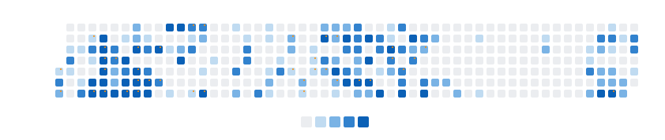

# StravaGraph

A GitHub profile enhancement that displays your Strava activity as a contribution-style heatmap directly in your GitHub profile README.

## Overview

StravaGraph integrates your athletic data from Strava with your GitHub profile, generating a contribution-style heatmap that visualizes your workout frequency and intensity. The visualization mirrors GitHub's own contribution graph aesthetics while representing your physical activities. Color intensity variations reflect your chosen activity metrics, providing profile visitors with an elegant representation of your athletic consistency and commitment.



## Key Features

| Feature                        | Description                                                                                      |
| ------------------------------ | ------------------------------------------------------------------------------------------------ |
| **Activity Visualization**     | Displays Strava activities in a GitHub-style heatmap with organized days of the week             |
| **Versatile Activity Support** | Compatible with running, cycling, swimming, hiking, and various other Strava activity types      |
| **Metric-Based Intensity**     | Configurable color intensity based on duration, distance, elevation, effort, or heart rate zones |
| **Automated Updates**          | Daily refresh via GitHub Actions workflow                                                        |
| **Secure Authentication**      | Implements OAuth with Strava API without exposing sensitive tokens                               |
| **Customizable Appearance**    | Adaptable design to complement your GitHub profile aesthetic                                     |
| **Dark Mode Support**          | Automatic theme switching based on user preferences                                              |
| **Achievement Highlighting**   | Visual indicators for personal records and significant milestones                                |
| **Reliable Rendering**         | PNG output format ensures consistent display across GitHub README environments                   |

## Implementation

### Quick Setup

1. **Fork this repository**
2. **Create a Strava API application** at https://www.strava.com/settings/api
3. **Configure your credentials** using one of these methods:

   **Option A: Using a .env file (recommended for local development):**

   ```bash
   # Create a .env file with your credentials
   cp .env.example .env
   # Edit the .env file with your actual values
   ```

   To export variables from your .env file to the current shell (useful for some commands):

   ```bash
   # Make the script executable if needed
   chmod +x ./export_env.sh

   # Export variables to current shell
   source ./export_env.sh
   ```

   **Option B: Using environment variables directly:**

   ```bash
   export STRAVA_CLIENT_ID=your_client_id
   export STRAVA_CLIENT_SECRET=your_client_secret
   export STRAVA_REFRESH_TOKEN=your_refresh_token  # If you already have one
   ```

4. **Generate your Strava refresh token** if you don't have one yet:
   ```bash
   go run ./cmd/strava-heatmap/main.go -auth
   ```
5. **Configure repository secrets** (Settings > Secrets and variables > Actions):

   - `STRAVA_CLIENT_ID`: Your Strava API client ID
   - `STRAVA_CLIENT_SECRET`: Your Strava API client secret
   - `STRAVA_REFRESH_TOKEN`: Your Strava refresh token
   - `PAT`: GitHub Personal Access Token with repository write permissions

   > **About the PAT**: This token allows the GitHub Action to update your profile repository. To create one:
   >
   > 1. Go to GitHub → Settings → Developer settings → Personal access tokens → Tokens (classic)
   > 2. Click "Generate new token" → "Generate new token (classic)"
   > 3. Name it something like "StravaGraph Access" and set expiration as desired
   > 4. Select the `repo` scope to allow repository modifications
   > 5. Click "Generate token" and copy the token value immediately

6. **Add the marker comments to your GitHub profile README**:

   ```markdown
   ## My Strava Activity

   <!-- STRAVA-HEATMAP-START -->
   <!-- STRAVA-HEATMAP-END -->
   ```

7. **Execute the GitHub Action** to generate and update your activity heatmap

For comprehensive setup information, refer to the [Installation Guide](./INSTALL.md).

## Usage Guide

### Building from Source

```bash
go build -o strava-heatmap ./cmd/strava-heatmap
```

### Command Reference

| Command     | Description                               | Example                                    |
| ----------- | ----------------------------------------- | ------------------------------------------ |
| `-auth`     | Display authentication instructions       | `./strava-heatmap -auth`                   |
| `-update`   | Update README with generated heatmap      | `./strava-heatmap -update`                 |
| `-generate` | Create SVG without modifying README       | `./strava-heatmap -generate > heatmap.svg` |
| `-test`     | Validate configuration and authentication | `./strava-heatmap -test`                   |

### Configuration Options

Customize your visualization by editing the `config.json` file:

```json
{
	"activityTypes": ["Run", "Ride", "Swim", "Hike", "WeightTraining"],
	"metricType": "distance",
	"colorScheme": "strava",
	"showStats": false,
	"dateRange": "1year",
	"cellSize": 10,
	"includePRs": true,
	"darkModeSupport": true,
	"weekStart": "Monday",
	"timeZone": "UTC"
}
```

For a complete configuration reference with all available options, see [examples/config.customized.json](./examples/config.customized.json).

## Documentation

- [Installation Guide](./INSTALL.md) - Detailed setup and configuration instructions
- [API Documentation](./API.md) - Technical API reference

## Customizing Colors

You can customize the colors of your heatmap to match your preferred style by updating the `colorScheme` and `customColors` options in your `config.json` file:

### Built-in Color Schemes

Choose from several pre-defined color schemes by setting the `colorScheme` field:

```json
"colorScheme": "github" // Options: "github", "strava", "blue", "purple"
```

- **github**: GitHub's classic green gradient (`#ebedf0`, `#9be9a8`, `#40c463`, `#30a14e`, `#216e39`)
- **strava**: Strava's orange/red palette (`#494950`, `#ffd4d1`, `#ffad9f`, `#fc7566`, `#e34a33`)
- **blue**: Blue gradient (`#ebedf0`, `#c0dbf1`, `#7ab3e5`, `#3282ce`, `#0a60b6`)
- **purple**: Purple gradient (`#ebedf0`, `#d9c6ec`, `#b888e0`, `#9c4acf`, `#7222bc`)

### Custom Color Palette

For full control, use the "custom" color scheme and define your own colors:

```json
"colorScheme": "custom",
"customColors": ["#ebedf0", "#9be9a8", "#40c463", "#30a14e", "#216e39"]
```

The `customColors` array contains 5 hex color codes, representing intensity levels from lowest to highest.

### Dark Mode Colors

You can also customize how your heatmap appears in dark mode:

```json
"darkModeSupport": true,
"darkModeColors": ["#161b22", "#0e4429", "#006d32", "#26a641", "#39d353"]
```

Set `darkModeSupport` to `false` if you prefer to disable dark mode support.

## Architecture

### Project Structure

```
/
├── cmd/
│   └── strava-heatmap/             # Application binary
│       └── main.go                 # Main entry point
├── internal/                       # Core implementation
│   ├── auth/                       # Strava OAuth authentication
│   │   ├── oauth.go                # OAuth flow implementation
│   │   └── token.go                # Token management
│   ├── strava/                     # Strava API integration
│   │   ├── activities.go           # Activity data fetching
│   │   ├── client.go               # API client implementation
│   │   └── models.go               # Data structures
│   ├── processor/                  # Data processing
│   │   ├── aggregator.go           # Activity aggregation
│   │   ├── metrics.go              # Metrics calculation
│   │   └── stats.go                # Statistics generation
│   ├── svg/                        # Visualization
│   │   ├── generator.go            # SVG creation
│   │   ├── heatmap.go              # Heatmap rendering
│   │   ├── themes.go               # Color schemes
│   │   └── tooltips.go             # Interactive tooltips
│   ├── github/                     # GitHub integration
│   │   ├── actions.go              # GitHub Actions support
│   │   └── readme.go               # README updating
│   └── config/                     # Configuration
│       ├── parser.go               # Config file loading
│       └── validator.go            # Config validation
├── .github/workflows/              # CI/CD automation
│   └── update-heatmap.yml          # GitHub Action workflow
├── assets/                         # Static assets
│   ├── icons/                      # Activity icons
│   └── templates/                  # SVG templates
├── examples/                       # Usage examples
│   └── config.customized.json      # Comprehensive config example
├── scripts/                        # Development scripts
│   └── pre-commit.sh               # Git pre-commit hook script
├── config.json                     # Configuration file
├── export_env.sh                   # Environment variable helper
├── .env.example                    # Environment template
├── Makefile                        # Development automation
├── README.md                       # Primary documentation
├── INSTALL.md                      # Installation guide
└── API.md                          # API reference
```

### Development

#### Code Formatting

This project uses automatic code formatting and linting via Git pre-commit hooks. To set up the development environment:

```bash
# Install the pre-commit hook
make install-hooks
```

The pre-commit hook will automatically:
- Format Go code using `gofmt`
- Run `golangci-lint` to check for issues
- Add formatted files to your commit

You can also manually run formatting and linting:

```bash
make fmt     # Format code with gofmt
make lint    # Run golangci-lint
make check   # Run both formatting and linting
make test    # Run tests
```

### Contributing

Contributions are welcome. Please follow our collaboration workflow:

1. Fork the repository
2. Create a feature branch (`git checkout -b feature/enhancement-name`)
3. Commit your changes with descriptive messages (`git commit -m 'Add feature: enhancement description'`)
4. Push to your branch (`git push origin feature/enhancement-name`)
5. Submit a Pull Request

Please ensure all code adheres to project conventions and includes appropriate test coverage.

## License

MIT

---

## My Strava Activity

<!-- STRAVA-HEATMAP-START -->

<!-- STRAVA-HEATMAP-END -->
